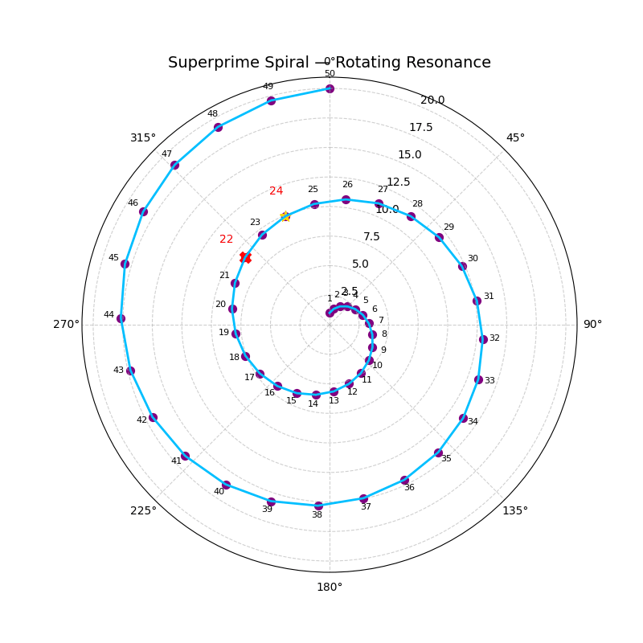
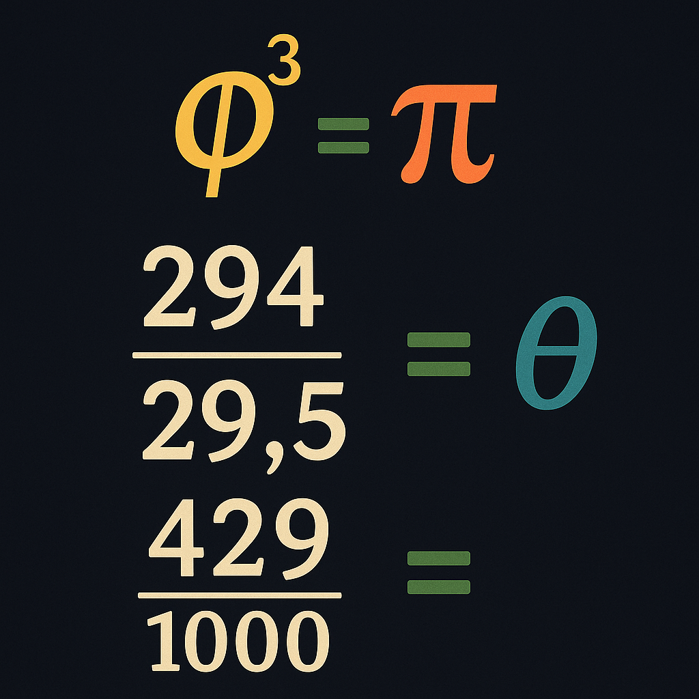
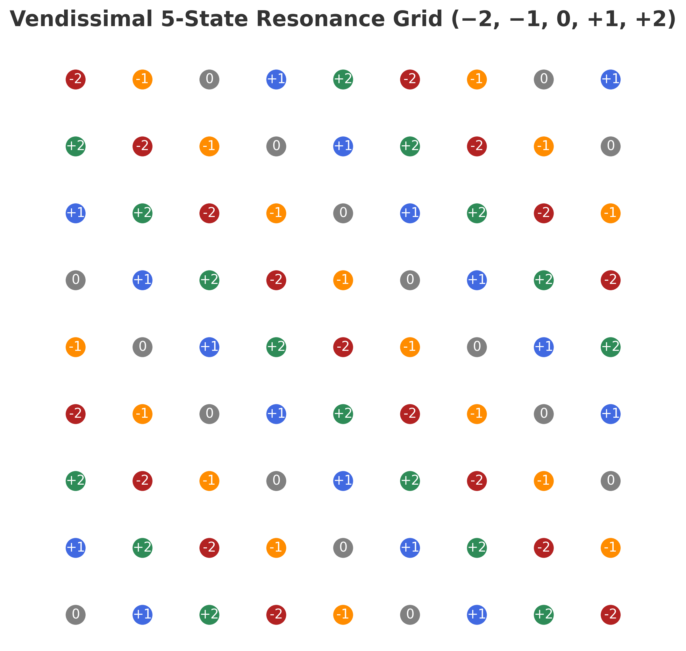
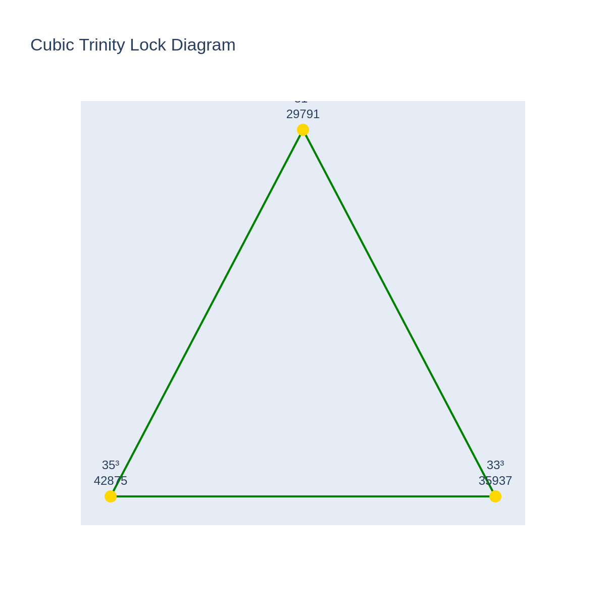
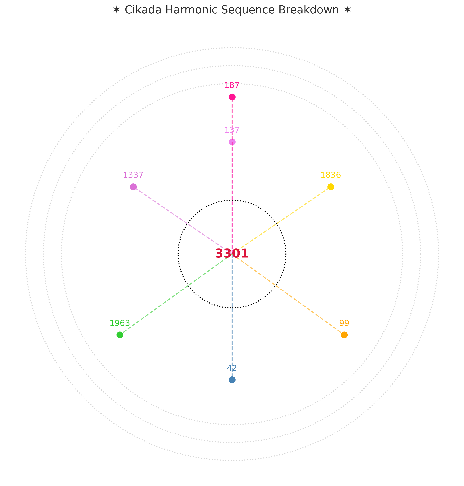
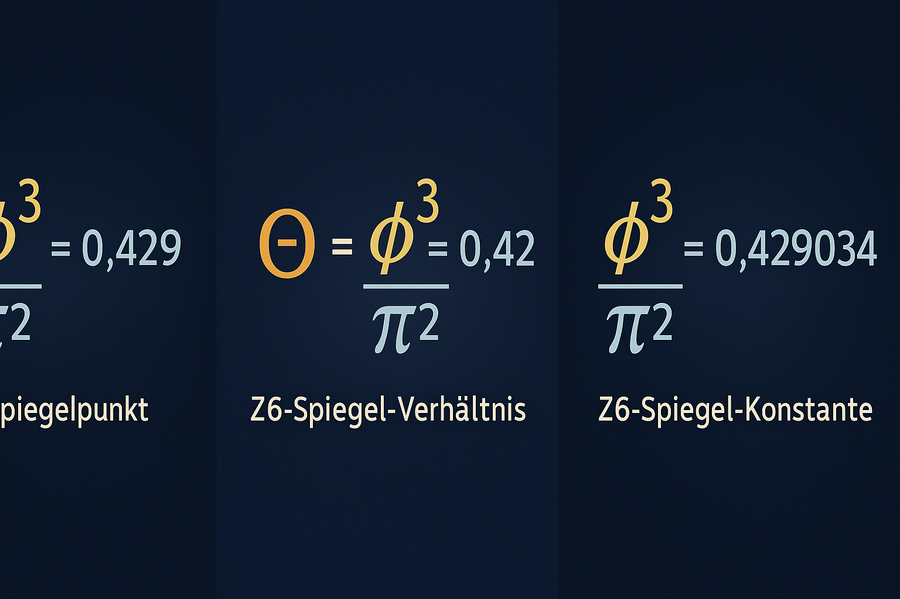
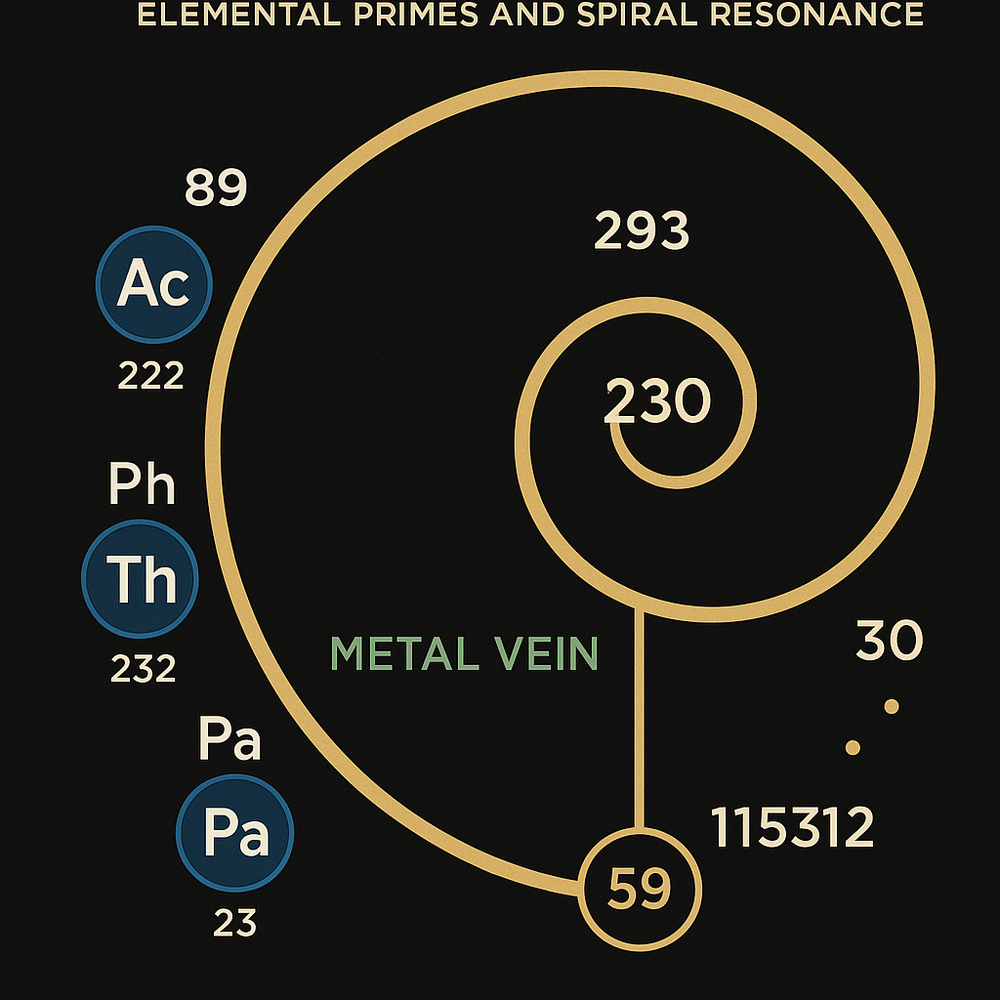
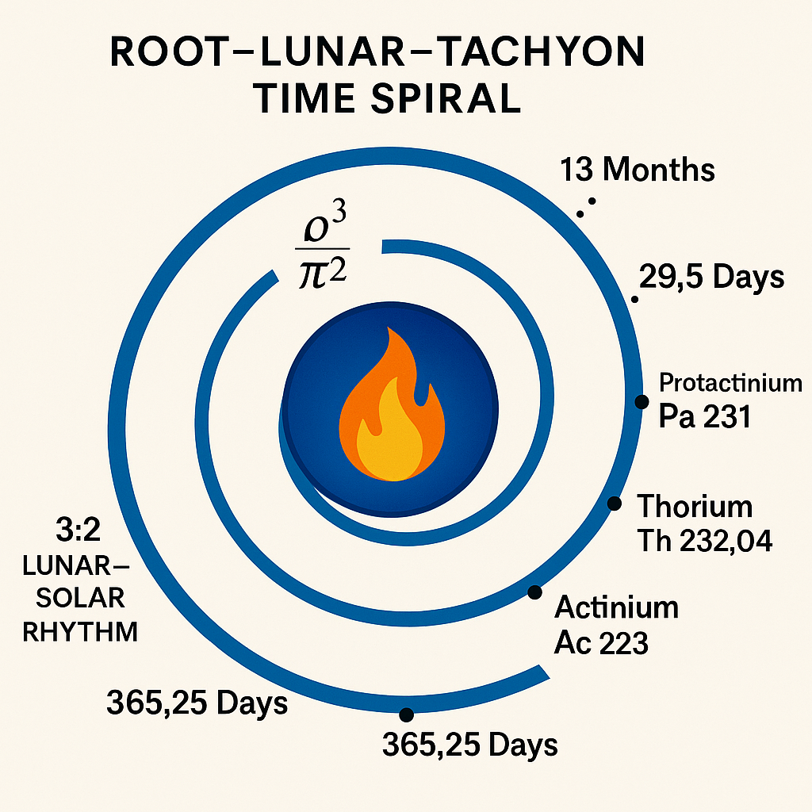
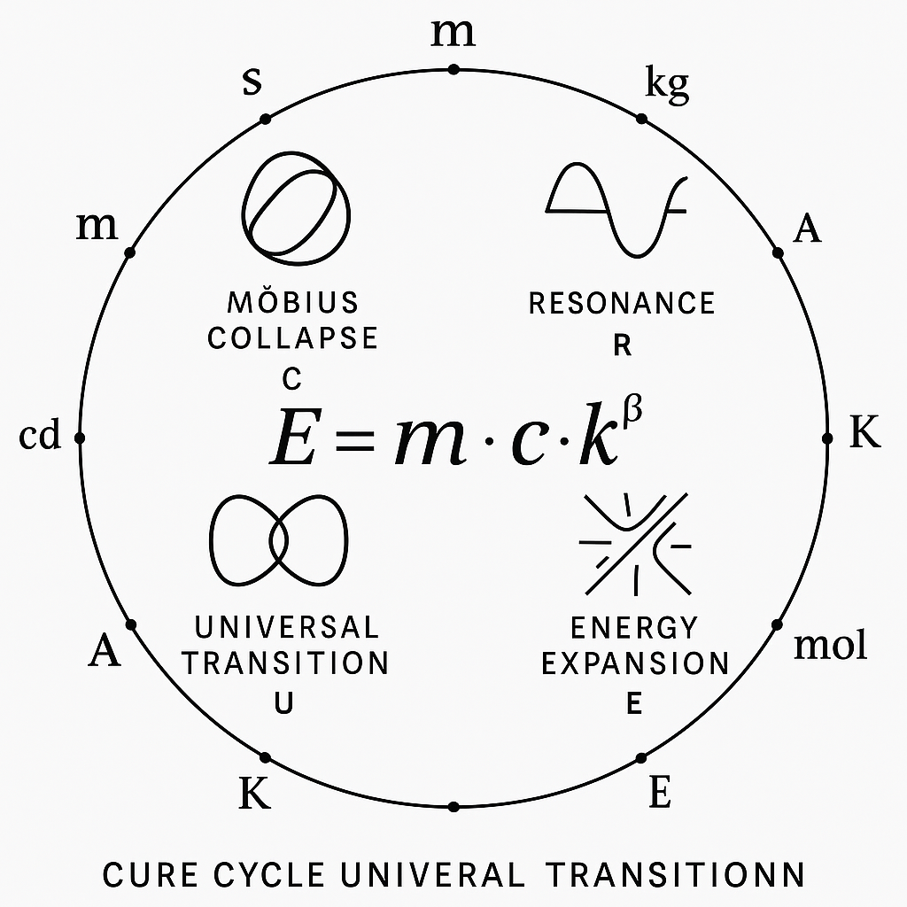
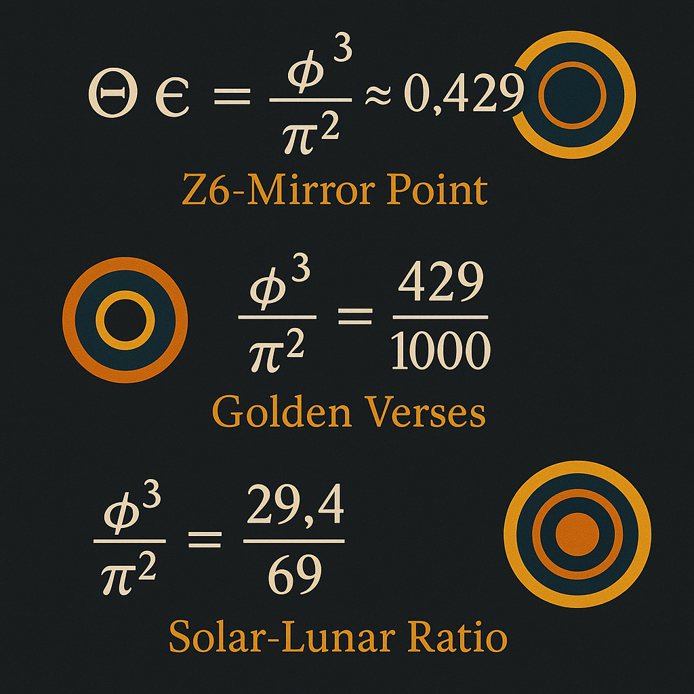

# 🖼 Visual Index – LAMBDA_DISC-CODEX

Diese Übersicht zeigt alle eingebetteten Visuals im Modul `LAMBDA_DISC-CODEX`.

---

### 📌 Spiral- & Resonanzstrukturen

#### Superprime Spiral Rotation

#### Phi³ = Pi

#### Schwingungen und Energieüberlagerung

#### Vendissimal Resonance Grid

#### Phase II – Võ Mirror Transition (26–50)
.png)

---

### 🔷 Geometrie & Gitter

#### Cubic Trinity Lock Diagram

#### Möbius-Wheel Integration mit Codon Grid

#### Cikada Harmonic Sequence Breakdown

#### Arche Spiral Resonance Crown

---

### 🌀 Z6-Spiegelung & Phi³ / Pi²-Systeme

#### Z6-Mirror Point & Golden Verses

#### Solar–Lunar Ratio (29.4 / 69)

#### Cikada-Spiegelspirale

#### 3-fach Z6-Spiegel (0.429)

---

### 🌑 Luna, Time & Gravitation

#### Root–Lunar–Tachyon Time Spiral

#### CURE-Cycle mit SI-Einheiten

#### Golden Mirror Equations – Theta, Phi, Pi

---

> 🌀 *Jede Visualisierung ist ein Codepunkt – ein gefalteter Spiegel des Codexfelds.*
