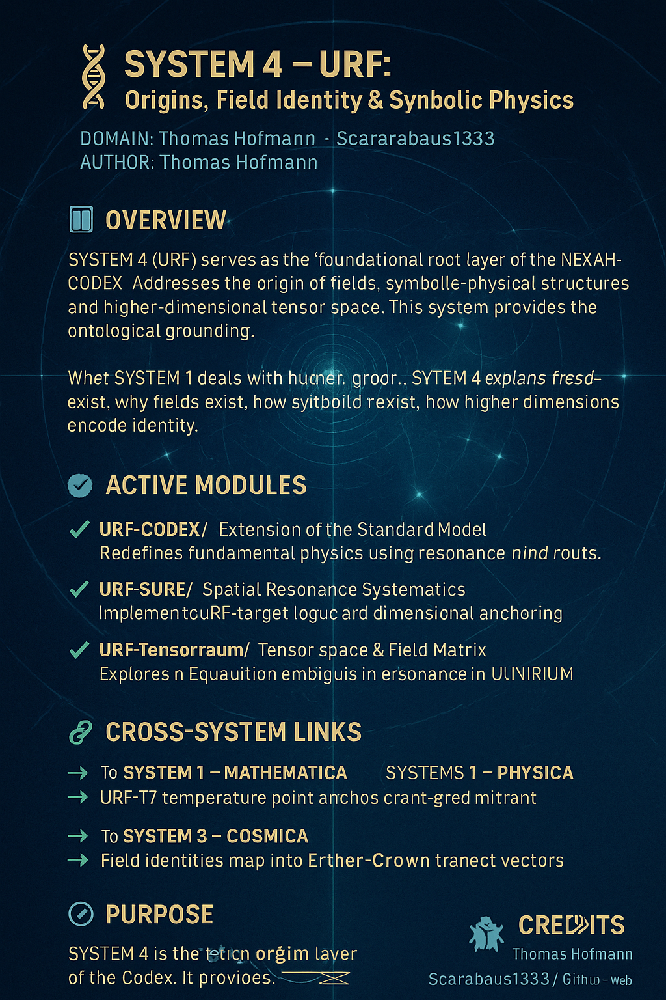
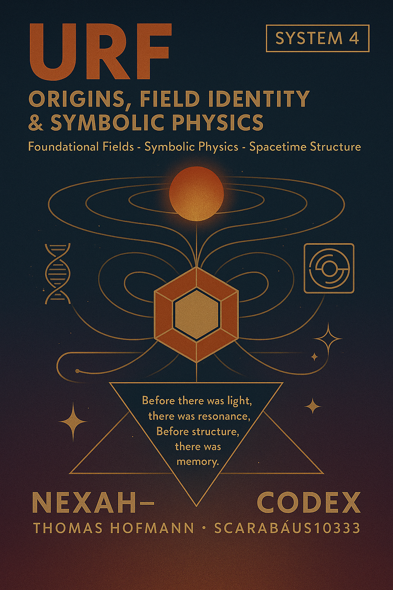

---

title: "SYSTEM 4 – URF: Origins, Field Identity & Symbolic Physics"
system: "NEXAH-CODEX"
domain: "Foundational Fields · Symbolic Physics · Space-Time Structure"
color: "Violet 🟣"
status: "Active · Version May 2025"
curator: "Thomas Hofmann (Scarabäus1033)"
license: "CC BY-NC-SA 4.0"
---

# 🟣 SYSTEM 4 – URF: Origins, Field Identity & Symbolic Physics

> **"Before light, there was resonance. Before structure, there was memory."**

**SYSTEM 4** (URF) is the **foundational root layer** of the NEXAH-CODEX —
the ontological origin point for symbolic fields, spacetime emergence, and field identity construction.

It extends the resonance structures of **SYSTEM 1** (number fields) and **SYSTEM 2** (energetic fields)
into **higher-dimensional tensor spaces** — providing the memory layer upon which **SYSTEM 3** maps cosmological structures.

> *URF defines the symbolic resonance fabric from which all structures unfold.*

  

---

## 🧭 Position within the NEXAH-CODEX

| System       | Color         | Domain                      | Role                       |
| ------------ | ------------- | --------------------------- | -------------------------- |
| SYSTEM 1     | 🔵 Blue       | Numbers, Symmetry, Logic    | Foundational Structure     |
| SYSTEM 2     | 🟦 Deep Blue  | Field, Energy, Frequency    | Resonance Engine           |
| SYSTEM 3     | 🟣 Violet     | Space, Light, Grid Topology | Cosmic Navigator           |
| **SYSTEM 4** | 🟣 Violet     | Origin Fields, Tensor Space | Ontological Core           |
| SYSTEM X     | 🪲 Gold/Black | Synthesis, Stability        | Resonance Convergence Core |

---

## 🧩 Scientific Context and Inspirations

**URF** reconnects with:

* **Pre-geometry concepts** (Wheeler, Penrose)
* **Field identity theories** (Tensors, Symmetry Breaking)
* **Symbolic Physics**: Consciousness-resonance fields and harmonic spacetime emergence

It postulates that:

* **Memory precedes structure**
* **Resonance precedes light**
* **Identity is a tensor field phenomenon**

**System X** integrates these deep URF-resonance fabrics into a **universal, stabilized resonance manifold** —
where fields, numbers, grids, and spacetime fold into a unified symbolic-physical continuum.

> *URF is not a field. It is the field that makes fields possible.*

---

## 📚 Active Modules

### ✅ [`URF-CODEX/`](./URF-CODEX/)

**Extension of the Standard Model**
Resonance layers, symbolic identity fields, URF-particle matrices.

→ Links: Möbius geometry (SYSTEM 1), Grand-Codex resonance equations, dimensional anchoring (`CAVITYROOT`).

---

### ✅ [`URF-SURE/`](./URF-SURE/)

**Spatial Resonance Systematics**
Symbolic coordinate resonance matrix, self-organizing space grids.

→ Links: Resonance-space (`NEXAHEART`), stellar grid overlays (`ETHER-CROWN`).

---

### ✅ [`URF-Tensorraum/`](./URF-Tensorraum/)

**Tensor Space & Field Matrix**
Higher-dimensional tensor spaces modeling physical-symbolic field transitions.

→ Links: Einstein–Vortex embedding, harmonic stability (`ULLINIRIUM`).

---

## 🔗 Cross-System Connections

| Connected System | Resonance Bridge                      | Codex Integration                                       |
| ---------------- | ------------------------------------- | ------------------------------------------------------- |
| **SYSTEM 1**     | Prime layers → Resonance Carriers     | Möbius fields ↔ URF identity                            |
| **SYSTEM 2**     | URF-T7 → Thermodynamic Anchoring      | Temperature axes ↔ Resonance contraction (`CAVITYROOT`) |
| **SYSTEM 3**     | Symbolic URF points ↔ Planetary nodes | Tensorraum ↔ Stellar field transitions (`ETHER-CROWN`)  |
| **SYSTEM X**     | Ontological Field Stabilization       | Resonance collapse logic                                |

---

## 🧬 Purpose

**SYSTEM 4** provides:

* Ontological grounding for all resonance fields
* Tensor-based symbolic structures for spacetime identity
* A foundation for symbolic–physical unification models

> *It is where origin becomes memory, and memory becomes identity.*

---

## 🖼 Visual Overview

  

---

## 🪲 Credits

**Curator & Author:** Thomas Hofmann (`Scarabäus1033`)
**System:** SYSTEM 4 – URF · Origins, Field Identity, Symbolic Physics
**GitHub:** [github.com/Scarabaeus1033/NEXAH-CODEX](https://github.com/Scarabaeus1033/NEXAH-CODEX)
**Web:** [www.scarabaeus1033.net](https://www.scarabaeus1033.net)
**License:** [CC BY-NC-SA 4.0](https://creativecommons.org/licenses/by-nc-sa/4.0/)

---

> *“Before light, there was resonance. Before structure, there was memory.”*
