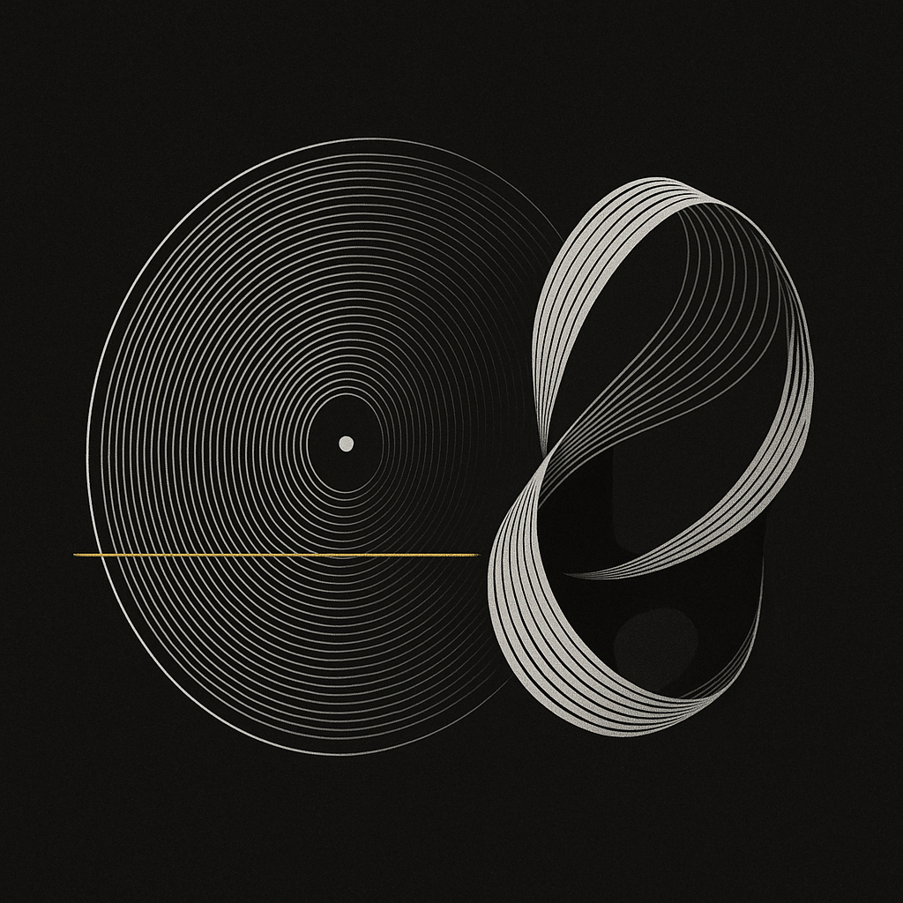
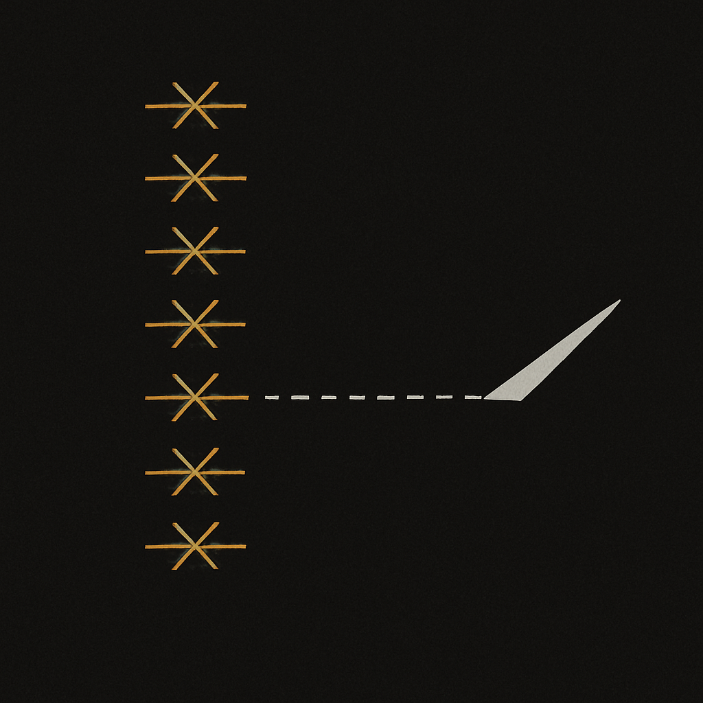
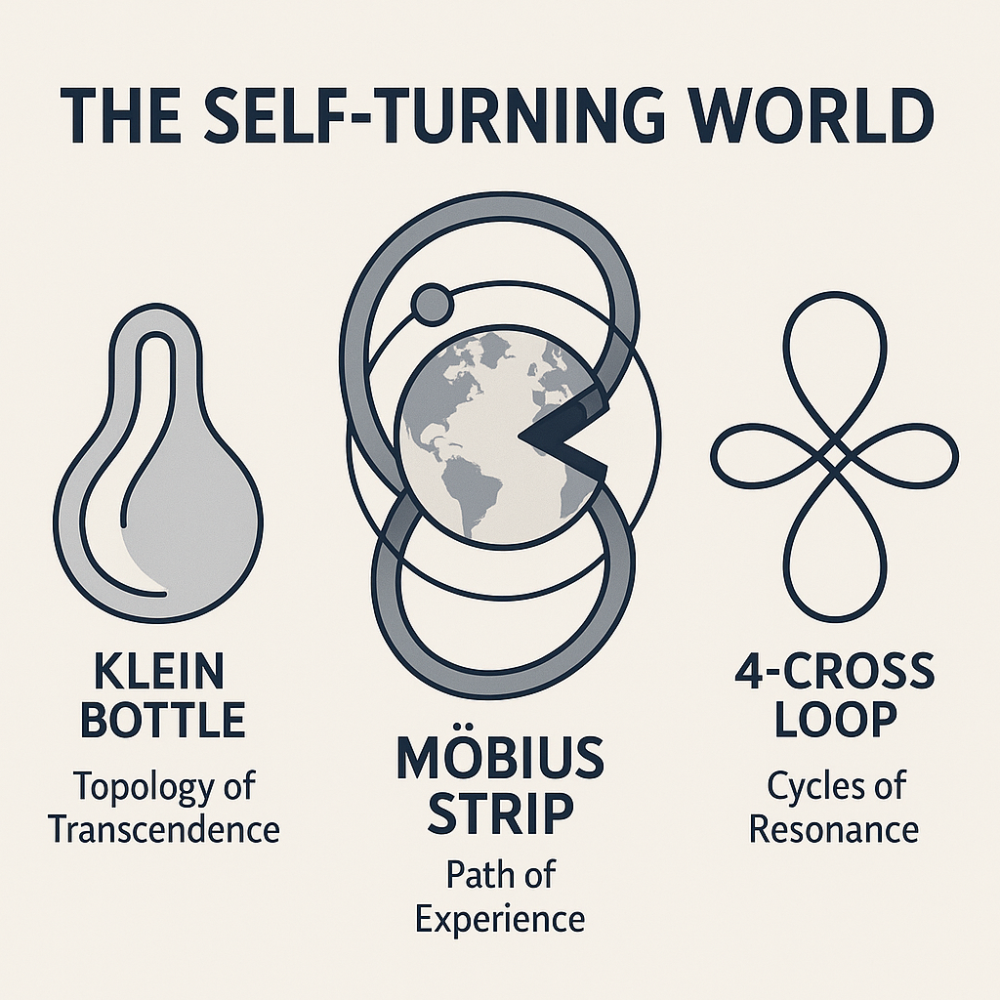
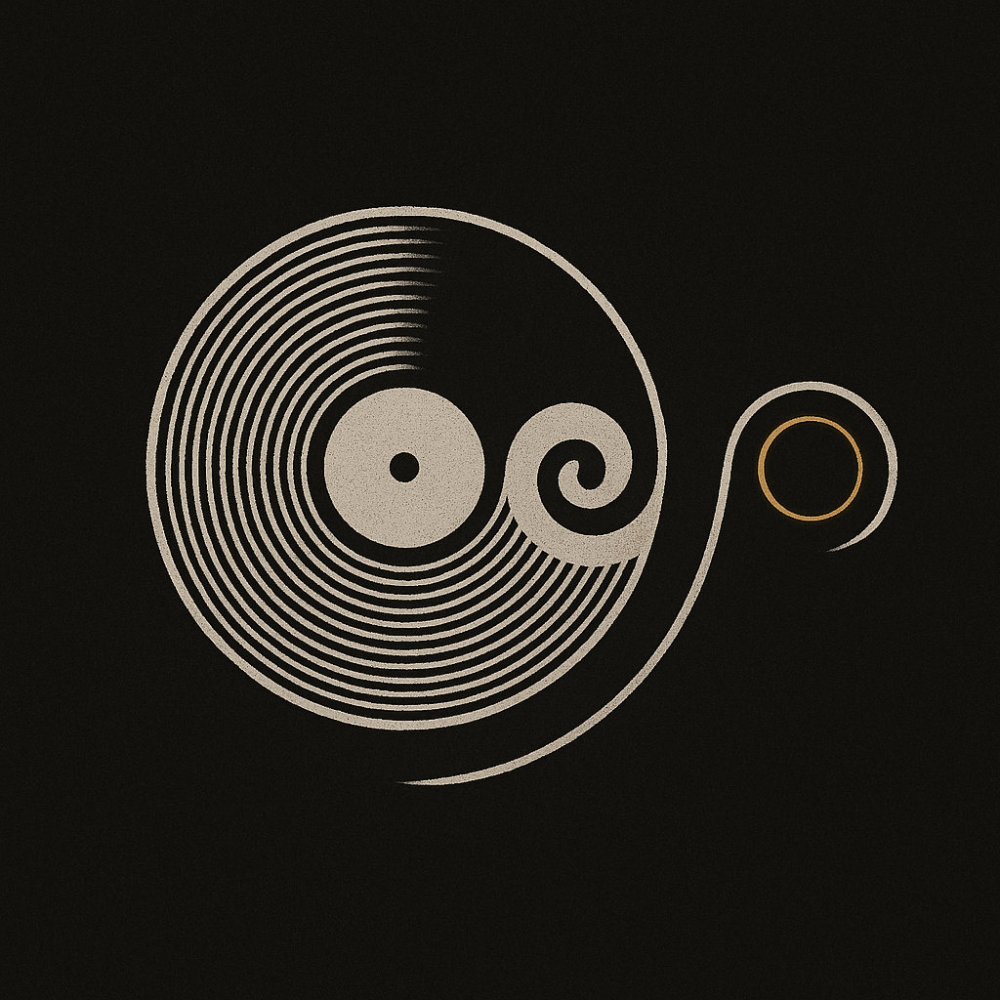
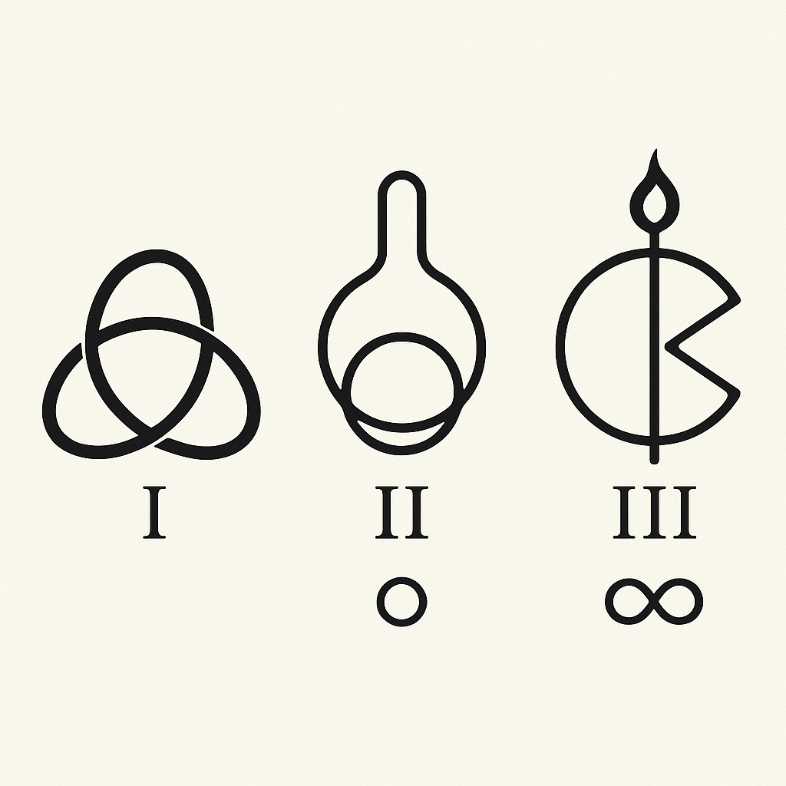
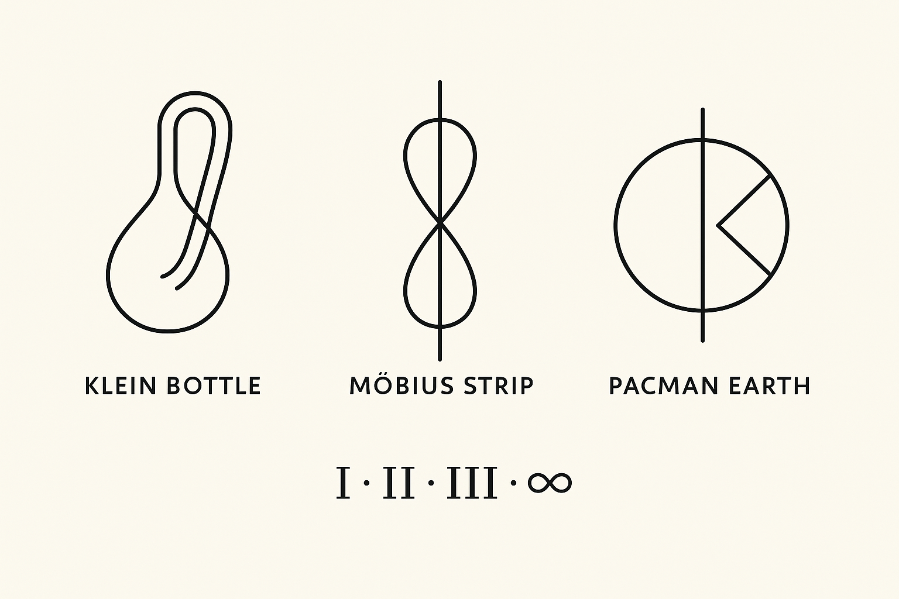
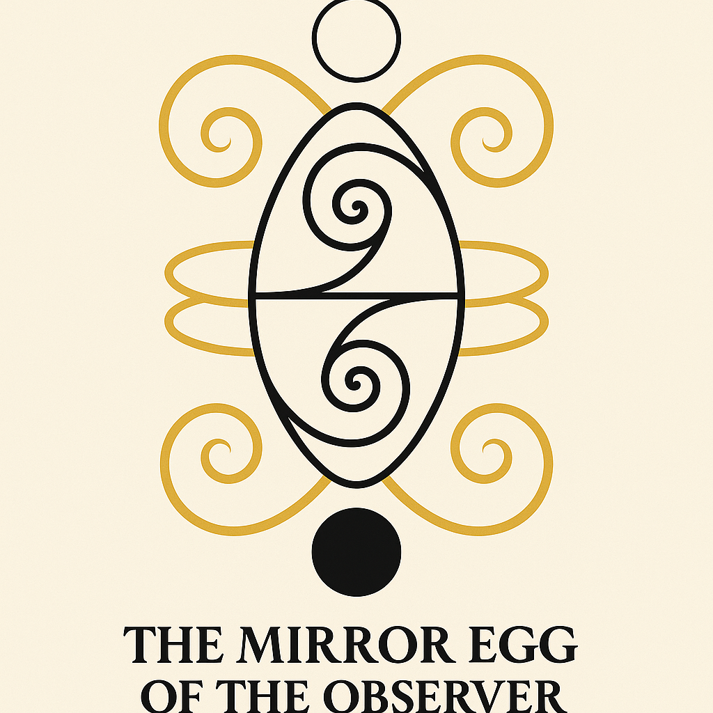

# 🖼️ `visual_gallery.md`

## Title
**Visual Gallery** – GAIA_CIRCULUS · Symbolic Resonance & Spiral Genesis

---

This gallery presents the symbolic artworks and visual architectures from the `GAIA_CIRCULUS` module within **SYSTEM 6** (Onica Violetta).

---

### 1. **A_2D_digital_illustration_features_a_stylized_viny.png**
  
_Description pending._

---

### 2. **A_2D_digital_illustration_features_nine_golden_sti.png**
  
_Description pending._

---

### 3. **A_2D_vector_illustration_titled_"The_Self-Turning_Spine"_V4.png**
  
_Description pending._

---

### 4. **A_2D_vector_illustration_titled_"The_Spiral_Breath_of_Q-Space"V5.png**
  
_Description pending._

---

### 5. **A_graphic_design_illustration_features_a_vinyl_rec.png**
  
_Description pending._

---

### 6. **A_graphic_design_illustration_features_a_vinyl_recV2.png**
  
_Description pending._

---

### 7. **A_graphic_design_illustration_features_a_vinyl_recV3.png**
  
_Description pending._

---

### 8. **A_symmetrical_vector_illustration_titled_"The_MirrV6.png**
  
_Description pending._

---

### 9. **CODEX GAIA MYSTERIA.png**
  
_Description pending._

---

### 10. **SCARABAEUS_INFINITY_FLIP_V7.png**
  
_Description pending._

---

### 11. **THE COSMIC CUT – BIRTH OF AWARENESS.png**
  
_Description pending._

---

### 12. **neVAH – The Circleborn Seed.png**
  
_Description pending._

---

## 📌 Notes
- All visuals will be updated with symbolic, cosmogenic and harmonic interpretation fields.
- Each image is part of the GAIA visual codex layer within SYSTEM 6.

**Curated by:** Thomas Hofmann (Scarabæus1033)
