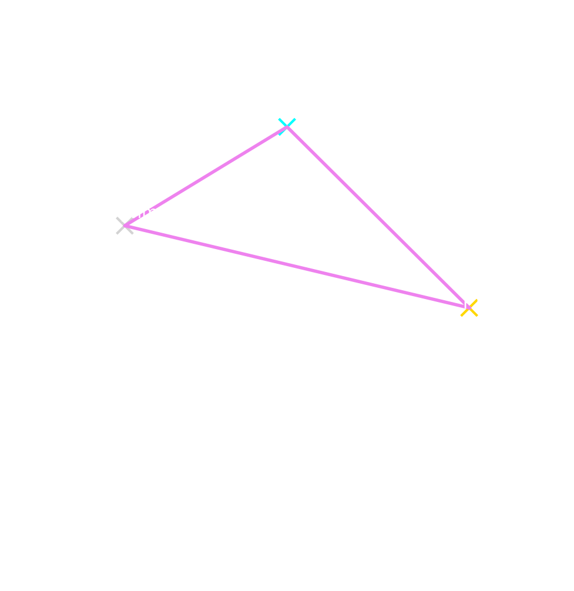
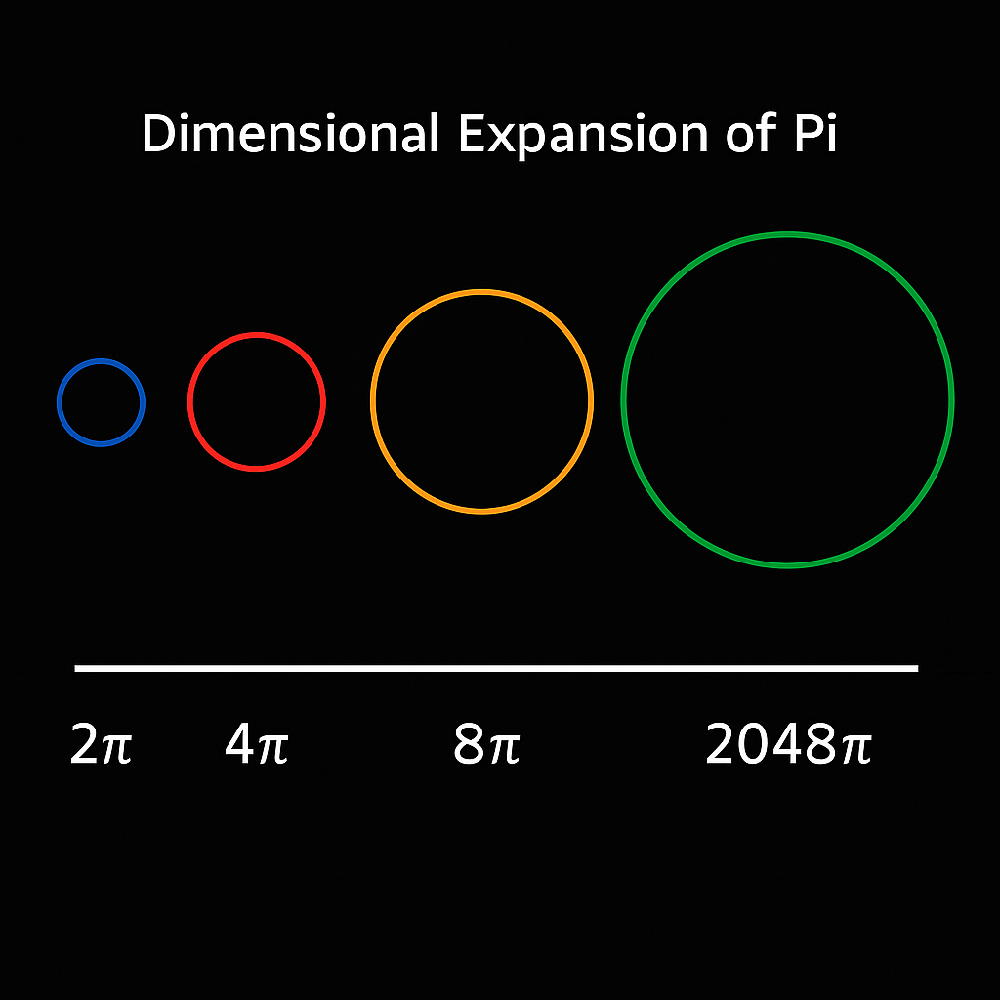

# 📘 `codex_binomial_fields`

## Title

**Codex Binomial Fields** – Symbolic Expansion of Frequency & Dimensionality

## Overview

This module explores the **binomial formula** not as a mere algebraic identity, but as a **symbolic resonance operator** across layers of mathematical, visual, and codex-theoretical structure. The classical binomial expansion is interpreted as a generative spiral mechanism, producing **frequency layers**, **dimensional foldings**, and **symmetry bridges** within the NEXAH-CODEX.

---

## 🔢 Core Formula

The binomial expansion:

```math
(a + b)^n = \sum_{k=0}^{n} \binom{n}{k} a^{n-k} b^k
```

is interpreted as:

* **Resonant Field Expansion**: \$a\$ and \$b\$ as primary oscillators (e.g. wave-pairing, loop–counterloop)
* **Fold Generation**: \$n\$ represents dimensional folding depth (e.g. triadic, pentagonal, heptagonal fields)
* **Frequency Dispersion**: binomial coefficients \$\binom{n}{k}\$ interpreted as **resonance weights** per fold

---

## 🔁 Symbolic Interpretation

| Classical Term       | Codex Mapping                                  |
| -------------------- | ---------------------------------------------- |
| (a + b)              | Duality Basis: Symmetry ↔ Asymmetry            |
| n                    | Dimensional Operator (3D, 7D, 12D)             |
| \binom{n}{k}         | Field Weighting: Combinatorial Resonance Logic |
| Polynomial Expansion | Multifold Spiral Grid / Breath Configuration   |

This links to **spiral breathing**, **mirror doubling**, and **dimensional transitions** (related to √2, φ, π).

---

## ✴️ The Binomial Resonance Field

The classical binomial formula

```math
(a + b)^n
```

is not merely algebraic—it becomes a **resonance operator** when embedded in NEXAH’s symbolic field architecture. Its structure unfolds into geometries, frequencies, and prime interferences across dimensions.

---

## 🔺 Triangular Folds and Pascal Resonance

Each power of the binomial expansion generates a new **resonance layer** within a triangular architecture:

* Pascal’s Triangle = **frequency pyramid**
* Fibonacci diagonals = **spiral growth indicators**
* Prime shadowing patterns = **resonance gaps**

This pattern manifests numerically and visually:



---

## 🌀 Spiral Logic, Superpositions & Mirrors

Each binomial layer is interpreted as a **spiral pulse** around origin:

* Fibonacci/Phi folds → clockwise expansion
* Negative binomials (with alternating signs) → counterclockwise contractions
* Combination of both: **breathing spiral field**

Visual reference:



---

## 🔁 Mirror-Symmetry & Operator Decomposition

Binomial fields are sensitive to **mirroring axes**:

* Involutive maps: (a+b)^n ↔ (b+a)^n
* θ-axis inversion: φ → 1/φ; π → −π
* Modular binomials (mod p): resonance glitches → prime-based echo patterns

---

## 🔢 Codex Applications

1. **Spiral Folding Grids** for Prime Genesis modules
2. **Expansion Patterns** in λ-fold models (see LAMBDA DISC)
3. **Mirror-Space decompositions** for Möbius Crown Modules

---

## 🔍 Related Visuals

* `Dimensional-Ascension-Grid.png`
* `root_spiral_gate.png`
* `Spiegelung und φ-Rotation auf dem Einheitskreis.png`
* `TT-Spiral_Gate_75↔76.001_Resonanzspule_mit_Zeitmodulation.png`

---

## 🧩 Related Modules

* `spiral-logic.md` (SYSTEM 1)
* `PRIME_TRINITY_GRID/`
* `LAMBDA_DISC-CODEX/`

---

**Status:** Draft Complete · Ready for Integration in SYSTEM 7

**Codex Builder:** Thomas Hofmann · Scarabäus1033
