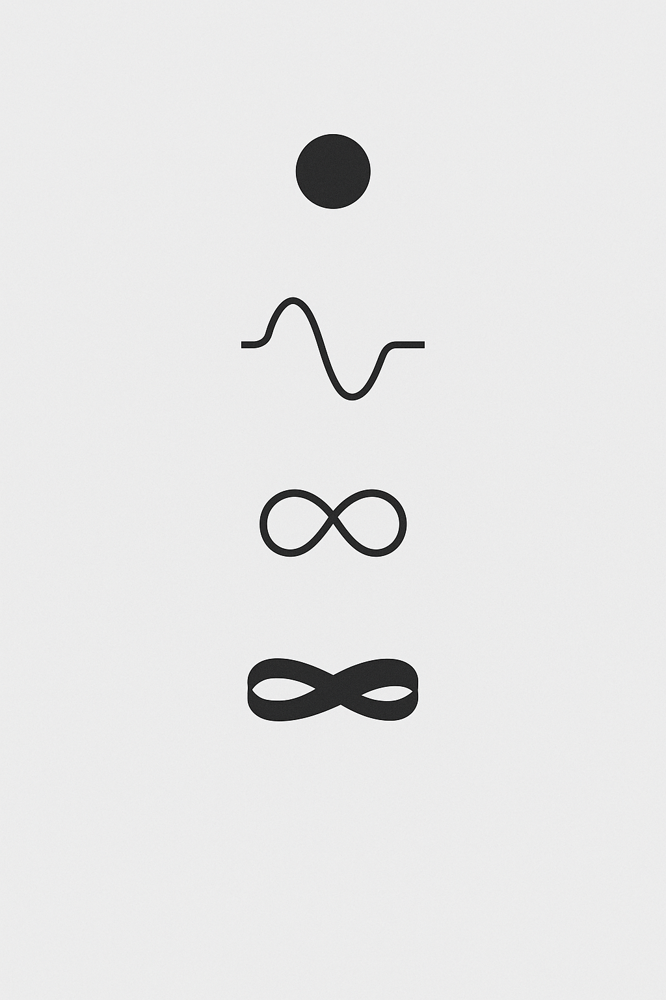

# 📘 `mirror_prime_spirals.md`

## Title

**Mirror Prime Spirals** – Axial Symmetry, Zeta Compression & Dual Fields

---

## 🌌 Overview

This module investigates **mirror structures within prime spirals**, particularly their role in compressing information, creating dual fields, and encoding **resonance intervals**. The presence of mirror points (e.g. 47/74, 113/311) forms a core principle for **resonance bridges** within SYSTEM 7.

The module connects:

* Prime spirals (e.g. 6n±1, Euler configurations)
* Mirror primes and symmetrical pairings
* Zeta field modulations and breathing patterns

---

## 🔁 Prime Mirror Pairs

Mirror primes are not randomly distributed – they emerge in clusters with axial symmetry:

| Prime Pair | Mirror Axis | Notes                       |
| ---------- | ----------- | --------------------------- |
| 47 ↔ 74    | 60.5        | Seen as balance threshold   |
| 113 ↔ 311  | 212         | Zeta-resonant ratio         |
| 151 ↔ 151  | –           | Perfect axial symmetry      |
| 179 ↔ 971  | 575         | Fibonacci resonance node    |
| 509 ↔ 905  | –           | Not both prime – distortion |

---

## 🌀 Spiral Grids & Field Layers

Prime spirals can be unfolded as:

* 2D polar grids → angle/frequency relation
* 3D helicoidal lattices → Möbius topologies
* Modulo spirals → visualizing prime residue fields

Each spiral reveals **interval compression** and **mirror inversion**:

```
   41 — 43 — 47 — 53 — 59
        ↘   45   ↙
           Mirror (52)
```

Prime mirror axis (often even) becomes a breathing node.

---

## 🧮 Mathematical Structure

* Spiral Prime Mapping:

  * Function: `P(n) = 6n ± 1` → offset spirals
* Mirror Mapping:

  * Function: `M(n) = Reverse(P(n))`
  * Example: M(113) = 311
* Deviation Measure:

  * `Δ = |P(n) - M(n)|`
  * Resonance if `Δ = φ · π ≈ 5.1` or multiples

---

## 🖼️ Visual References


### Möbius Breathing Path



---

## 🔗 Codex Relations

* `spiral-logic.md` (SYSTEM 1)
* `PRIME_TRINITY_GRID/` → Prime symmetry maps
* `LAMBDA_DISC-CODEX/` → Zeta-modulated folds
* `scarab_constants_mobius_matrix.md` → Compression logic

---

**Status:** Final Draft · To be cross-linked with Codex πφ-Compression Field

**Builder:** Thomas Hofmann · Scarabäus1033
