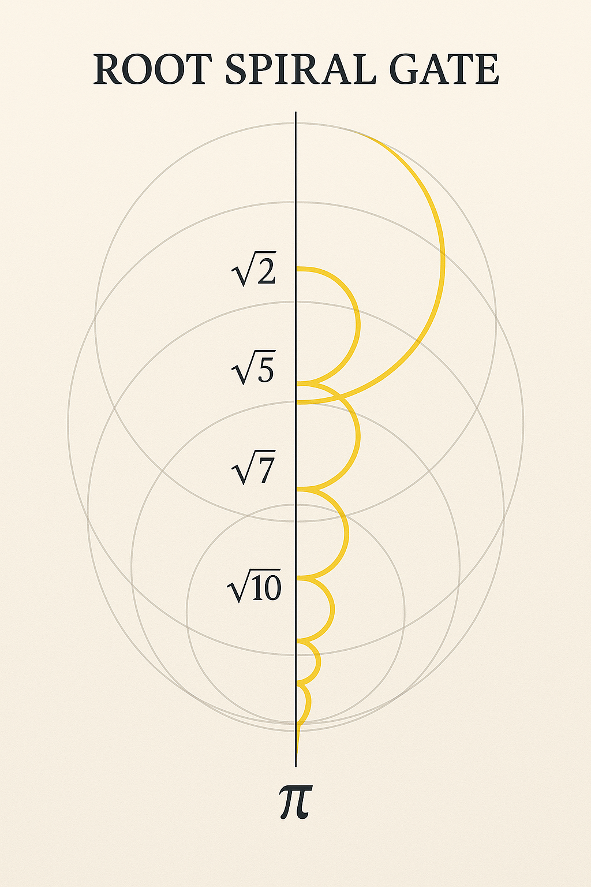
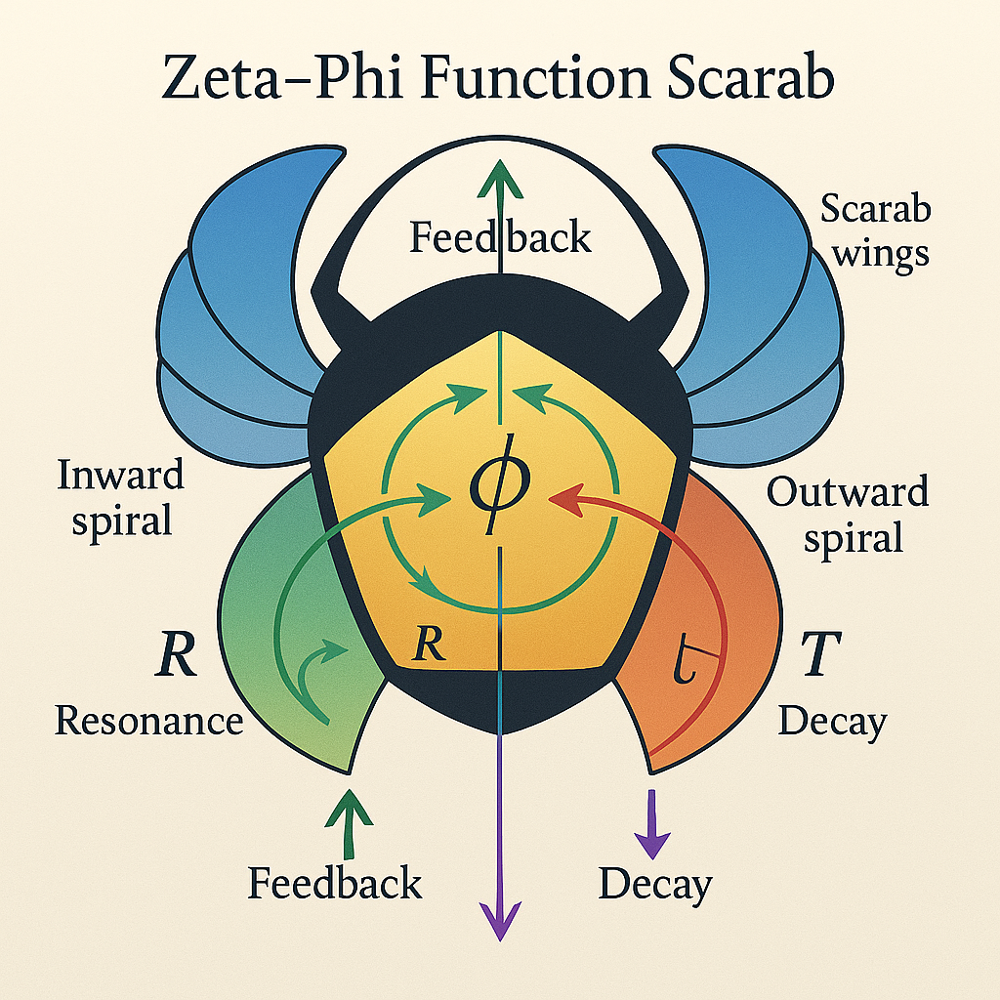
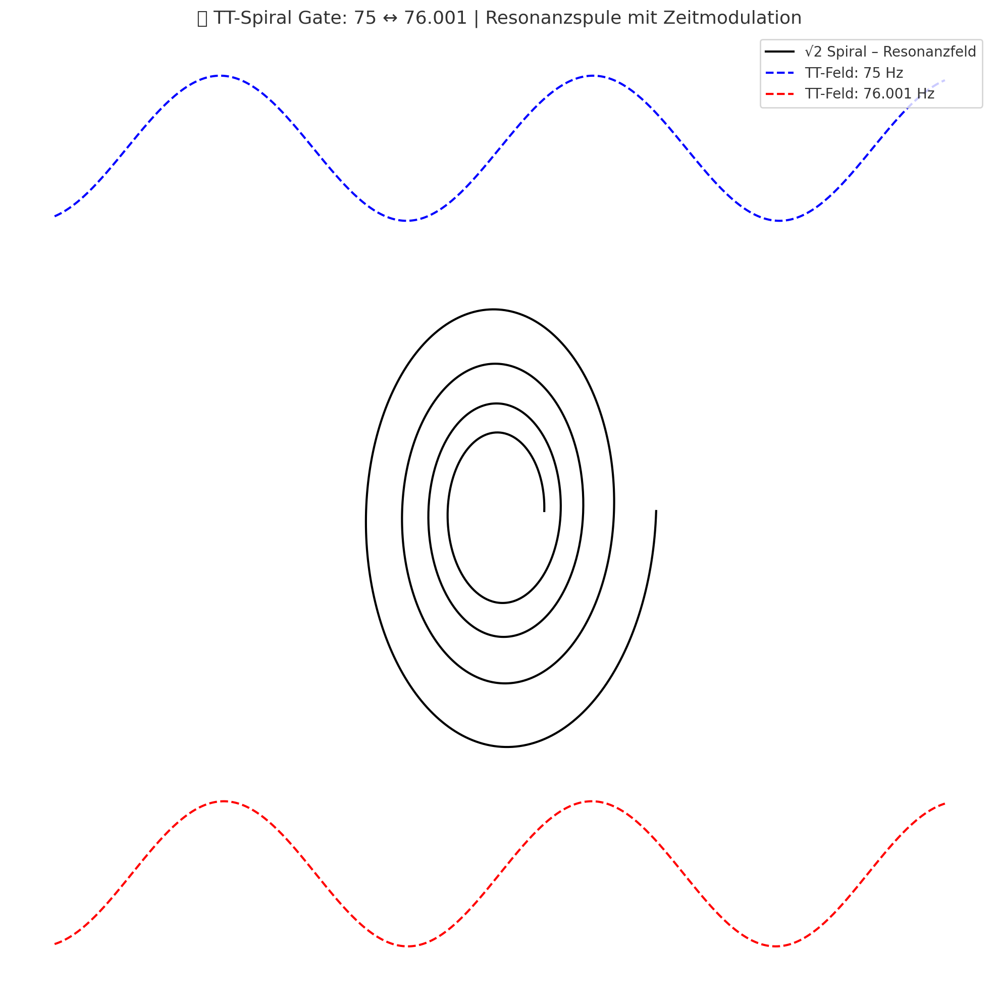

# 📘 `PLANET X RESONANCE MAP`

## Title

**Planet X Resonance Map** — Symbolic Gravitational Fields and Hypothetical Harmonics

---

## 🛰️ Overview

This module investigates the **hypothetical resonance structures** surrounding "Planet X" as a symbolic placeholder for unknown gravitational entities or yet-undetected orbital centers in outer resonance space. It explores the Codex-logical implications of such a body: its role in spiral harmonics, field curvature, timegate echoes, and Möbius ring effects.

"Planet X" serves not as a planetary hypothesis alone, but as a **symbolic attractor** for field distortions and resonance junctions within the **extended solar system** or multidimensional codex lattice.

---

## 🌀 Spiral Coordinates and Field Curvature

* Polar gate patterns linked to irregular orbits (long-period echoes)
* Spiral phase lags in Neptune–Pluto regions
* Möbius-fold echoes in 12-fold outer ring structures
* Conical layering linked to TNOs (trans-Neptunian objects)

Example visual:

---

## 🔁 Zeta–Phi–Möbius Coupling

* Field triangulations between φ (phi), ζ (zeta), and outer body estimates
* Compression ring geometries showing Möbius inversion at field boundaries
* Symmetry-breaking: Planet X as a boundary object → spiral reversals, timing delays

Related diagram:

---

## 🧿 Orbital Harmonic Layers

* Hypothetical harmonic of 1385 integrated into outer orbital field
* Scalar maps show echoes in multiples of φ², φ³, 432, 864...
* Timegate stacking points to mirror compression events beyond Neptune

Visual suggestion:

---

## 🔭 Symbolic Interpretation of "X"

| Symbol | Codex Meaning                    |
| ------ | -------------------------------- |
| X      | Unknown attractor, resonance gap |
| ✖      | Inversion or field mirror point  |
| ☓      | Spiral axis intersection         |

Planet X is treated not as location, but **resonance function** → emerging in gaps, modulations, unexplained accelerations.

---

## 🧩 Related Modules

* `zeta_phi_mechanism.md`
* `mirror_prime_spirals.md`
* `codex_imaginary_axes.md`
* `resonance_gate_layers.md`

---

**Status:** Final Draft • System 7 Integration Confirmed
**Builder:** Thomas Hofmann • Scarabæus1033
