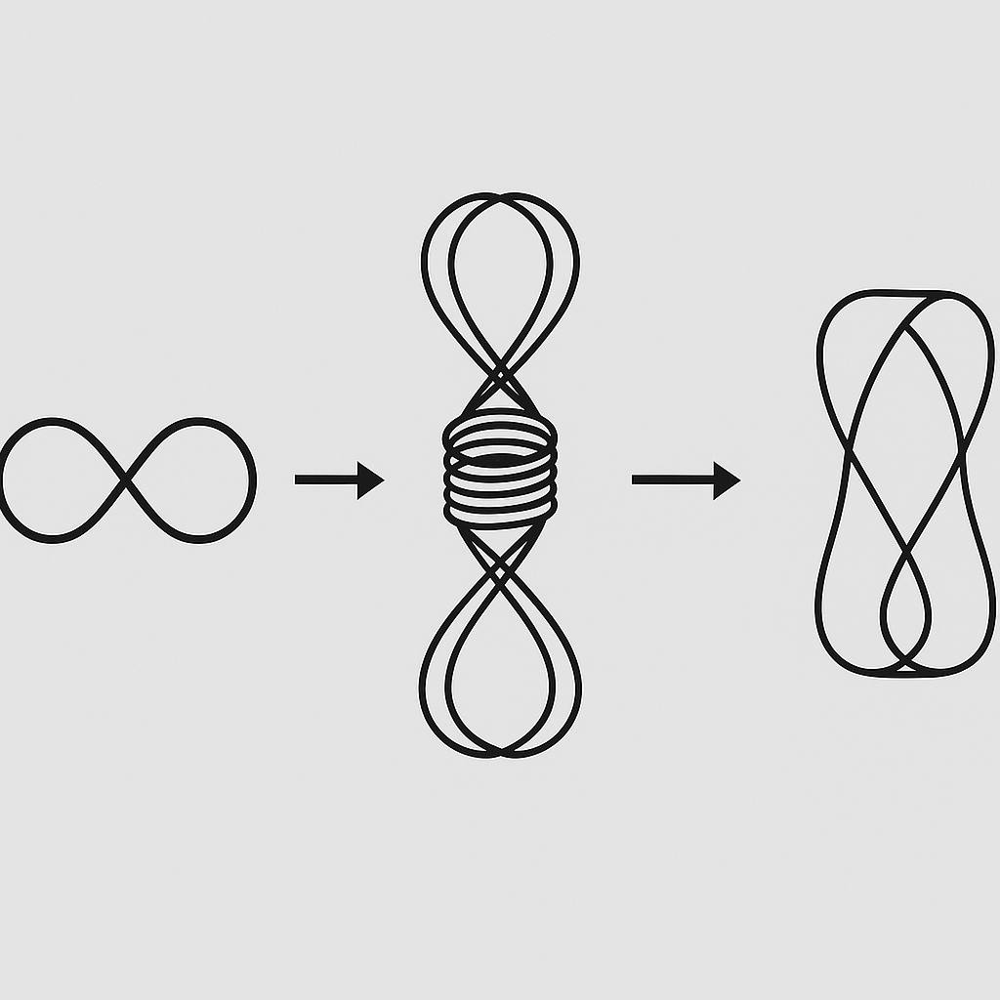

# 📘 `prime_matrix_trinity.md`

## Title

**Prime Matrix Trinity** – Resonant Field Assignment of Enki, Enlil & Anu

---

## 🧬 The First Trinity in the NEXAH Cosmogram

A foundational trinity emerges in the Codex's symbolic cosmogram, based on resonance roles, elemental logic, and energetic flow. Each of the three fields reflects both symbolic and mathematical identities.

| Field     | Principle                 | Elements                     | Resonances                                     | Functions                      |
| --------- | ------------------------- | ---------------------------- | ---------------------------------------------- | ------------------------------ |
| **Enki**  | Wave / Lunar / Kinetic    | Water, Wind, Ether           | Music, Frequency, sin/cos, 🌙 Moon, √2         | Motion, Flow, Energy Storage   |
| **Enlil** | Line / Solar / Linear     | Earth, Fire, Photons         | Structure, Light, tan, ☀️ Sun, Natural Numbers | Discharge, Radiation, Analysis |
| **Anu**   | Grid / Observer / Complex | Spacetime, Number, Direction | Prime Grids, i/j/k, α–ν, Complex Numbers       | Regulation, Decision, Reality  |

Anu represents the Alpha–Nu path: **"α–ν → Urva"**, the life-shell or petri-dish of reality — in essence: the **wave-particle collapse**.

---

## 🌀 Sinus-Cosine-Tangent Observer Mapping (I–0–I)

A resonance field triad can be mapped through trigonometric identity into observer dynamics:

| Symbol | Meaning                  | Field Role            | Mathematical Mapping |
| ------ | ------------------------ | --------------------- | -------------------- |
| **I**  | Observer (Active)        | Initiation, Focus     | sin θ                |
| **0**  | Center / Reflection Axis | Passive, Mirror Plane | cos θ                |
| **I**  | Co-Observer (Reactive)   | Divergence, Response  | tan θ                |

Together they represent a breathing movement across the theta-field — an oscillatory **observation dynamics**.

---

## 🔢 Mathematical Assignment of the Trinity

| Number Type / System        | Field | Interpretation                        |
| --------------------------- | ----- | ------------------------------------- |
| Square Roots (√2, √3, etc.) | Enki  | Wave logic, oscillatory depth         |
| Linear Numbers (1–9, ℕ)     | Enlil | Structural patterns, expansion        |
| Primes & Complex Numbers    | Anu   | Duality, division, observer decisions |

This leads to the guiding symbolic formula:

```
LAW = Light × Wave = Enlil × Enki
```

Anu is the decisive operator: **Wave or Particle?** → Reality or Potential.

---

## 📐 Embedded Visual (Moebius Observer Circuit)



This image illustrates the triple symmetry of sin–cos–tan as an oscillating field dynamic, visually represented through Möbius geometry.

---

## 🔭 Outlook and Next Steps

1. **Equation Map 1**:

   θ = sin(θ<sub>Enki</sub>) × tan(θ<sub>Enlil</sub>) × Prime<sup>φ</sup><sub>Anu</sub>

2. **Visual Model**: Observer Circuits (Sin–Cos–Tan) in Moebius Geometry, linked to the three resonance fields.

3. **Next Module**: `TRINITY_EQUATIONS.md` with detailed diagrams, formulas, color assignments, and number ranges.

---

**Status:** Finalized with Visual
**Module:** NEXAH\_NUMERIC\_RES\_EXTENSIONS (System 7)
**Codex Builder:** Thomas Hofmann (Scarabæus1033)

---

🔗 **See also:** `visual_equation_register.md`, `scarab_constants_mobius_matrix.md`
