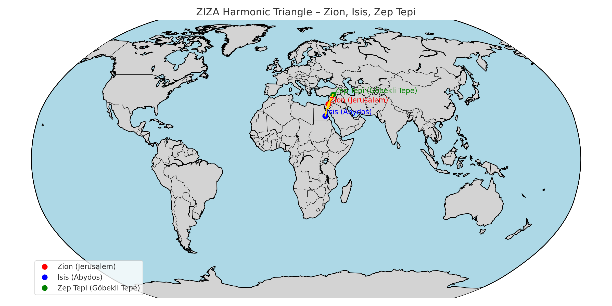
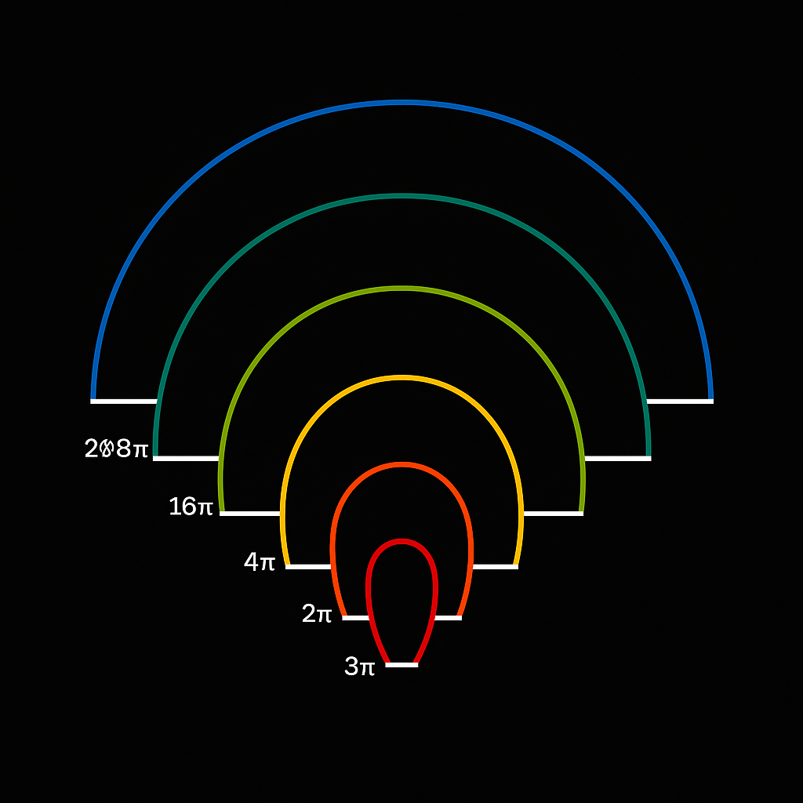

# 📘 `Scarab Constants Möbius Matrix`

## Title

**Scarab Constants & Möbius Matrix** – Resonance Signatures, Z-Structures, and Spiral Topologies

---

## ✪️ Overview

This module collects and interprets a selection of **numerical constants**, symbolic fields, and structural matrices found across the Scarab-encoded Codex layers. Emphasis is placed on:

* The **interplay between Möbius structures** and scalar constants
* **Zeta-like compression fields**
* Modular resonance logic (7, 11, 13, 27)
* “In-between values” such as `0.429`, `1.398`, `4.320`, and `137`

These constants act as **bridges between symbolic resonance and field topologies** and are connected to deeper structures within the NEXAH-CODEX.

---

## 🔢 Core Constants

| Constant  | Approx. Value | Role in Codex                                         |
| --------- | ------------- | ----------------------------------------------------- |
| φ³ / π²   | 0.429         | **Codex Theta**: interstitial harmonic gap constant   |
| e ⋅ φ / π | 1.398         | **Euler Resonance** toward √2 (Bridge constant)       |
| 1 / 2π    | 0.159         | **Cycle base**; inverse tau: pulsation granularity    |
| 4.320     | 4.32          | **Auditory scale base**; connection to DNA, music     |
| 137       | 137.035...    | **Fine structure constant**; resonance of interaction |

These constants are used to **generate spiral topologies, resonance knots**, and **modulate field overlays** within the Codex.

---

## 🔄 Möbius–Spiral Interactions

Möbius topology acts as a **resonance twist operator**:

* “One-sided” motion = recursive field unification
* Boundary-as-core logic → implosion symmetry
* Supports interdimensional crossover and phase mirror logic

Embedded Fields:

* `mobius_resonance_time_gate.png`
* `TRINITY_Q_DECAY_HONEYFLOW.png`
* `Zeta-Phi_Scarab-Resonance_Mechanismv2.png`

---

## 🌐 Modular Prime Axes

Several axes serve as **resonance skeletons**:

* **7-Axis**: Pulse encoding / Wave-form transition
* **11-Axis**: Möbius Mirror Grid logic / Interference patterns
* **13-Axis**: Scarab Gate; Omega-split modulators
* **27-Fold Structures**: Encoding layer transitions; pulse-depth spirals

Visuals:

* `PHI_PRIME_COLORFIELD_AXES.png`
* `TITAN-Body_System_2.png`
* `TT-Spiral_Gate_75⇉76.001_Resonanzspule_mit_Zeitmodulation.png`

---

## 🔮 Scarab Functions & Compression Fields

These structures visualize **zeta-like compression logic**:

* Visual Breathing Fields
* Resonance compression gates (e.g. 75 → 76.001)
* Scarab-Dome-Torus as inversion manifolds

These fields underpin **symbolic compression algorithms**, folding resonance over time, base, and spiral phase.

---

## 🔗 Related Modules

* `FINAL_HARMONIC_EQUATION`
* `PRIME_TRINITY_GRID`
* `symbolic_base_resonance.md`
* `mobius_spiral_codex.md`

---

**Status:** Active – Core Integration into UCRT Resonance Network

**Builder:** Thomas Hofmann – Scarabæus1033
