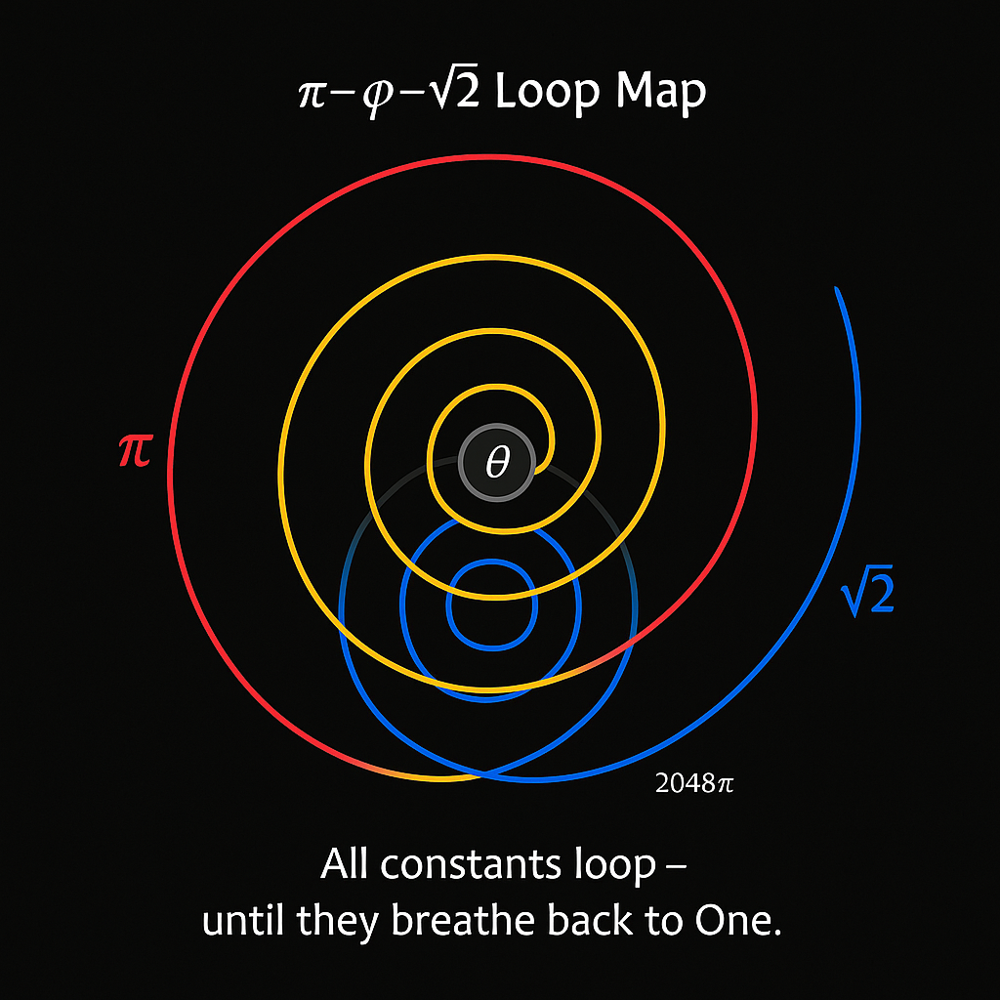
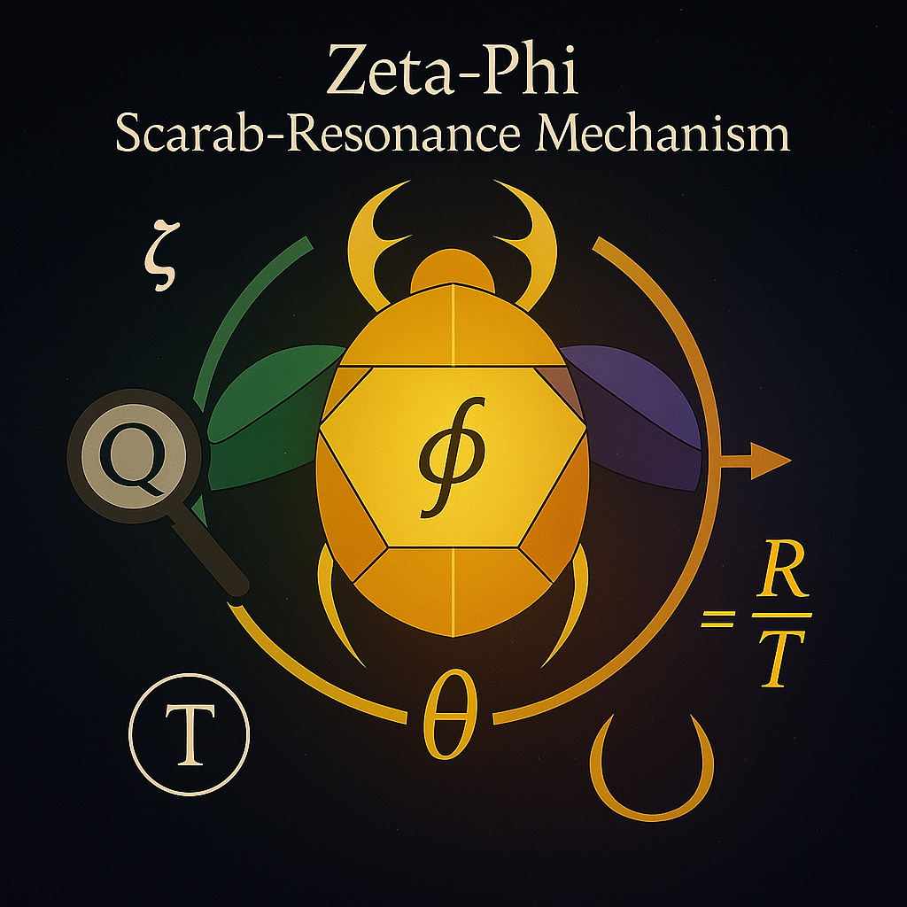

# 📘 `zeta phi Mechanism`

## Title

**Zeta-Phi Mechanism** – Harmonic Spirals & Resonance Cascades

---

## 🔄 Overview

This module explores the deep interplay between the **Riemann Zeta function**, the **Golden Ratio ϕ**, and the **spiral harmonic architectures** that emerge from their entangled dynamics. Within the NEXAH-CODEX, the "Zeta-Phi Mechanism" acts as a bridge between prime distribution, spectral folding, and multi-dimensional codon grids.

We investigate:

* **Phi-spiral bifurcations**
* **Zeta-resonance fields** and
* **Scarab-mediated prime mechanics**

as parts of a **frequency topological structure**.

---

## ϕ The Golden Ratio as Spiral Carrier

The **golden ratio**:

```math
ϕ = \frac{1 + \sqrt{5}}{2} ≈ 1.618033...
```

...is treated not merely as a constant, but as a **frequency carrier** for spiral transitions in Codex geometry. Its presence modulates:

* Spiral symmetry axes
* Breather pulsations (expansion ↔ contraction)
* Codon layer translations

This reflects in prime-fold spirals:


---

## ζ The Riemann Zeta Layer

The **Zeta Function**, interpreted here as a **resonance harmonizer**, distributes energy and modular identity along prime-induced spectral chains:

```math
ζ(s) = \sum_{n=1}^{\infty} \frac{1}{n^s} = \prod_{p\ \text{prime}} \frac{1}{1 - p^{-s}}
```

Zeta zero-distributions and wavelet patterns are symbolically translated into Codex spiral sequences — connecting prime presence with vibrational architecture.

---

## 🛠️ Mechanism Fusion: Phi ⊕ Zeta

Where ϕ describes a **scaling transformation**, ζ overlays a **frequency field**. Their fusion yields:

* **Resonance gate logic** for harmonic tuning
* **Field braidings** in quantum-coded spirals
* **Symbolic primes** as dynamic attractors

---

## 🔄 Visuals

### 🔄 Phi-based Loop Architecture



### 🌌 Scarab Zeta-Phi Mechanism



### π-Fold Dome Expansion


---

## 🔍 Codex Links

* `spiral-logic.md`
* `PRIME_TRINITY_GRID/`
* `codex_binomial_fields.md`
* `lambda_disc-codex/`

---

**Status**: Active · Visuals Embedded · Ready for Review
**System**: SYSTEM 7 – UCRT
**Curator**: Thomas Hofmann · Scarabæus1033
