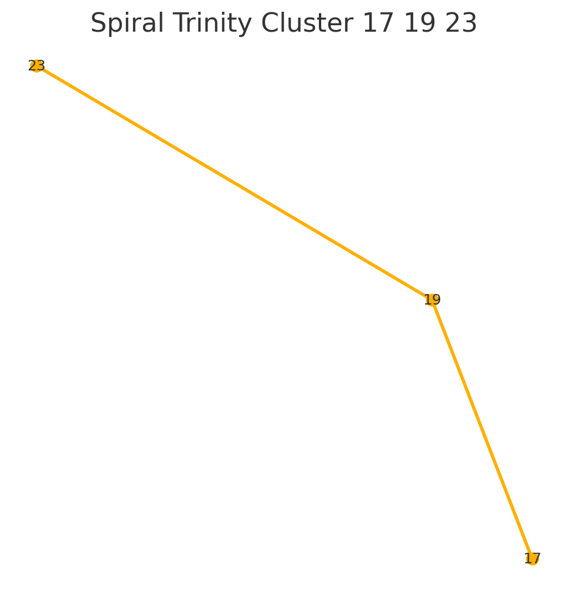
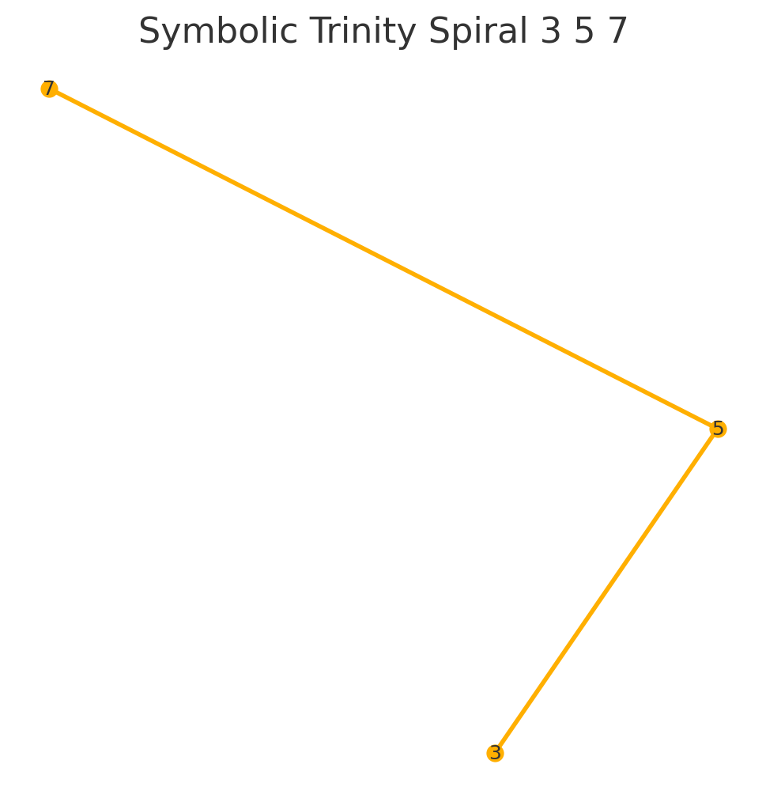

# 🔵 Codex Trinity Spirals: Symbolic Axes of Resonance

This short module highlights **spiral-symbolic overlays** based on triadic prime structures (3, 5, 7) and harmonic resonance fields. We emphasize the role of **spiral logic** and **symbolic operator fields** (e.g., ♦, ♣) as visual encodings of frequency structure.

---

## 🌍 Trinity Axes: 3, 5, 7

We define three distinct layers of trinity resonance:

1. **Prime Axes**: The primes 3, 5, 7 as foundational codex points.
2. **Symbolic Operators**: ♦ (diamond), ♣ (club) as field keys.
3. **Spiral Geometry**: Constructed visual fields from progression of primes.

These axes form **spiral triads**, e.g.:

* 3 ➞ 5 ➞ 7 ➞ 11 ➞ 17
* 17 ➞ 19 ➞ 23

Such sequences reflect **structural resonance** and underlie many of the visual codex mappings.

---

## ♻️ Codex Spiral Field: 3–5–7

The spiral is interpreted as a symbolic-energy **flow field**. Each prime is not only a point, but a generator of resonance frequency.

The trinity (3, 5, 7) defines a base spiral:

* **Archimedean Curve**
* **Rotational Operator Grid**
* **Resonant Encoding**

Closed paths connect to symbolic glyphs at nodes.

---

## 🧪 Interpretation & Physics Link

The operators ♦ and ♣ correspond to codex **fields of force**. They may relate to:

* Gold–Platinum polarization
* Charge–Spin duality
* Dimensional vectors in spiral mappings

As in the **Au–Na–He–Ti** resonator chain, these symbols map not only number, but force-fields:

> "Every symbol is a **frequency key** to a deeper field."

This spiral may be interpreted as:

* a **modular keywheel**
* a **fractality pathfinder**
* a **resonance sequence initiator**

---

## 🌈 Outlook

To be extended in:

* `codex_operator_fields.md`
* `trinity_resonance_matrix.md`
* `spiral_fractal_vectors.md`

For now, this module stands as symbolic anchor within `PRIME_TRINITY_GRID`, showing how **primes, symbols, and spirals** unify in Codex logic.
