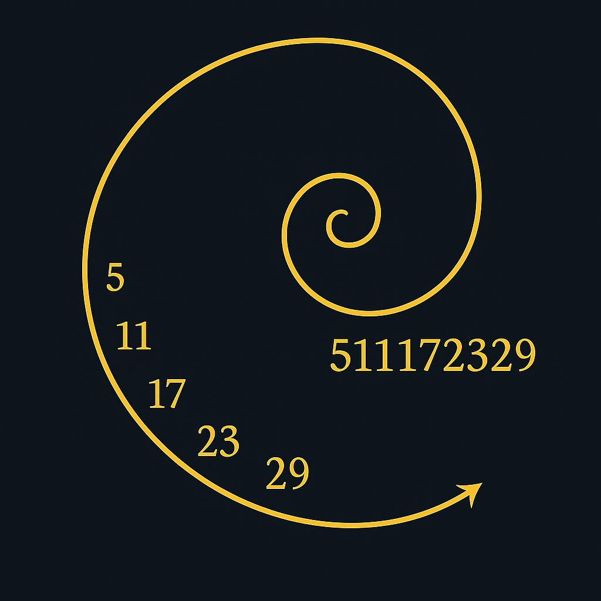
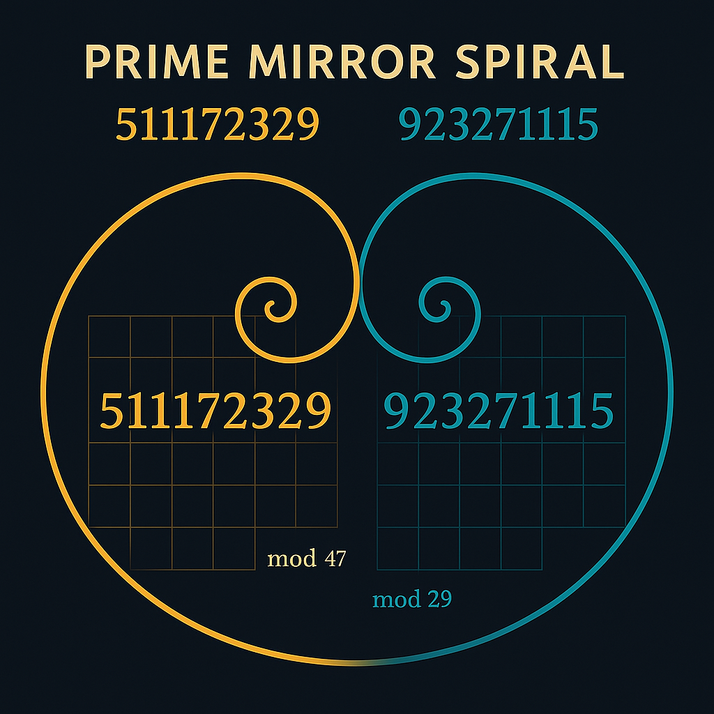

# PRIME TRINITY SNAKE – 511172329

A Codex Analysis of Prime Progressions, Resonance Numbers, and Mirror Structures

---

## 1. Introduction: The Serpent of Primes

We analyze a specific prime progression:

```
5, 11, 17, 23, 29
```

Concatenated into a singular resonance string:

```
511172329
```

This number acts as a **Codex Snake**: a layered field-resonance object formed by ordered primes. We examine its structure, modular echoes, mirrored twin (923271115), and embedded prime factors.

---

## 2. Primary Structure: Prime Progression Spiral

Visualizing the prime sequence as a spiral structure:



- **Nature**: strictly increasing sequence
- **Spacing**: constant difference of 6
- **Codex Class**: 6n + 5 Primes
- **Role**: harmonic serpent origin in Codex Grid

---

## 3. Prime Factors: Codex Decomposition

The number 511172329 has only two nontrivial prime factors:

```
47 * 10876007
```



- **47**: a Codex number (Resonance Mirror of 74)
- **10876007**: high-resonance field prime

This decomposition reveals a deep simplicity and harmonic echo, especially in connection with visual structures.

---

## 4. Mirror Snake: The Twin Resonance (923271115)

Reverse the original prime sequence to get:

```
923271115
```

Its factors:

```
5 * 13 * 29 * 489799
```

- Strong **multiprime factorization**
- Deep twin resonance with original
- Emergence of 29 in both sequences: a **prime anchor**

---

## 5. Base Decomposition: Modular Resonance Spaces

We evaluate both numbers in different base systems:

- **Binary**: wave complexity
- **Octal**: 3635757351
- **Duodecimal**: 1232353a1
- **Hexadecimal**: 1e77dee9

The spiral nature reveals modular zones and suggests the use of **mod 3-5-7 lattices**:


This enables visualization of prime behavior in compact resonance fields.

---

## 6. Resonant Grid: Euler–Lagrange Surface

We propose a harmonic lattice model based on these modular principles:


This grid model connects:

- Prime paths
- Residue classes
- Frequency modules

The snake coils along this topological surface.

---

## 7. Snake Reflection: Harmonic Folding

We perform resonance folding via axis symmetry around **7** (Codex Resonance Prime).

Third mirrored variant:

```
111579232
```

With factors:

```
2^5 * 397 * 8783
```

Again, simplicity emerges from complexity. These variants form a **Trinity Snake Field**: three prime-linked entities.

---

## 8. Codex Classification

This construct belongs to:

- **PRIME_TRINITY_GRID** (Codex Module)
- **SYSTEM 7**: UNIVERSAL RESONANCE FIELDS
- Uses resonance axes, base-space decompositions, visual modular surfaces

A synthetic result of:

- Prime concatenation
- Factor decomposition
- Modular grid modeling
- Symbolic reflection

---

## 9. Outlook: Toward the Trinity Resonance Grid

This module sets the stage for:

**`TRINITY_RES_GRID.md`**

Which will analyze:

- Snake triplets and base-mirrors
- Grid-space modularity
- Prime resonance chains across multiple Codex dimensions

> „The serpent does not crawl. It resonates.“

---

[Back to Module Overview](../README.md)
