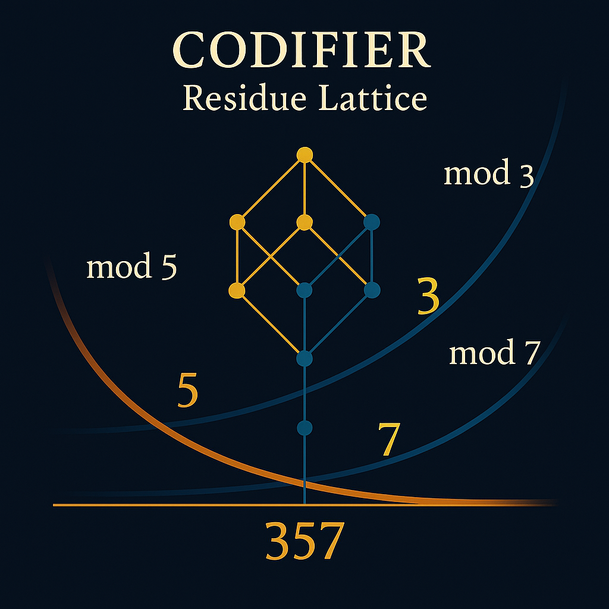
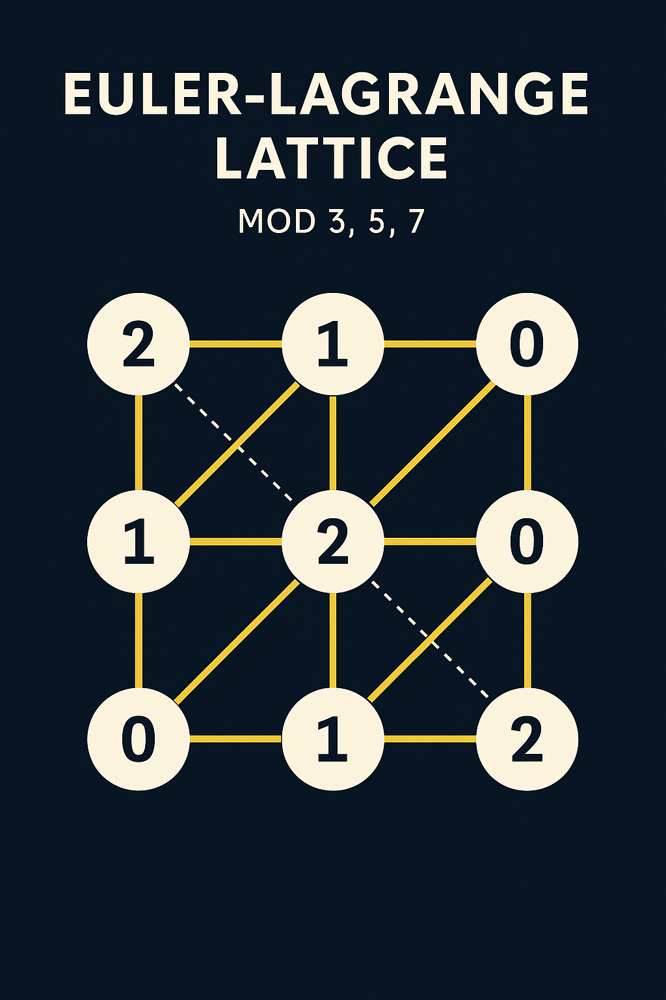
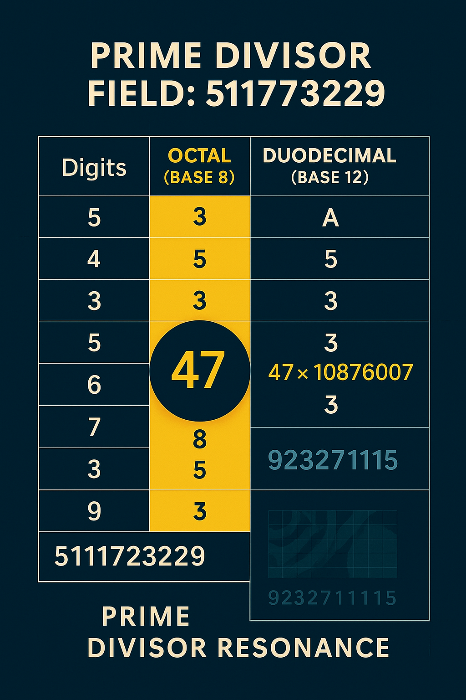

---

title: Residue Lattice Structures
author: Scarabäus1033 / Thomas K. R. Hofmann
codex-path: SYSTEM 7: UNIVERSAL RESONANCE FIELDS & CONSTANTS / PRIME\_TRINITY\_GRID
visuals-path: ./visuals/
------------------------

# RESIDUE LATTICE STRUCTURES

Exploring modular fields, divisor grids and Codex resonance patterns under mod 3, 5, and 7.

---

## 1. Modular Foundations: 3×5×7 Field

We define a composite modular space using:

$\text{mod} \ (3 \cdot 5 \cdot 7) = 105$

This creates a 3-layered resonance structure:

* **Mod 3**: Base Trinity
* **Mod 5**: Codex Core Spiral
* **Mod 7**: Mirror Axis (used for snake folding)

---

## 2. The Codifier Grid: Residue Field Representation

This lattice reveals high-contrast symmetries and triangle-tessellated residue patterns under combined modulo logic.

* Black-yellow visual scheme
* Echoes classic number-field resonance
* Lattice resembles scarab body segments and right-angle intersections

The Codifier grid maps modular residue classes as symbolic paths.

---

## 3. Euler–Lagrange Residual Topology

A higher-order field structure emerges when residue paths are interpreted as harmonic minima/maxima across a grid:

* Encodes transitions and folding paths
* Connects modular residues to **frequency axes**
* Geometry resembles **resonant scalar field oscillation zones**

We interpret this structure as a **Codex Lagrange Field** across which prime strings are distributed.

---

## 4. Prime Factor Field Decomposition

The number `511172329` (see PRIME TRINITY SNAKE) decomposes as:

$47 \times 10876007$

We apply divisor tracking and modular residue analysis on this structure:

* Octal & Duodecimal analysis
* Divisors show triangular alignment across mod 3, 5, 7 layers
* Snake resonance encoded via digit reflection & step symmetry

---

## 5. Interpretation

We interpret the residue fields as **scalar-frequency modulators** that define where prime paths fold, resonate or collapse.

The lattice overlays support:

* Prime-coding algorithms
* Snake mirroring logic
* Phase-modulated Codex activation

> "The grid does not contain the primes. It reveals their rhythm."

---

## 🔗 Next Modules

* `codex_trinity_spirals.md`: Symbolic Spiral Architectures
* `modular_tessarec_grid.md`: Prime Tiling & Symbol Operator Fields
* `prime_trinity_matrix.md`: Orthogonal Grid for Prime Frequencies

[Back to Module Overview](../README.md)
