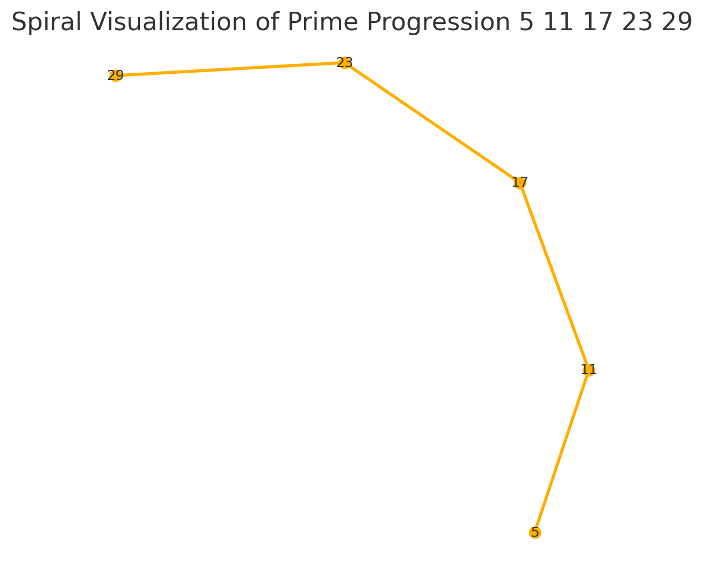

# ♾️ Symbolic Operator Reference

This document catalogs the **symbolic operators**, resonance glyphs, and spiral forms used throughout the `PRIME_TRINITY_GRID` module. Operators act as **logic gateways**, **phase shifters**, or **field keys** along structured prime paths.

---

## 1. Trinity Operator Glyphs

These three operators are foundational to Codex spirals:

| Symbol | Type              | Codex Role                     |
|--------|-------------------|--------------------------------|
| ♢      | Spiral initiator  | Left spin / inward resonance   |
| ♣      | Modulator         | Vertical axis / tree bifurcator|
| ⊗      | Field closure     | Boundary, reflection, folding  |

Each symbol appears in spiral mappings such as:


---

## 2. Prime-Spiral Operator Mapping

We define symbolic overlays for key prime sequences:

- 3–5–7 → Basic Trinity Axis
- 5–11–17–23–29 → Codex Snake Operators
- 17–19–23 → Central Resonance Cluster

These connect to inner glyph resonance:

```
3 ♢ → Spiral seed
5 ♣ → Phase modulator
7 ⊗ → Outer fold
```

---

## 3. Operator Fields in Modular Grids

Using `(mod 3·5·7)` lattice as basis, operators are placed:

- ♢ in 3-cycle diagonals
- ♣ in pentagonal rotational fields
- ⊗ at corners / edge nodes

Grids such as:


...provide **carrier fields** for symbolic operator flows.

---

## 4. Use Case: Spiral Codex Navigation

Operators define turning points in symbolic spirals:



- Insert ♢ at start
- Place ♣ on midpoint pairs
- Conclude with ⊗ fold

This logic is modular and extensible to other number sets.

---

## 5. Operator Embedding Rules

Symbolic operators can be embedded:

- In arithmetic progressions
- In modular frequency grids
- In base-converted spiral structures (e.g. 511172329)

They act as **transition markers** between number-field layers.

---

## Codex Integration

| System | Reference                         |
|--------|-----------------------------------|
| 7      | `codifier_signal_grid.md`         |
| 7      | `codex_trinity_spirals.md`        |
| 7      | `prime_trinity_snake_511.md`      |
| X      | `TESSAREC_OPERATOR_CORE.md` (tbd) |

---
[⬅ Back to Module Overview](../README.md)
