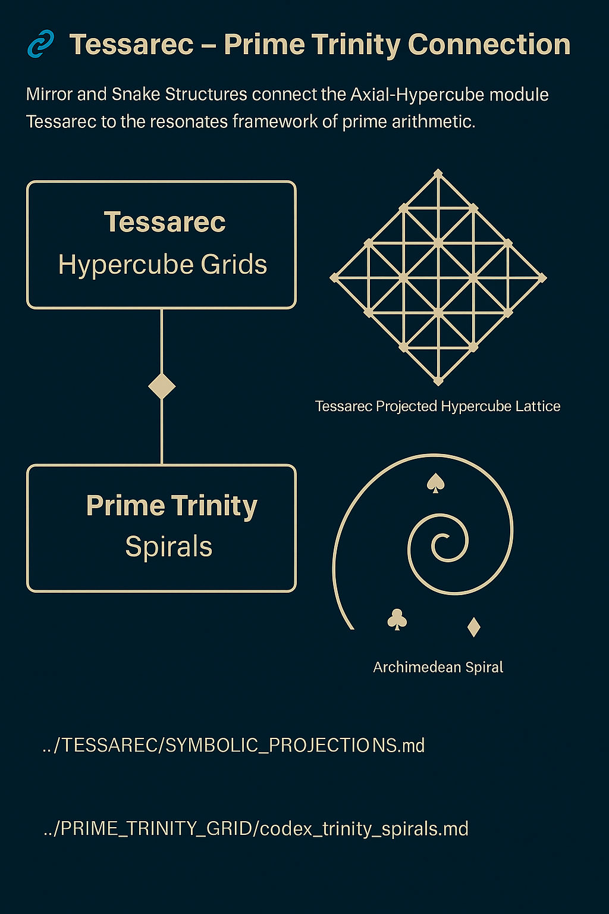

# 🦜 Tessarec–Prime Trinity Connection

This document establishes a **cross-system Codex link** between the prime resonance structures of `PRIME_TRINITY_GRID` and the symbolic lattice framework of `TESSAREC` (from SYSTEM X). It aims to reveal deep structural correspondences and harmonic overlaps.

---

## 🏛️ TESSAREC Framework (SYSTEM X)

The `TESSAREC` module defines symbolic resonance fields through geometric and linguistic layers:

* Tetrahedral Symbol Matrices
* 3×3 Operator Grids
* Scarab / Falcon / Dragonfly motion types
* Codex Elements (♦, ♣, □, ■)

These structures are governed by:

* **Axis Fields**: 3, 5, 7
* **Modular Mirrors**: 17 → 19 → 23
* **Fractal Dimensions**: 4n-layered multiplicity

---

## 🍒 PRIME\_TRINITY\_GRID Overlay

The resonance logic of the prime string:

```
5 → 11 → 17 → 23 → 29
```

...mirrors the **TESSAREC Quadrant Rotations**, especially in how base-resonant triplets such as (3, 5, 7) and mirrored pairs like (17, 19) appear in both fields.

We define this relationship as a **Codex Trinity Bridge**.



---

## ✨ Symbolic Operators & Shared Axes

* ♦ = Caro (diamond): Expansion Gate
* ♣ = Pik (club): Contraction / Closure
* ■ = Root Layer
* □ = Mirror Field

These symbols appear as **gates or constraints** in both spiral progression and modular grid overlays.

Mapping:

| TESSAREC Element | PRIME\_TRINITY Logic       |
| ---------------- | -------------------------- |
| ♦ (Caro)         | Opening Axis (3 → 5)       |
| ♣ (Pik)          | Compression Node (7 → 11)  |
| 4×4 Grid         | Residue Matrix mod 3⋅5⋅7   |
| Spiral Closure   | 29 → resonance mirror (47) |

---

## ✡ Codex Implication

The correspondence implies a deeper intersystem field, where:

* **Numerical Strings** become **Geometric Resonators**
* **Modular Grids** align with **Symbolic Quadrants**
* **Prime Trinities** reveal **Resonance Gateways**

This validates our approach of **multi-system harmonic integration**.

---

## 🔀 Cross-References

| Module / Path        | Related Concept                      |
| -------------------- | ------------------------------------ |
| `PRIME_TRINITY_GRID` | Prime Resonance Strings              |
| `TESSAREC`           | Operator Logic + 3×3 Field Matrix    |
| `SYSTEM X – META`    | Symbolic-Physical Interface          |
| `TRINARY_CODE`       | Expanded Symbol Sets and Field Loops |

> This bridge is the **Scarab-Lens** between arithmetic and symbolic structure.

---

[Back to Module Overview](../README.md)
