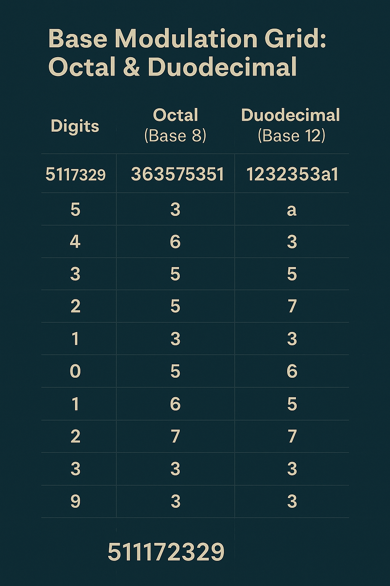

# 🧬 Trinity Resonance Matrix

## Overview

The **Trinity Resonance Matrix** organizes prime fields, symbolic structures, and modular axes into a unified resonance schema. It operates across base modulations, spiral dynamics, and visual logic overlays to construct a stable Codex Grid anchored in the trinitary primes 3, 5, and 7.

---

## 1. Prime Trinity Fields

Prime trios like `(3,5,7)` and `(17,19,23)` form the foundation for symbolic sequences and modular structures:

- 3 ↔ Initiator (Spiral Root)
- 5 ↔ Modulator (Middle Anchor)
- 7 ↔ Closure / Axis Fold

These roles are retained in:

- Spiral progressions
- Residue lattices
- Symbolic operator fields

Visual:


---

## 2. Spiral-Encoded Matrix Fields

The Codex uses spiral dynamics as a spatial framework. For example:

- `5 → 11 → 17 → 23 → 29` creates:

```text
    511172329
```

...a prime-trinity number sequence which becomes:

- Octal: 3635757351
- Duodecimal: 1232353a1

These feed into:



---

## 3. Grid Logic and Dimensional Planes

The Resonance Matrix organizes values in dimensions:

| Layer        | Structure               |
|--------------|--------------------------|
| Base Layer   | mod 3 · 5 · 7 lattice     |
| Phase Layer  | Prime spiral progression |
| Symbol Layer | Operator Glyph Fields    |
| Reflection   | Mirror Sequence Folding  |

See also:


---

## 4. Mirror and Dual Axes

Each prime structure has its mirrored twin. For `511172329`, the twin is:

```text
923271115
```

These align in Codex Resonance through:

- Composite reflection
- Divisor symmetry
- Spiral inversion

Visual:


---

## 5. Final Matrix Expression

Each Codex Trinity Resonance Matrix includes:

- **Numerical base values** (Octal / Duodecimal)
- **Trinity sequences**
- **Symbolic glyph overlays**
- **Spiral-encoded coordinates**

Matrix fields provide coordinate scaffolds for symbolic codex navigation.

---

## Related Modules

- `symbolic_operator_reference.md`
- `codifier_signal_grid.md`
- `prime_trinity_snake_511.md`

---
[⬅ Back to Module Overview](../README.md)
