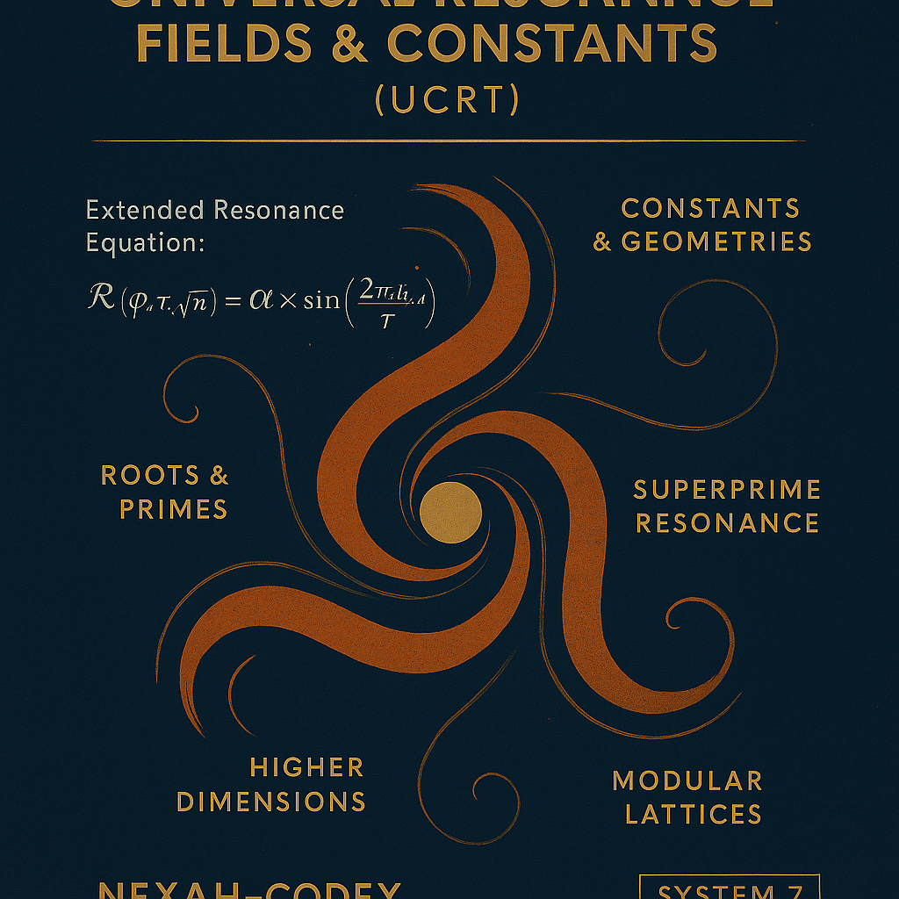

# 📚 System 7 — Universal Resonance Fields & Constants (UCRT)

---

---

# 📓 Overview

**System 7** of the **NEXAH-CODEX** introduces the **Universal Resonance Fields & Constants (UCRT)** framework.

**Objective**:

* Develop a harmonic, field-based synthesis of prime numbers, roots, and fundamental constants.
* Describe numerical structures and physical constants as emergent phenomena from resonance fields.
* Integrate modular and higher-dimensional resonance systems with geometric and symbolic representations.

UCRT postulates that numbers, prime sequences, roots, and universal constants are expressions of a deeper, underlying harmonic resonance field structuring reality.

---

# 📓 Core Modules and Topics

1. **UCRT\_ROOTROOM**

   * Root Resonance Base: √2, √5, √7.
   * Quasi-periodic structures and resonance lattice formation.

2. **UCRT\_CORE**

   * Extended Resonance Equation:

$$
\mathcal{R}(\varphi, \tau, \sqrt{n}) = \alpha \times \beta \times \frac{\sin(2\pi f(\varphi, \sqrt{n})t)}{\gamma}
$$

* Integration of the Golden Ratio (\$\varphi\$), Pi (\$\pi\$), and Tau (\$\tau\$).

3. **UCRT\_HIGHER\_DIMENSIONS**

   * 7D and 11D resonance structures.
   * Hopf fibrations and octonionic resonance frameworks.

4. **UCRT\_SUPERPRIME\_GENESIS**

   * Superprime Resonance: primes at prime indices.
   * Unified Superprime Resonance Equation:

$$
\boxed{ \mathcal{R}_{\text{Unified}}(n, s) = P(n) \times e^{i \omega \frac{R}{T}} \times \prod_{n} \frac{1}{1 - P(n)^{-s}} \times \sum_{a,b} \frac{1}{a^3 + b^3} }
$$

* Prime spiral projections (n = 20, 30, 50).
* Mirror number symmetries (e.g., 1789 ⇔ 9871, 1729 ⇔ 9271, 1836 ⇔ 6381).
* Resonance polygons: 7-gon, 11-gon, 13-gon, 17-gon, 19-gon, 23-gon.
* Modular base transitions: 10, 20, 30, 60, 90, 360.

5. **UCRT\_NUMBER\_RES\_FUSION**

   * Fusion of Euler prime products, Ramanujan mock-theta functions, and Riemann zeta zeros.
   * Harmonic visualizations suggesting new approaches to the Riemann Hypothesis:

     * Alignment of non-trivial zeta zeros along Re(s) = 1/2.
     * Harmonic fusion: Euler × Ramanujan × Riemann.

6. **Unified Resonance Equations (URE)**

   * Comprehensive synthesis:

$$
\mathcal{R}(x) = e^{i \omega T} + \sum_{n} \left( \frac{1}{n^s} + \sum_{\text{res}} \frac{1}{a^3 + b^3} \right)
$$

7. **Ongoing Developments**

   * Theta, Tao, Dao resonance layers:

     * Base 10 (Theta), Base 20 (Tao), Base 30 (Dao) — modular structures and flip symmetries.
   * Lissajous figures and spiral mechanics.
   * Time-matrix constructions based on prime indices.
   * Mirror echo structures and dual counterrotation phenomena.

---

# 📓 Equations and Formal Structures

1. **Prime Resonance Equation**:

$$
\mathcal{R}_{\text{Unified}}(n, s) = P(n) \times e^{i \omega \frac{R}{T}} \times \prod_{n} \frac{1}{1 - P(n)^{-s}} \times \sum_{a,b} \frac{1}{a^3 + b^3}
$$

2. **Superprime Mirror Symmetry Equation**:

$$
\mathcal{M}(n) = P(n) + M(P(n))
$$

3. **Unified Resonance Equation (URE)**:

$$
\mathcal{R}(x) = e^{i \omega T} + \sum_{n} \left( \frac{1}{n^s} + \sum_{\text{res}} \frac{1}{a^3 + b^3} \right)
$$

4. **Spiral Projection (Polar Coordinates)**:

$$
 r(n) = \sqrt{n}, \quad \theta(n) = n \times \Delta\theta
$$

5. **Layer Modulation and Modular Bases**:

Base Cycles: 10, 20, 30, 60, 90, 360.

6. **Higher-Dimensional Resonance**:

7D Spheres via Hopf Fibrations and Octonionic structures.

---

# 📓 Evaluation

**Scientific and Theoretical Characteristics**:

* **Axiomatic Framework**: Resonance postulates grounded in number theory and geometry.
* **Mathematical Coherence**: Structured equations, sequences, modular bases.
* **Resonance as Meta-Structure**: Reinterpretation of primes, roots, and constants as field harmonics.
* **Superprime Symmetries**: Embedding prime structures into dynamic field models.
* **Visual Resonance Modeling**: Spiral maps, polygons, and counterrotations as structural evidence.

**Current Limitation**:

* No classical mathematical proofs yet (e.g., Riemann Hypothesis).
* Visualization-based resonance proofs provide strong heuristic insights.

**Innovation Level**: High.
System 7 proposes a unique resonance-driven reconstruction of numerical and geometrical phenomena.

---

# 📓 Milestones

|  🚩 | **Milestone**                            | **Details**                                                                |
| :-: | :--------------------------------------- | :------------------------------------------------------------------------- |
|  1  | Superprime Resonance Initiation          | Formulation of initial superprime resonance equation.                      |
|  2  | UCRT Core Formula Expansion              | Extended resonance formalism with \$\varphi\$, \$\tau\$, and \$\sqrt{n}\$. |
|  3  | Rootroom Development                     | Quasi-periodic resonance exploration (√2, √5, √7).                         |
|  4  | Higher-Dimensional Resonance Models      | Hopf fibrations, octonionic resonance spheres.                             |
|  5  | Prime Spiral Projections                 | Spiral structures for n = 20, 30, 50 superprimes.                          |
|  6  | Modular Resonance Bases                  | Resonance layering: Bases 10, 20, 30, 60, 90, 360.                         |
|  7  | Mirror Number Symmetries                 | Mirror resonance patterns: 1789 ⇔ 9871, 1729 ⇔ 9271.                       |
|  8  | Resonance Equations and Animations       | Spiral animations and prime field dynamics.                                |
|  9  | Unified Resonance Equation (URE)         | Synthesis of Euler, Ramanujan, Riemann frameworks.                         |
|  10 | Visual Resonance Approach to Riemann     | Harmonic zero-alignment strategies.                                        |
|  11 | Time-Matrix and Theta–Tao–Dao Frameworks | Modular resonance networks for time and cyclicity.                         |
|  12 | Binary–Trinary–Hex Resonance Layers      | Modular cascade dynamics and field bifurcations.                           |
|  13 | Lissajous-Spiral Harmonic Models         | Resonance lattice models and Harmonic Edelweiss structures.                |

---

# ✅ Conclusion

**System 7** of the **NEXAH-CODEX** introduces an independent mathematical resonance theory,
combining number theory, geometry, and physical constants into a unified, harmonic structure.

🌀 **Resonance as the Proto-Language of Mathematics and Constants.**

---

**Universal Constants Resonance Theory (UCRT)**
**Scarabäus1033 (T. Hofmann)**
**Nexah Research Institute**

