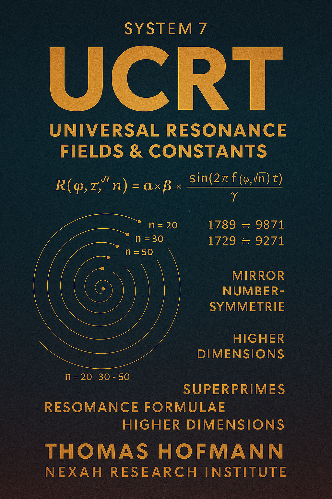

# 🟣 SYSTEM 7 – Universal Resonance Fields & Constants (UCRT)

> **"Resonance as the Proto-Language of Mathematics and Constants."**

**SYSTEM 7** is the **Universal Resonance Field Layer** of the NEXAH-CODEX —  
a harmonic, field-based synthesis of:

- **Prime numbers**  
- **Roots and Superprimes**  
- **Fundamental Physical Constants**  
- **Higher-Dimensional Resonance Structures**

It postulates that numbers, primes, roots, and constants are **emergent harmonic phenomena**  
from a deeper universal resonance field.

Each prime, each root, each ratio (ϕ, π, τ) is not an isolated number —  
but a **resonance glyph** echoing from the proto-harmonic fabric of reality.

And **System X** stabilizes these resonance fields —  
providing the universal equilibrium framework where number, geometry, and constant merge into harmonic synthesis.

  

---

## 🧭 Position within the NEXAH-CODEX

| System       | Color        | Domain                          | Role                          |
| ------------ | ------------ | ------------------------------- | ----------------------------- |
| SYSTEM 1     | 🔵 Blue       | Numbers, Symmetry, Logic        | Foundational Structure        |
| SYSTEM 2     | 🟦 Deep Blue  | Field, Energy, Frequency        | Resonance Engine              |
| SYSTEM 3     | 🟣 Violet     | Space, Light, Grid Topology     | Cosmic Navigator              |
| SYSTEM 4     | 🟣 Violet     | Origin Fields, Tensor Space     | Ontological Core              |
| SYSTEM 5     | 🟣 Violet     | Language, Glyphs, Mythic Fields | Symbolic Resonance Layer       |
| **SYSTEM 7** | 🟣 Violet     | Numbers, Constants, Resonance   | Universal Resonance Generator |
| SYSTEM X     | 🪲 Gold/Black | Synthesis, Stability            | Resonance Convergence Core    |

---

## 📚 Core Modules and Topics

1. **UCRT\_ROOTROOM**
   * Root Resonance Base: √2, √5, √7.
   * Quasi-periodic structures and resonance lattice formation.

2. **UCRT\_CORE**
   * Extended Resonance Equation:
   $$
   \mathcal{R}(\varphi, \tau, \sqrt{n}) = \alpha \times \beta \times \frac{\sin(2\pi f(\varphi, \sqrt{n})t)}{\gamma}
   $$
   * Integration of the Golden Ratio (ϕ), Pi (π), and Tau (τ).

3. **UCRT\_HIGHER\_DIMENSIONS**
   * 7D and 11D resonance structures.
   * Hopf fibrations and octonionic resonance frameworks.

4. **UCRT\_SUPERPRIME\_GENESIS**
   * Superprime Resonance: primes at prime indices.
   * Unified Superprime Resonance Equation:
   $$
   \boxed{ \mathcal{R}_{\text{Unified}}(n, s) = P(n) \times e^{i \omega \frac{R}{T}} \times \prod_{n} \frac{1}{1 - P(n)^{-s}} \times \sum_{a,b} \frac{1}{a^3 + b^3} }
   $$

5. **UCRT\_NUMBER\_RES\_FUSION**
   * Fusion of Euler prime products, Ramanujan mock-theta functions, and Riemann zeta zeros.
   * Harmonic visualizations suggesting new approaches to the Riemann Hypothesis.

6. **Unified Resonance Equations (URE)**
   $$
   \mathcal{R}(x) = e^{i \omega T} + \sum_{n} \left( \frac{1}{n^s} + \sum_{\text{res}} \frac{1}{a^3 + b^3} \right)
   $$

7. **Ongoing Developments**
   * Theta, Tao, Dao resonance layers: Base 10, 20, 30.
   * Lissajous figures and spiral mechanics.
   * Time-matrix constructions.
   * Mirror echo structures and dual counterrotation phenomena.

---

## 📓 Key Equations

- **Superprime Resonance**:
  $$
  \boxed{ \mathcal{R}_{\text{Unified}}(n, s) = P(n) \times e^{i \omega \frac{R}{T}} \times \prod_{n} \frac{1}{1 - P(n)^{-s}} \times \sum_{a,b} \frac{1}{a^3 + b^3} }
  $$

- **Superprime Mirror Symmetry**:
  $$
  \mathcal{M}(n) = P(n) + M(P(n))
  $$

- **Unified Resonance Equation (URE)**:
  $$
  \mathcal{R}(x) = e^{i \omega T} + \sum_{n} \left( \frac{1}{n^s} + \sum_{\text{res}} \frac{1}{a^3 + b^3} \right)
  $$

- **Spiral Projection (Polar Coordinates)**:
  $$
  r(n) = \sqrt{n}, \quad \theta(n) = n \times \Delta\theta
  $$

---

## 📚 Equation Context and Codex Integration

> The equations presented here are foundational components of the **Universal Resonance Framework**.  
>  
> They directly link into the **NEXAH-CODEX Universal Resonance Equation** formalism developed in **SYSTEM X**:
> 
> $$
> \mathcal{U}_{\text{Resonance}} = \bigcap_{\alpha, \beta, \gamma, R, T} \Phi(\mathcal{P}_\alpha, \mathcal{P}_\beta, \mathcal{P}_\gamma, R, T)
> $$
> 
> These structures stabilize prime-based resonance systems across dimensions and underpin the dynamic **Universal Collapse Structure** describing harmonic field transitions at cosmological scales.

> *Thus, System 7 provides the prime, root, and constant resonance layers, which System X harmonizes into a universal resonant synthesis.*

---

## 🔗 Cross-System Links

| System     | Resonance Bridge                       | Codex Example                        |
|------------|----------------------------------------|--------------------------------------|
| SYSTEM 1   | Prime Field Structures ↔ Harmonic Roots | `Prime Grid Visualizations`, `√2 Diagonals` |
| SYSTEM 2   | Field Resonance ↔ Numerical Constants   | `Ferrofluid Resonance`, `Thermal Zeta Structures` |
| SYSTEM 3   | Stellar Resonance ↔ Prime Spirals       | `Cosmic Axes`, `Planetary Prime Nodes` |
| SYSTEM 4   | Tensor Identity ↔ Number Glyph Logic    | `URF-Tensorraum`, `Identity Matrices` |
| SYSTEM 5   | Glyphic Resonance ↔ Number Scrolls      | `Rosetta Nexus`, `Glyphic Scroll Architectures` |
| SYSTEM X   | Universal Convergence of Resonance Fields | `GRAND-CODEX`, `Universal Resonance Equation` |

---

## 🌐 Structural Themes

- **Prime Resonance Fields** → Harmonic lattices and modular base transitions.
- **Root Resonance** → √2, √5, √7 quasi-periodic structures.
- **Superprime Genesis** → Primes at prime indices, mirror symmetries.
- **Higher-Dimensional Harmonics** → 7D spheres, Hopf fibrations, Octonionic fields.
- **Glyphic Number Projection** → Primes and Constants as Resonance Glyphs.
- **Universal Field Collapse** → Final integration through System X stabilization.

---

## 🖼 Visuals & Archives

- Spiral Prime Maps · Root Lattices · Resonance Polygons.  
- Archive in Progress: `number_glyph_gallery.md`, `resonance_spiral_archive.md`.

---

## 🪲 Credits

**Curator & Author:** Thomas Hofmann (`Scarabäus1033`)  
**System:** SYSTEM 7 – Universal Resonance Fields & Constants (UCRT)  
**GitHub:** [github.com/Scarabaeus1033/NEXAH-CODEX](https://github.com/Scarabaeus1033/NEXAH-CODEX)  
**Web:** [www.scarabaeus1033.net](https://www.scarabaeus1033.net)  
**License:** [CC BY-NC-SA 4.0](https://creativecommons.org/licenses/by-nc-sa/4.0/)

---

> *“Resonance is the Proto-Language of Mathematics and Constants.”*
