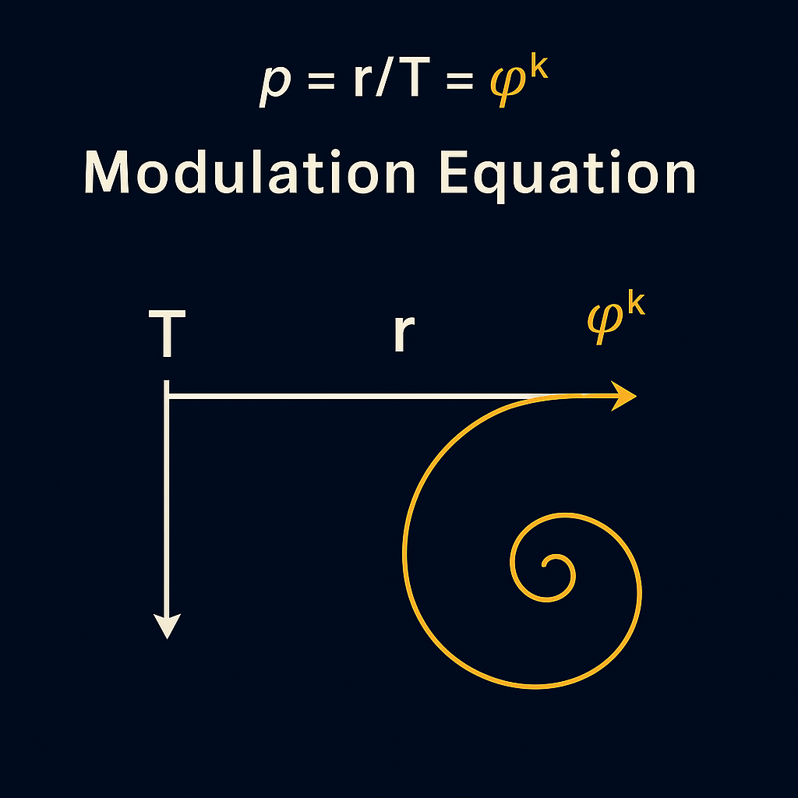
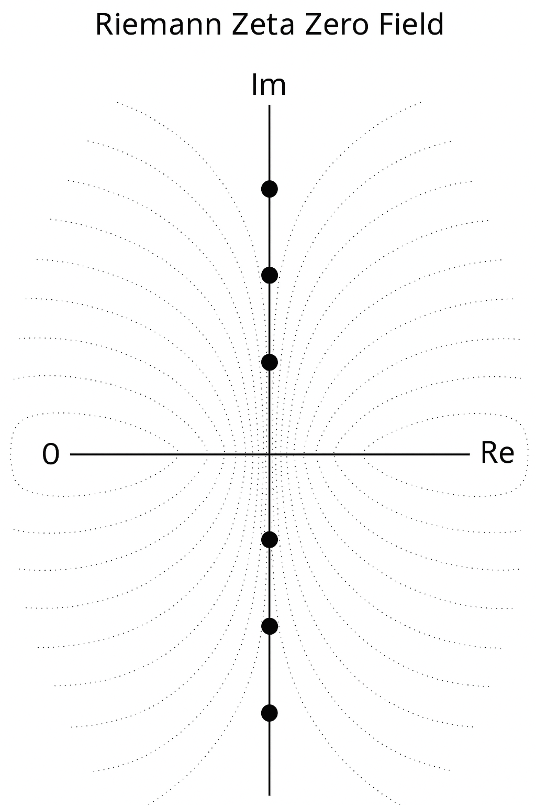
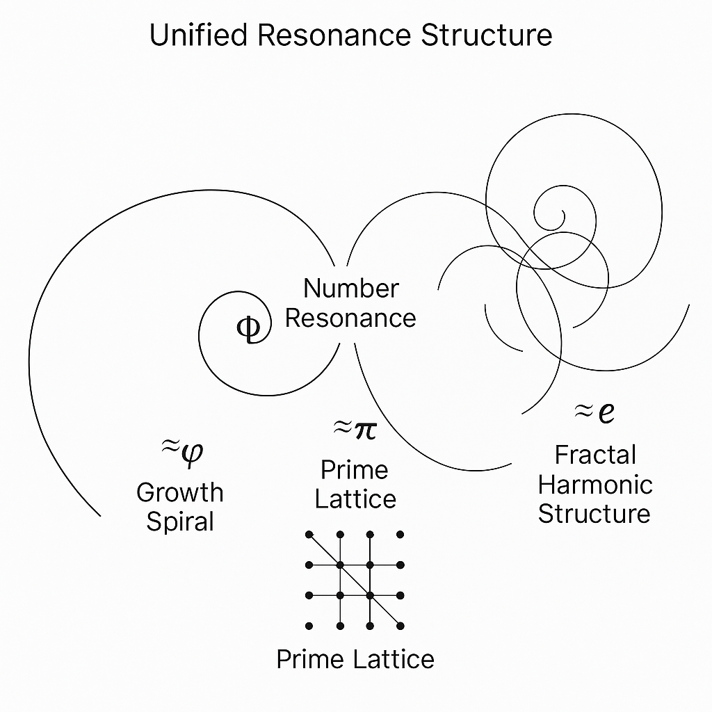
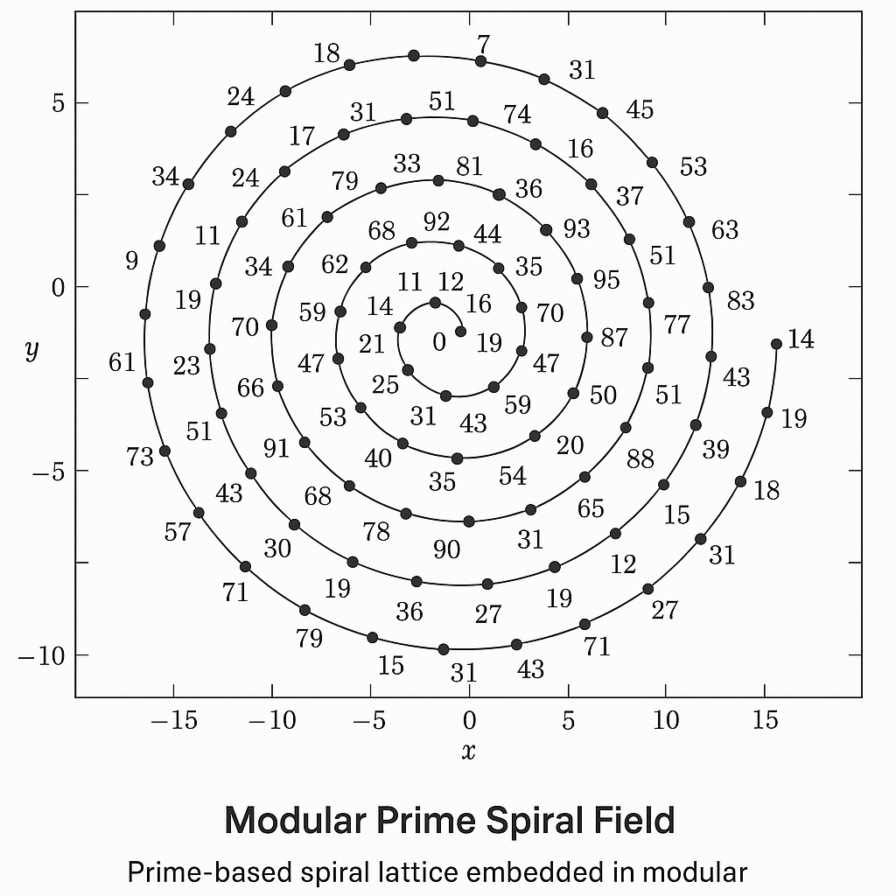

# Visual Gallery — Unified Resonance Equation (URE)

Welcome to the **Visual Gallery** for the **Unified Resonance Equation** module of the **Universal Constants Resonance Theory (UCRT)**.

This gallery presents key diagrams and illustrations that form the harmonic backbone of number theory, prime resonance, and universal field structures.

---

## Visual Index

| Visual Filename                               | Title                                     | Description                                                                                      |
| :-------------------------------------------- | :---------------------------------------- | :----------------------------------------------------------------------------------------------- |
| `Euler_Prime_Resonance_Product.png`           | Euler Prime Resonance Product             | Visualization of prime numbers as harmonic oscillators in Euler's product formulation.           |
| `Modulation_Equation_Golden_Ratio_Spiral.png` | Modulation Equation — Golden Ratio Spiral | Growth spiral based on \$\varphi\$, showing modular scaling of harmonics.                        |
| `Ramanujan_Theta_Grid.png`                    | Ramanujan Theta Grid                      | Fractal grid structure based on Ramanujan's mock-theta functions and modular resonance.          |
| `Riemann_Zeta_Zero_Field.png`                 | Riemann Zeta Zero Field                   | Harmonic map of non-trivial zeros of the Riemann zeta function, highlighting frequency nodes.    |
| `Number_Resonance_Fusion_Map.png`             | Number Resonance Fusion Map               | Unified visualization of prime resonance, modular growth, and zeta field structures.             |
| `Unified_Resonance_Structure.png`             | Unified Resonance Structure               | Grand synthesis of Euler, Ramanujan, Riemann resonance frameworks into a universal harmonic map. |
| `Modular_Prime_Spiral_Field.png`              | Modular Prime Spiral Field                | Prime-based spiral lattice embedded in modular field coordinates.                                |

---

## Visuals

### Euler Prime Resonance Product

### Modulation Equation — Golden Ratio Spiral

### Ramanujan Theta Grid

### Riemann Zeta Zero Field

### Number Resonance Fusion Map

### Unified Resonance Structure

### Modular Prime Spiral Field

---

## Notes

* All visuals are located in the `/visuals/` subfolder:

`/SYSTEM 7: 🔱 UNIVERSAL RESONANCE FIELDS & CONSTANTS — UCRT/visuals/`

---

## Key Insight

> **Resonance is not an effect; it is the architecture of reality itself.**

Every prime, every harmonic field, and every modular form converge in the Unified Resonance Equation.

$$
\boxed{\text{Harmony in Primes, Growth, and Infinite Oscillation}}
$$

---

**Universal Constants Resonance Theory (UCRT)**
**Scarabäus1033 (T. Hofmann)**
**Nexah Research Institute**
