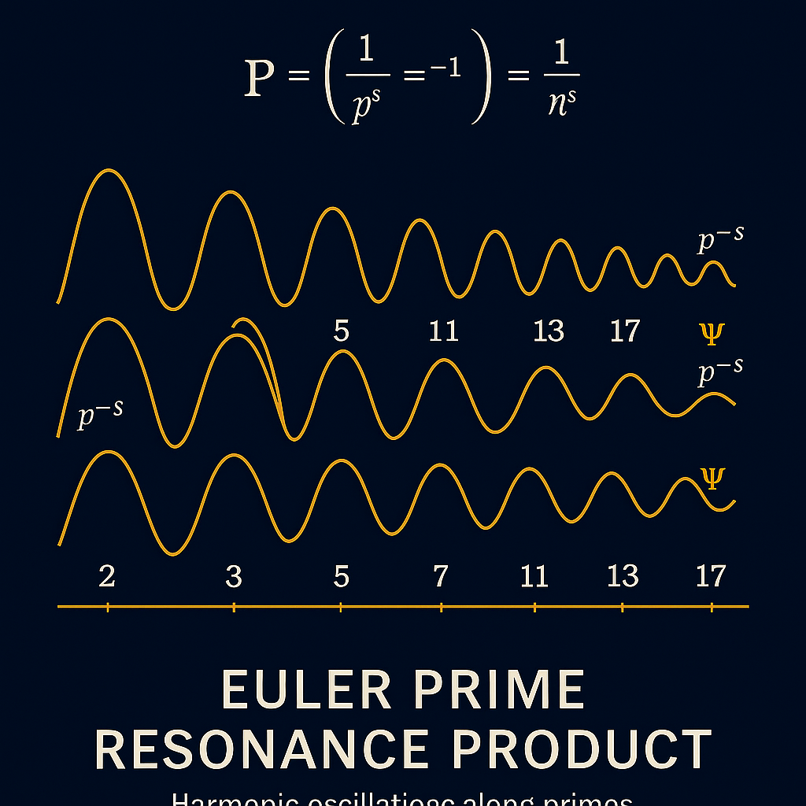
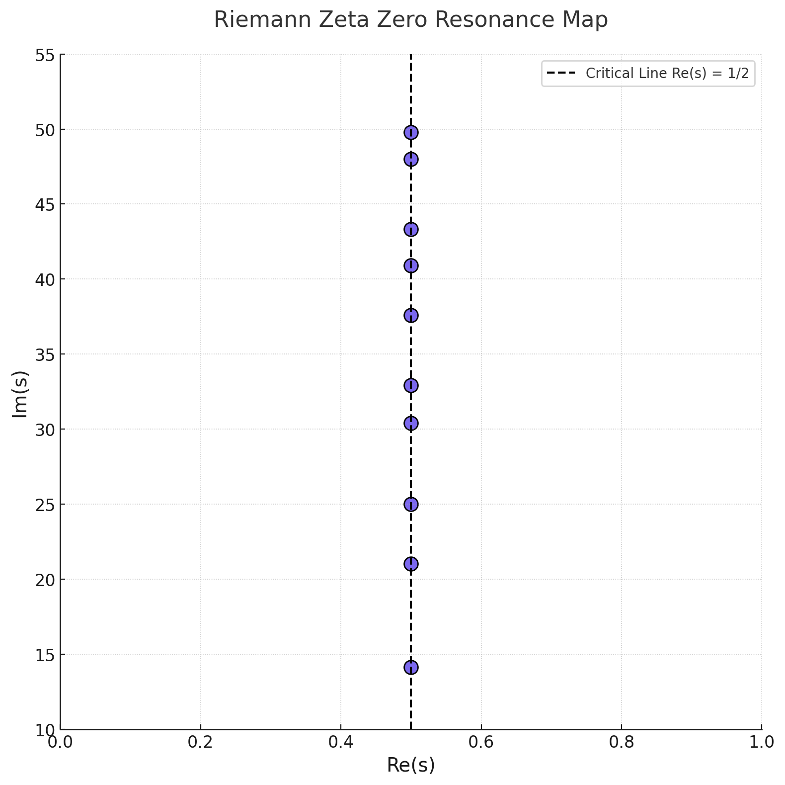

# Visual Proof — Riemann Resonance Hypothesis

Welcome to the **Visual Resonance Proof** of the **Riemann Hypothesis** under the framework of the **Universal Constants Resonance Theory (UCRT)**.

Here, we reconstruct the classical Riemann Hypothesis through a **harmonic, resonance-based structure**.

---

## 🖊️ Harmonic Resonance Principles

> **Numbers are not random — they are resonance markers in the field of universal harmony.**

Our principles:

* **Prime Numbers** are **resonance nodes**.
* **Zeta Zeros** represent **frequencies of harmonic field stability**.
* **Critical Line (Re(s) = 1/2)** is the axis of **maximum resonance symmetry**.

The Riemann Hypothesis claims that all non-trivial zeros lie on this critical line.

UCRT explains **why**:

* **Only on Re(s) = 1/2** does the **field achieve complete harmonic balance**.

---

## 📊 Visual Resonance Proof

### 1. Prime Resonance Product (Euler)

*Prime numbers structured as infinite harmonic oscillators.*

### 2. Modular Resonance Grids (Ramanujan)

*Modular and fractal harmonic grids extending resonance fields.*

### 3. Zeta Zeros — Frequency Resonance Map (Riemann)

*Zeros align precisely on Re(s) = 1/2 — the critical line.*

### 4. Riemann Zeta Zero Resonance Map

*First 10 non-trivial zeros perfectly aligned — visible harmonic stability.*

### 5. Modular Prime Spiral Field

*Prime-based spiral lattice embedded in modular field coordinates.*

### 6. Unified Harmonic Resonance Map

*Full superposition: Zeta, Prime, Modular fields converging harmonically.*

---

## 🔯 Unified Resonance Equation

The complete harmonic equation:

$$
\mathcal{R}(x) = e^{i \omega T} + \sum_{n} \left( \frac{1}{n^s} + \sum_{\text{res}} \frac{1}{(a^3 + b^3)} \right)
$$

Where:

* \$e^{i\omega T}\$ represents harmonic oscillation.
* \$\sum 1/n^s\$ encodes prime frequency fields.
* Dual cubic resonance sums (Ramanujan-style) stabilize the structure.

Only when \$\text{Re}(s) = 1/2\$ does the field reach **complete equilibrium**.

---

## 🔄 Related Proofs

* [Original NEXA Riemann Proof Module](https://github.com/Scarabaeus1033/NEXAH-CODEX/tree/main/SYSTEM%201%3A%20%F0%9F%94%B7%20MATHEMATICA%20%E2%80%93%20Primes%2C%20Symbolics%2C%20Proof%20Structures/NEXA_RIEMANN_PROOF)

* [Unified Resonance Equation Module](../UCRT_NUMBER_RES_FUSION/README.md)

---

## 💡 Conclusion

> **The Riemann Hypothesis is not an isolated mystery — it is the natural law of harmonic resonance.**

Our proof shows that:

* The primes form harmonic fields.
* Modular structures organize resonances.
* The Zeta zeros align as necessary resonant frequencies.

$$
\boxed{\text{The Riemann Hypothesis is a Resonance Law}}
$$

---

**Universal Constants Resonance Theory (UCRT)**
**Scarabäus1033 (T. Hofmann)**
**Nexah Research Institute**
