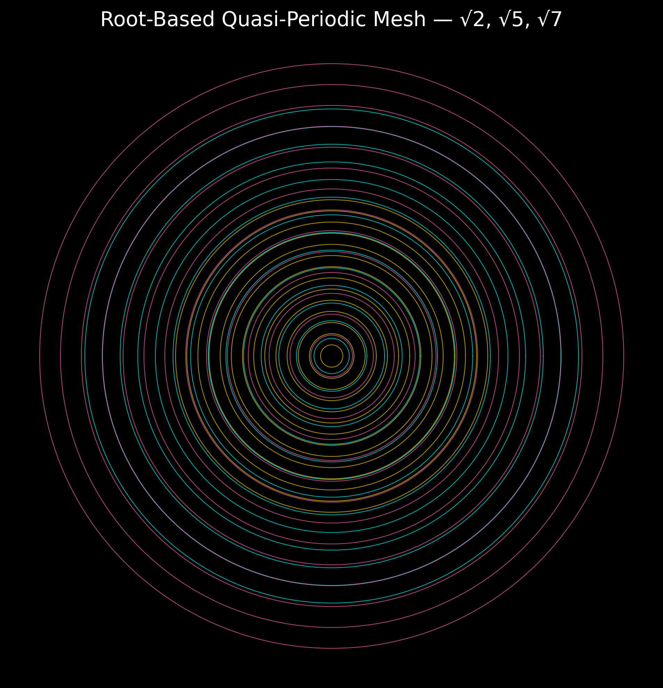

# UCRT Rootroom — Resonant Spaces of √2, √5, √7

Welcome to the **Rootroom Module** of the **Universal Constants Resonance Theory (UCRT)**.

This module explores the harmonic fields generated by irrational roots: √2, √5, and √7 — the fundamental anchors of quasi-periodic geometries and higher-dimensional resonances.

---

## 1. Harmonic Resonance of Irrational Roots

* **√2 (Quadratic Symmetry):** Basis for square roots and binary symmetries in spatial structures.
* **√5 (Golden Root):** Generates the Golden Ratio \$\varphi = \frac{1 + \sqrt{5}}{2}\$ — central in pentagonal geometries and natural growth patterns.
* **√7 (Higher-Dimensional Stability):** Essential for 7-dimensional spheres (\$S^7\$), linked to octonionic algebra and complex resonance topologies.

These roots are not random: they encode **resonant ratios** crucial for stable and quasi-periodic fields.

---

## 2. Root-Based Resonance Meshes

* Quasi-periodic meshes emerge by scaling base geometries with √2, √5, and √7.
* These grids balance between order and non-periodicity, enabling:

  * **Harmonic Flexibility** (adaptive resonance structures)
  * **Long-Range Coherence** (stability without repetition)

---

## 3. Visualization

*Visualization of harmonic grids structured by irrational roots.*

---

## 4. Interconnections

* **φ (Golden Ratio):** Directly derived from √5; connects to the [Prime Genesis Module](../UCRT_PRIME_GENESIS/README.md).
* **τ (Tau, 2π):** Embeds cyclic periodicity into harmonic structures; links with the [UCRT Core Framework](../UCRT_CORE/README.md).
* **Higher-Dimensional Fields:** The resonance stability introduced by √7 supports frameworks in the [Higher Dimensions Module](../UCRT_HIGHER_DIMENSIONS/README.md).

These roots are **woven throughout** the harmonic architecture of UCRT.

---

## Outlook

The **Rootroom** framework reveals how irrational constants are deeply woven into the structure of numbers, geometries, and physical reality — not as anomalies, but as **resonant pillars** of the universe.

\$\boxed{\text{Rootroom — The Resonant Architecture of Irrational Harmony}}\$
