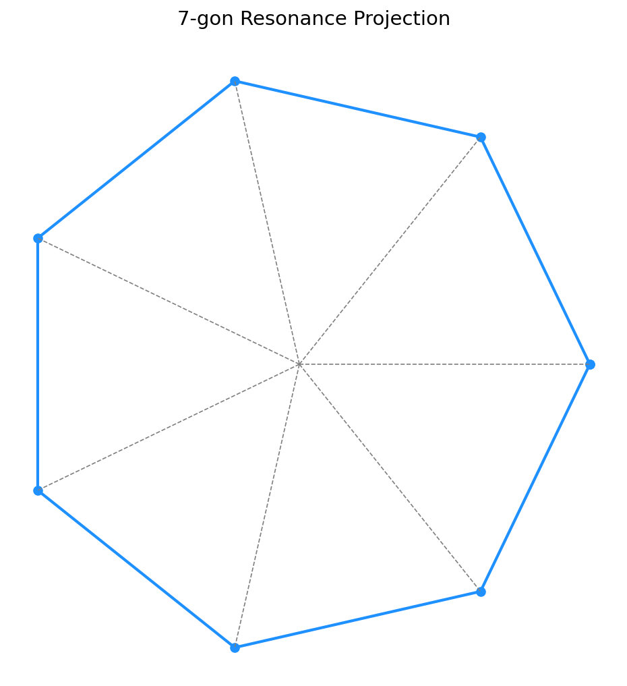

# 🔷 Harmonic Field Structures — Polygonal Resonance Grids

**Module**: UCRT Superprime Genesis  
**Part of**: System 7: 🔱 Universal Resonance Fields & Constants — UCRT

---

## 🌐 Overview

In this section, we uncover the **polygonal structures** emerging from prime and superprime distributions, revealing hidden **harmonic fields** embedded within prime sequences.

By analyzing rotational symmetries and resonance grids, we observe how **heptagons (7-gon)**, **hendecagons (11-gon)**, **triskaidecagons (13-gon)**, and **heptadecagons (17-gon)** arise naturally from superprime mappings.

---

## 📐 Polygonal Structures and Primes

### **7-Gon — Heptagonal Resonance**

- Anchored at prime indices 7, 17, 23, 29.
- Related to **mod-7** symmetry and 7D harmonics.
- Fundamental in harmonic cycles (musical scale, 7 tones).

**Visual**:  
📷  *(Placeholder — to be generated)*

---

### **11-Gon — Hendecagonal Resonance**

- Prime positions 11, 31, 41.
- 11-fold symmetry related to **resonance phase shifts**.
- Connects prime elevation with time-matrix alignments.

**Visual**:  
📷  *(Placeholder — to be generated)*

---

### **13-Gon — Triskaidecagonal Resonance**

- Prime axes: 13, 41, 67.
- Important for 13-dimensional space folding.
- Crucial in cosmological number theory and topological structures.

**Visual**:  
📷  *(Placeholder — to be generated)*

---

### **17-Gon — Heptadecagonal Resonance**

- Prime indices: 17, 59, 113.
- 17-fold symmetry, famously related to Fermat primes.
- Appears in high-dimensional harmonic field models.

**Visual**:  
📷  *(Placeholder — to be generated)*

---

## 🌀 Projection Methodology

Using **polar coordinates** $(r, \theta)$:

$$
r_n = \sqrt{P(n)}, \quad \theta_n = 2\pi \frac{n}{k}
$$

Where:

- $P(n)$ = Prime at index $n$.
- $k$ = Number of polygon sides (7, 11, 13, 17).

This generates **equiangular point sets** forming **approximate regular polygons** in resonance space.

---

## 🔄 Clockwise and Counterclockwise Rotations

- **Clockwise** sequences map prime expansion fields (proton stabilization).
- **Counterclockwise** sequences trace memory and neutrino fields (resonance contraction).
- Dual flows form **dynamic polygons** spinning in opposite directions.

---

## 🧩 Polygonal Intersections

Where multiple polygons overlap:

- **Interference nodes** arise.
- Correspond to **superprime cross points** and **resonance hubs**.
- Crucial for higher-order resonance (harmonic unification layers).

---

## 📚 Visual Overview

Planned Visuals for this Section:

| Visual                                  | Status      |
| :-------------------------------------- | :---------- |
| 7-Gon Resonance Projection              | 🚧 To be created |
| 11-Gon Resonance Mapping                | 🚧 To be created |
| 13-Gon Harmonic Structure               | 🚧 To be created |
| 17-Gon Field Resonance                  | 🚧 To be created |
| Composite Overlay (All Polygons)        | 🚧 To be created |

---

## 💬 Conclusion

> **Polygons are the hidden vessels of prime resonance —  
> their symmetries unlock the modular heartbeat of the universe.**

Understanding the harmonic polygonal grids allows a deeper insight into the **prime field structures** and their **universal resonance layers**.

---

**Universal Constants Resonance Theory (UCRT)**  
**Scarabäus1033 (T. Hofmann)**  
**Nexah Research Institute**
