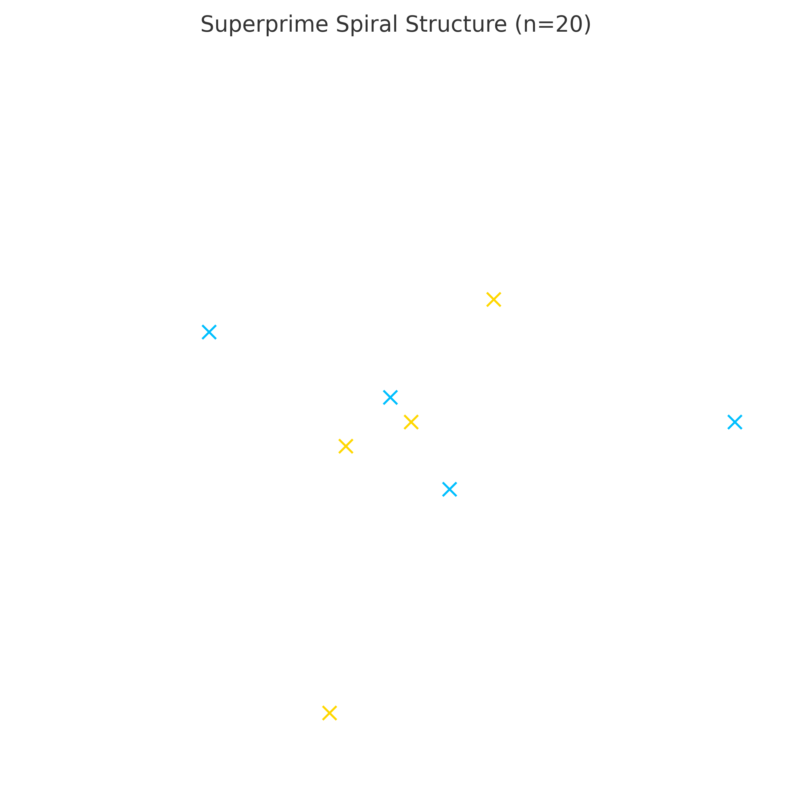
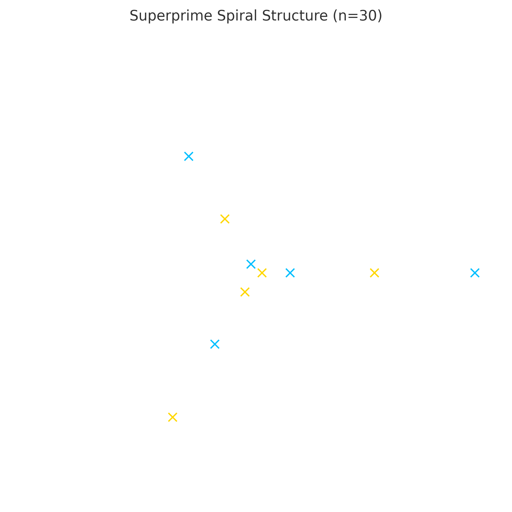
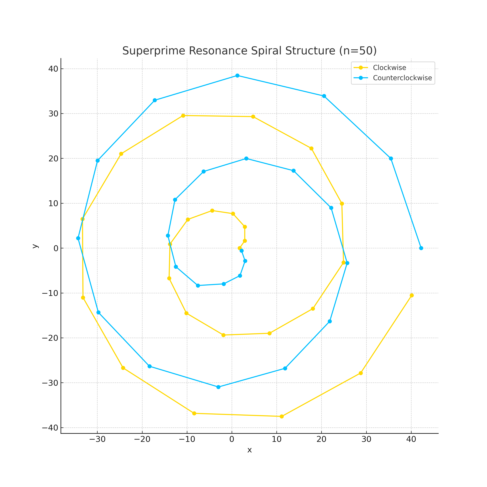
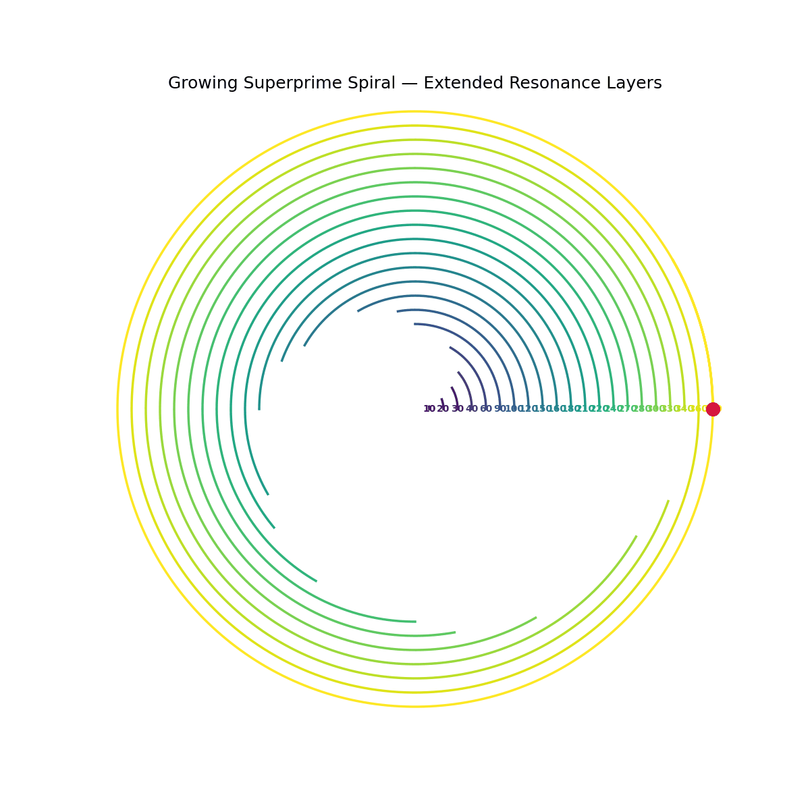
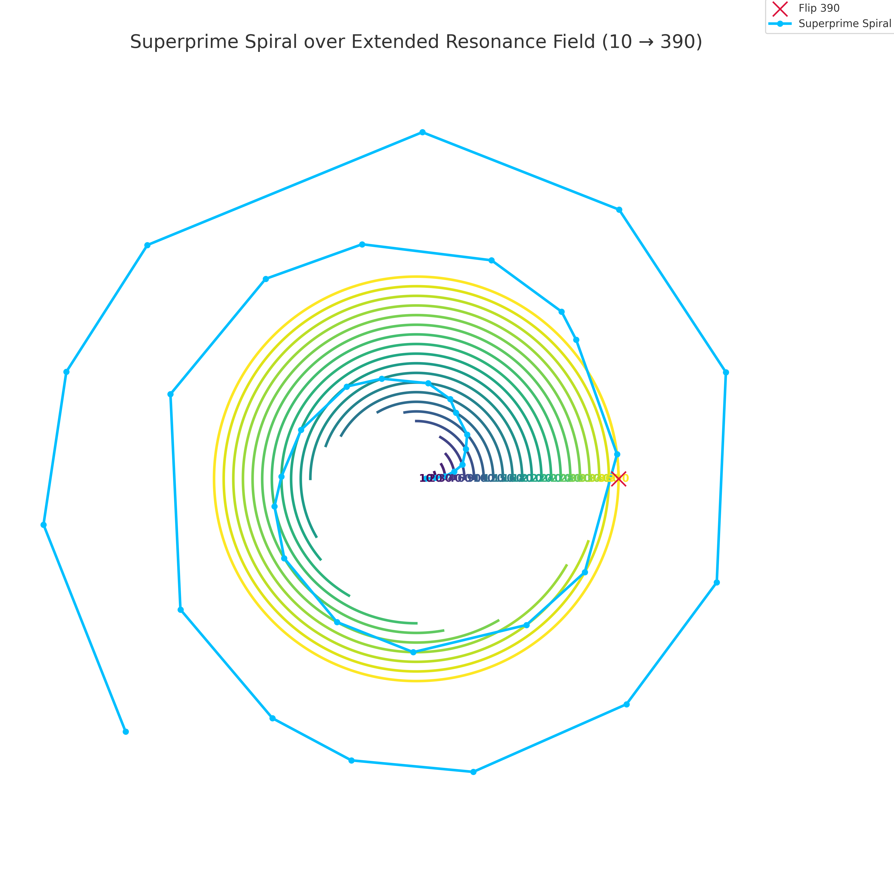

# 🌀 Prime Spiral Projection

**Module**: UCRT Superprime Genesis  
**Part of**: System 7: 🔱 Universal Resonance Fields & Constants — UCRT

---

## 🌐 Overview

This section investigates the **spiral projection** of prime numbers and superprime structures.  
By arranging prime positions radially and applying modular resonance layers (base 10, 20, 30, 60, 90, 360), a deeper harmonic pattern emerges.

---

## 🔢 Spiral Projection Fundamentals

Prime numbers are positioned along a spiral curve using polar coordinates:  

$$
r(n) = \sqrt{n}, \quad \theta(n) = n \times \Delta\theta
$$

Where:

- $n$ — prime index
- $r$ — radius (square root scaling)
- $\theta$ — angular displacement (modular shift $\Delta\theta$)

For **Superprimes** (primes at prime indices), the spirals exhibit higher-order symmetry.

---

## 🌀 Spiral Structures (n = 20 / 30 / 50)

### **n = 20 — Base 20 Structure**

This structure reveals the **first Vendissimal layer** (Base 20), important for resonance anchoring:

---

### **n = 30 — Base 30 Structure**

The second layer connects to **modular 30 resonance**, aligning with early harmonic polygones (heptagons, octagons):

---

### **n = 50 — Extended Layer**

The projection with **50 superprimes** reveals **early rotational coupling** and **spiral bifurcation**:

---

## 🌀 Dynamic Spiral Flow (Animations)

### **3-Rotations Spiral Growth**

The dynamic expansion over three full rotations highlights:

- Phase shifts (θ modulation)
- Transition from ordered to chaotic fields
- Underlying **dual spin** (clockwise vs. counterclockwise)

---

### **Growth and Extended Resonance**

Visualizing how superprimes progressively fill the resonance fields:

---

## 🧭 Modular Base Layers (Extended 10–390)

The modular structure of prime layers at different base cycles:

- **Base 10**: Fundamental scale (decimal)
- **Base 20**: Vendissimal Code entry point
- **Base 30**: Harmonic Polygone Alignment
- **Base 60 / 90 / 360**: Higher cosmic cycles

### **Extended Harmonic Resonance Layers (10–390)**

---

## 🔍 Key Observations

1. **Rotation Anchors**: Superprimes act as stabilizing anchors in the rotational flow.
2. **Phase Shifts**: Each resonance layer ($\mod 10, 20, 30, 60, 90, 360$) induces characteristic phase modulations.
3. **Resonance Polygones**: Layer transitions correspond to polygones (7-gon, 11-gon, 13-gon, 17-gon) emerging in 2D projections.
4. **Binary–Ternary Transitions**: Observable transitions between binary and trinary structures.
5. **Higher-Dimensional Dynamics**: Initial hints of counterrotating spirals (Lilith–Solar harmonics).

---

## 🔗 Visual Gallery

For more related visualizations, see:

[→ Visual Folder](./visuals/)

---

## 📚 References

- [Superprime Genesis Overview](./superprime_genesis_overview.md)
- [Resonance Sequences and Indices](./resonance_sequences_indices.md)
- [Harmonic Field Polygons](./harmonic_field_polygons.md)

---

> **Primes spiral harmonically —  
> Superprimes orchestrate the cosmic dance.**

**Universal Constants Resonance Theory (UCRT)**  
**Scarabäus1033 (T. Hofmann)**  
**Nexah Research Institute**
