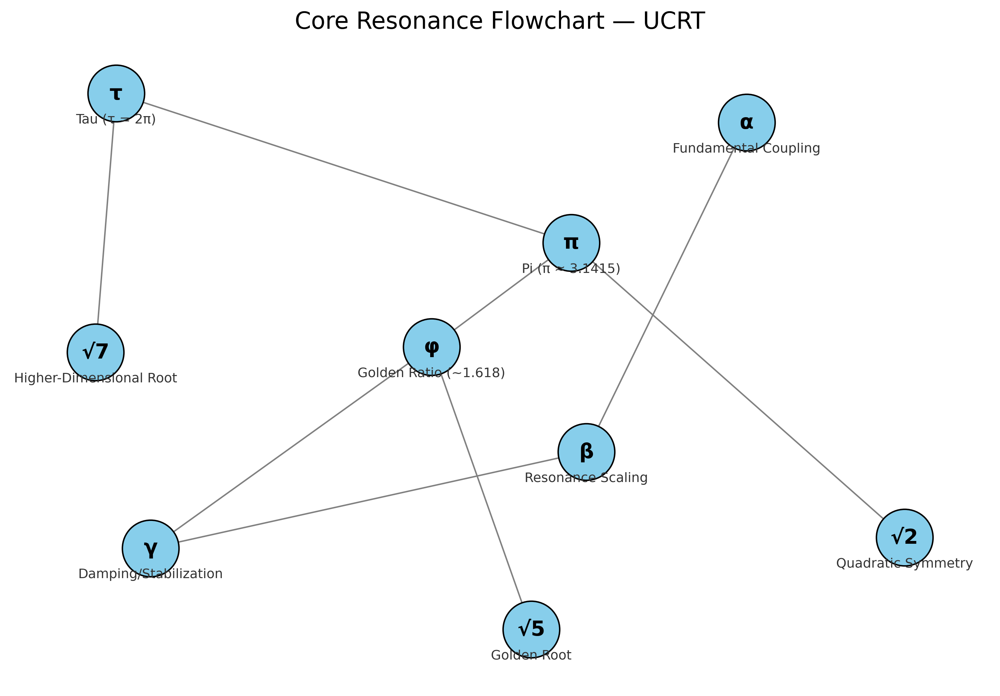
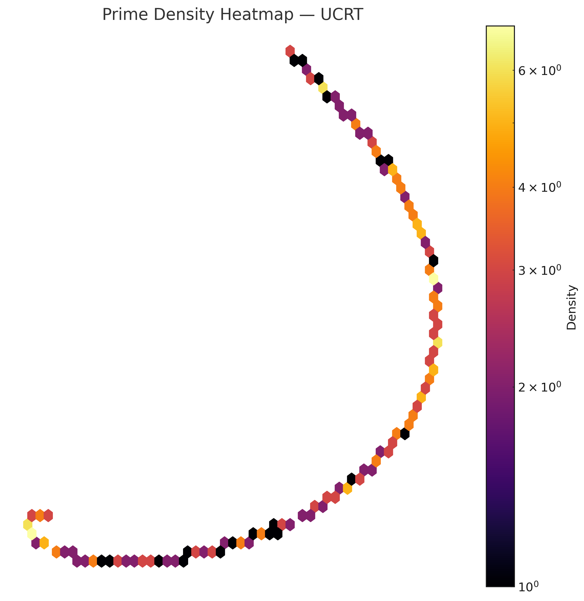
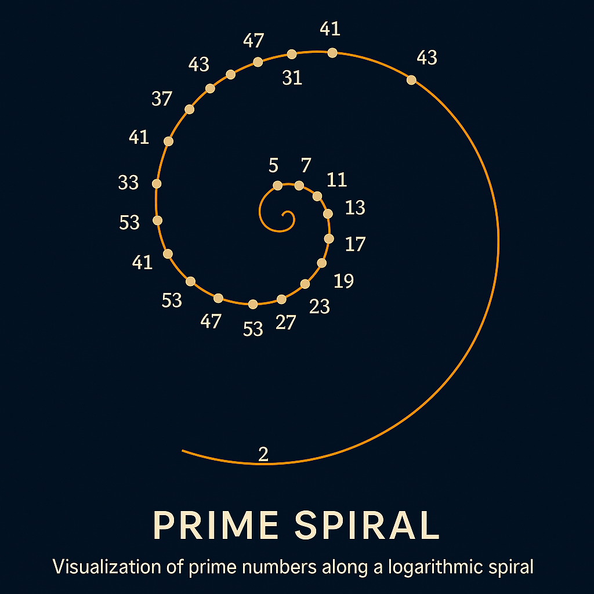
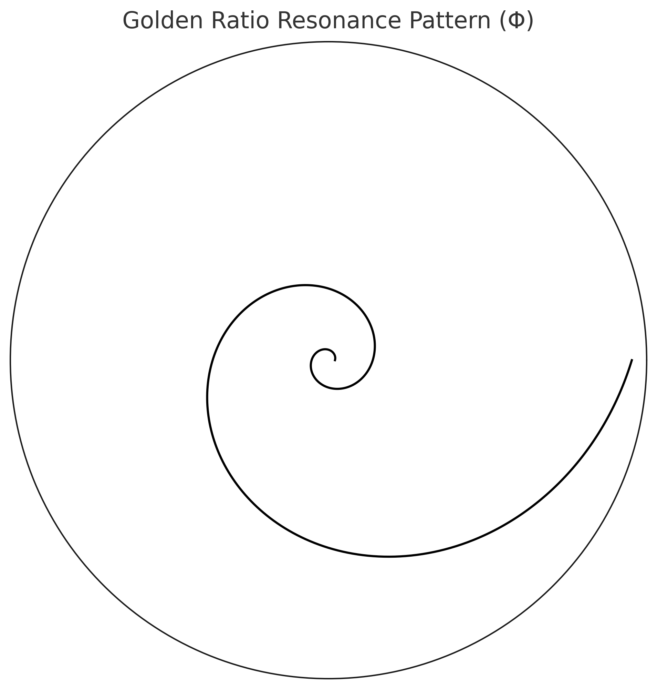
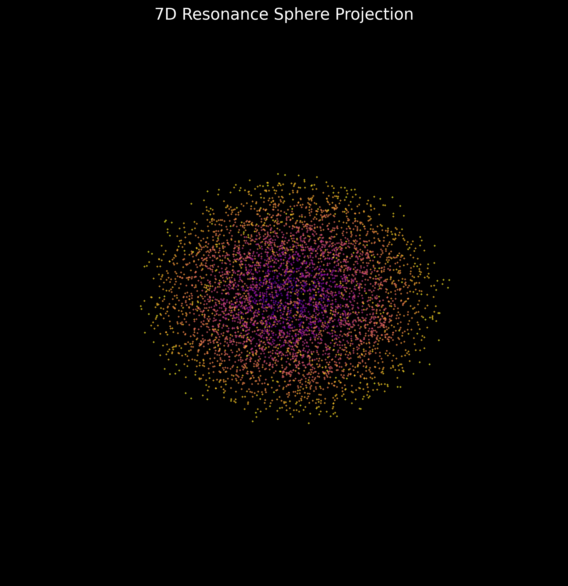
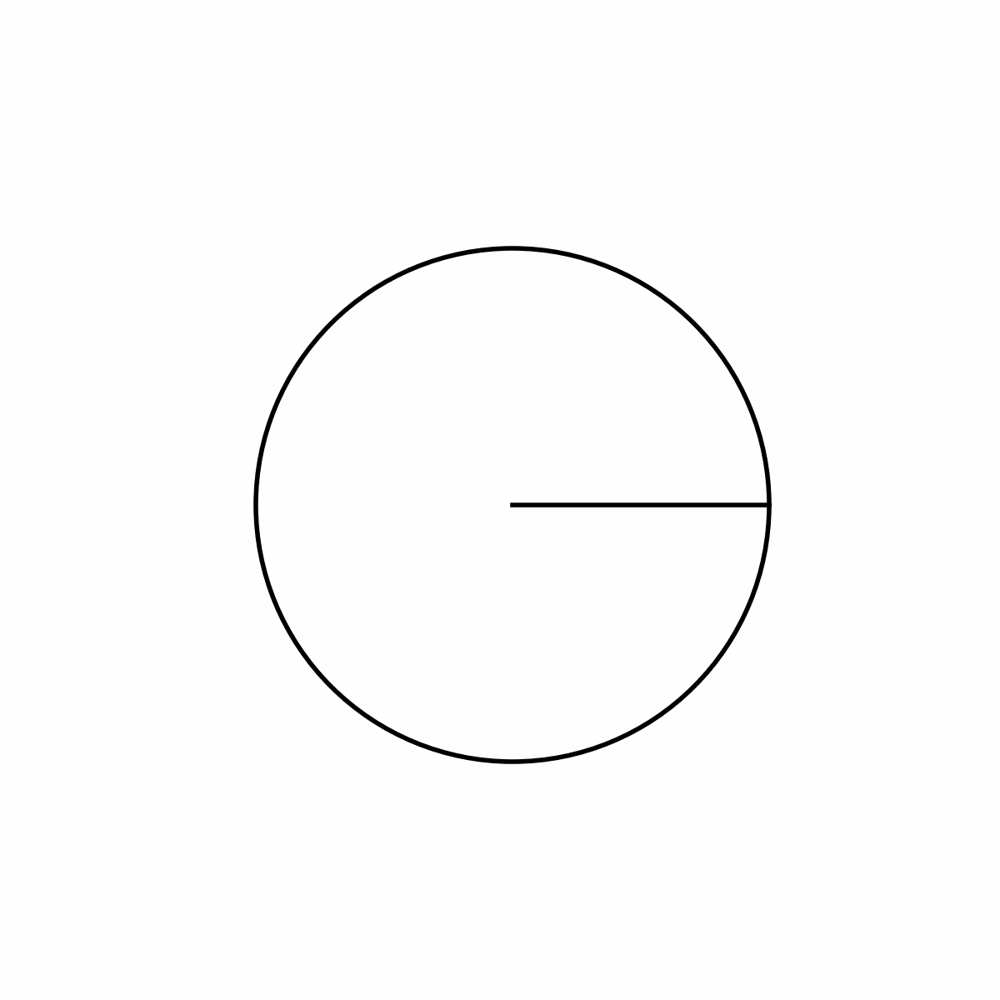

# Visual & Equation Gallery — Universal Constants Resonance Theory (UCRT)

Welcome to the **Visual & Equation Gallery** of **UCRT**.

This gallery presents the foundational harmonic structures, mathematical frameworks, and visual representations of the Universal Constants Resonance Theory.

---

## 🖊️ Key Equations

### 1. Universal Resonance Formula

$$
R(\varphi, \tau, \sqrt{n}) = \alpha \times \beta \times \sin(2\pi \times f(\varphi, \sqrt{n}) \times t) / \gamma
$$

**Where:**

* $\alpha$ = Fundamental coupling constant ($\approx 1/137$)
* $\beta$ = Resonance scaling factor
* $\gamma$ = Damping and stabilization coefficient
* $f(\varphi, \sqrt{n})$ = Harmonic frequency scaling function
* $2\pi$ = Ensures full-cycle periodicity
* $\varphi$ = Golden Ratio ($\approx 1.618$)
* $\sqrt{n}$ = Irrational roots ($\sqrt{2}, \sqrt{5}, \sqrt{7}$)

---

### 2. Energy Scaling Law

$$
E_{\text{res}} \propto \left( \frac{R}{T} \right)^2 \times \varphi
$$

*Energy resonance scales harmonically with radius/time ratios and the golden ratio.*

---

### 3. Prime Genesis Formula

$$
n_{\text{prime}}(k) \approx \text{floor}(\varphi^k \times \log(k))
$$

*Primes emerge as stable harmonic points on a logarithmic $\varphi$-spiral.*

---

### 4. Resonance Velocity Relation

$$
p = \frac{r}{t}
$$

*Linking spatial extension to time — the harmonic definition of motion.*

---

### 5. Higher-Dimensional Volume (7-Sphere)

$$
\text{Volume}(S^7) = \frac{\pi^4}{3}
$$

*The 7D volume structure underpins harmonic resonance stability.*

---

### 6. Root-Based Mesh Grid Equation

$$
\text{Mesh}(r, \theta) = r(\sqrt{n}) e^{k\theta}
$$

*A quasi-periodic lattice based on irrational roots.*

---

## 🌐 Key Visuals

### 1. Core Resonance Flowchart

*Dynamic flow between fundamental constants $\alpha, \beta, \gamma, \varphi, \pi, \tau, \sqrt{2}, \sqrt{5}, \sqrt{7}$.*

---

### 2. Root Resonance Grid

*Quasi-periodic lattice structures generated by $\sqrt{2}$, $\sqrt{5}$, and $\sqrt{7}$.*

---

### 3. Prime Density Heatmap

*Distribution of primes along the $\varphi$-logarithmic spiral.*

---

### 4. Prime Resonance Spiral

*Primes mapped onto a harmonic spiral structure.*

---

### 5. Root-Based Quasi-Periodic Mesh

*Harmonic grid structured by irrational roots.*

---

### 6. Golden Ratio Resonance Pattern

*Growth spiral based on $\varphi$.*

---

### 7. 7D Resonance Sphere Projection

*Higher-dimensional symmetry in resonance fields.*

---

### 8. Universal Resonance Field Map

*Composite map integrating $\varphi$, $\pi$, $\tau$, and irrational roots.*

---

### 9. Tau-Pi Cycles Animation

*Cyclic $2\pi$ rotations and harmonic oscillations.*

---

## 🔄 Module Crosslinks

* [UCRT Core Framework](../UCRT_CORE/README.md)
* [Rootroom — Irrational Resonance Fields](../UCRT_ROOTROOM/README.md)
* [Prime Genesis Module](../UCRT_PRIME_GENESIS/README.md)
* [Higher Dimensions Module](../UCRT_HIGHER_DIMENSIONS/README.md)

---

$$
\boxed{\text{Resonance is the Fabric of Reality}}
$$
