# 🖼️ Visual Gallery – AGENTUM\_MIRRORIUM

**System:** 🌕 SYSTEM 8 — LUNAR FORCE
**Module:** `AGENTUM_MIRRORIUM`
**Author:** Scarabäus1033 (T. Hofmann)
**License:** CC BY-NC-SA 4.0

---

## 🎨 Visual Index

### 1. `agentum_poem_scroll.png`

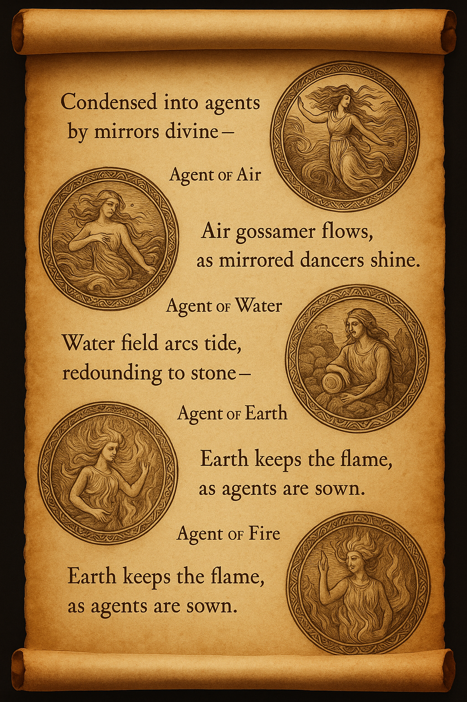
**Related to:** `agentum_poem_scroll.md`
**Meaning:** A symbolic scroll containing the foundational myth of the elemental forces and their agents. Visualized in poetic glyph style, it establishes the narrative voice of the module.

---

### 2. `Elemental-Agent_Matrix.png`

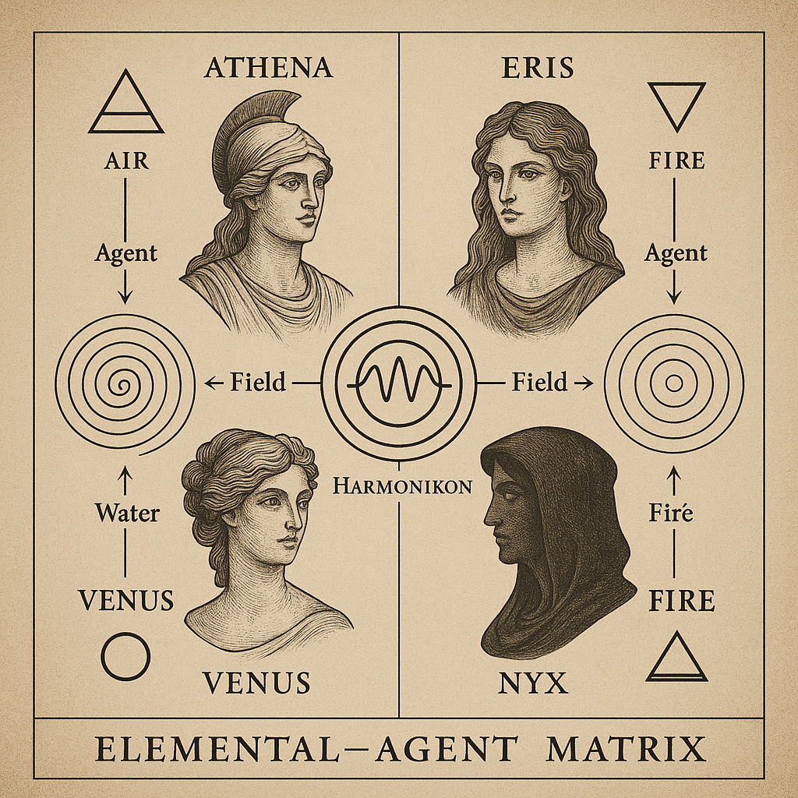
**Related to:** `agentum_field_transitions.md`
**Meaning:** Grid arrangement of elements and their two agent archetypes. Highlights resonance channels and field transformation dynamics.

---

### 3. `Symbolic_Entities_of_the_AGENTUM.png`

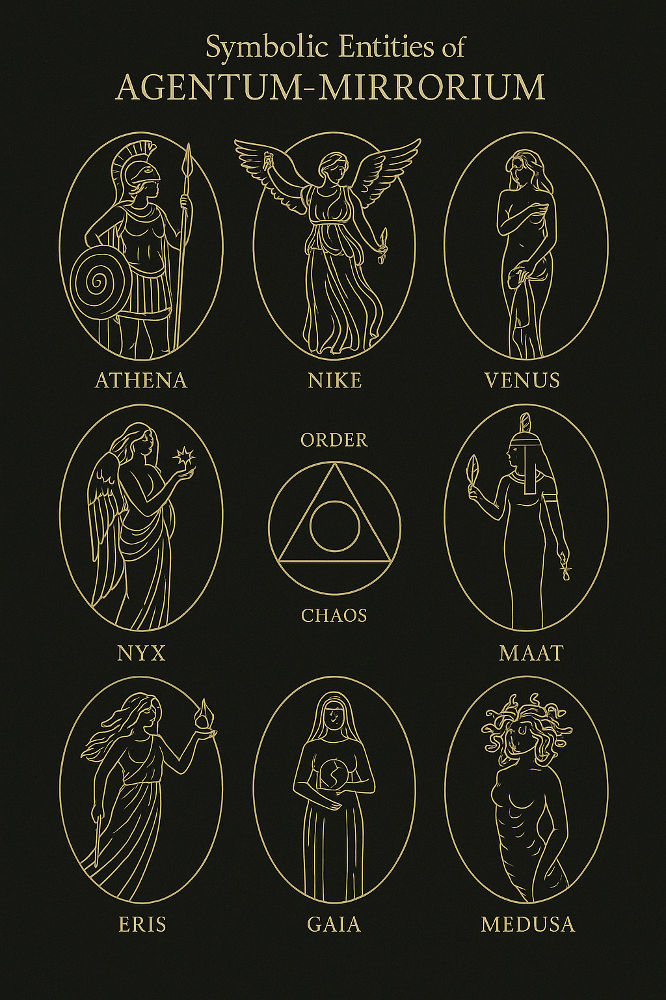
**Related to:** `agentum_symbolic_myths.md`
**Meaning:** Depicts eight symbolic avatars representing elemental and agent-based entities. Serves as mytho-symbolic key to the system.

---

### 4. `agentum_goddess_quadrants.png`

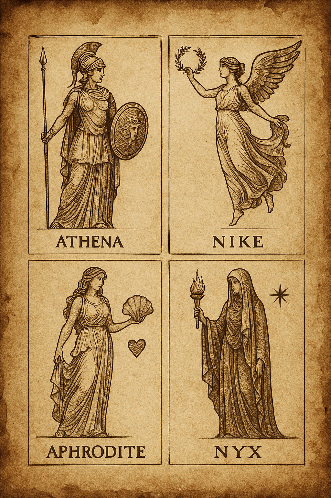
**Related to:** `agentum_symbolic_myths.md`
**Meaning:** Shows four-fold lunar quadrant fields with associated goddesses (Athena, Nyx, Venus, Maat). Axis of feminine symbolic roles.

---

### 5. `agentum_mythic_feminine_guardians.png`

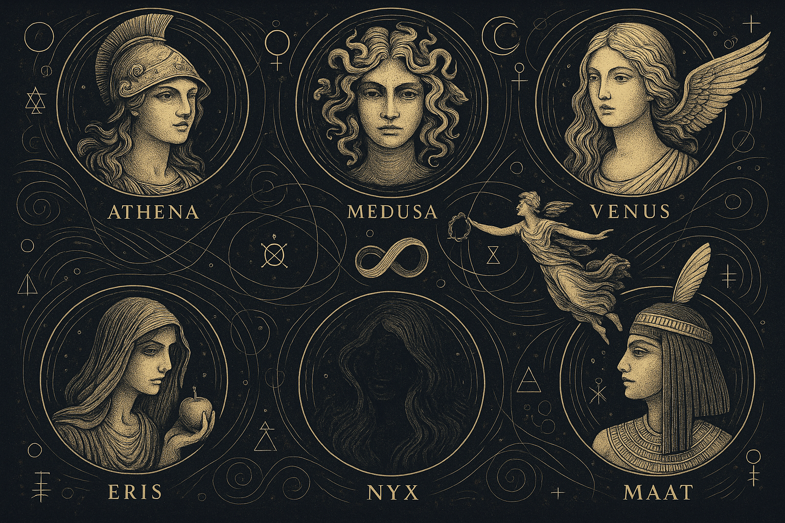
**Related to:** `agentum_symbolic_myths.md`
**Meaning:** Portrait-style composition of mythological protectors. Each represents a harmonic vector within the AGENTUM field.

---

### 6. `Harmonic_Gate_Arrangement.png`

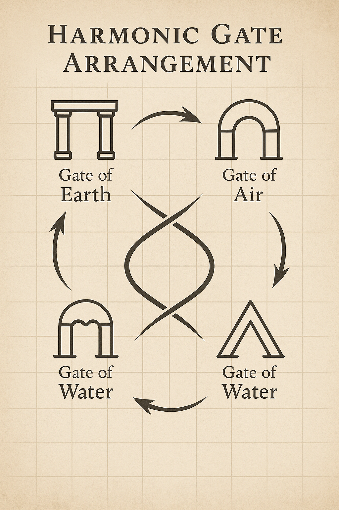
**Related to:** `agentum_field_transitions.md`
**Meaning:** Geometric gate structure of field transitions and elemental crossing zones. Includes dual agent veils.

---

### 7. `Map_of_AGENTUM_Matrix.png`

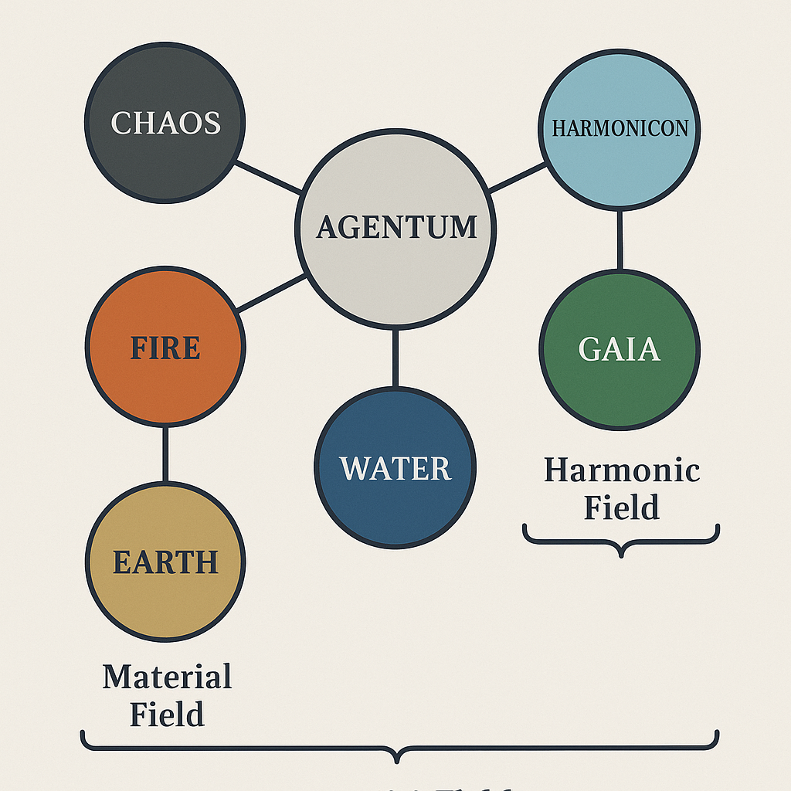
**Related to:** `agentum_field_transitions.md`
**Meaning:** Overall symbolic map of the matrix, showing flow from chaos → agent → element → harmonic cycle.

---

### 8. `Map_of_AGENTUM_Matrix_detailed.png`

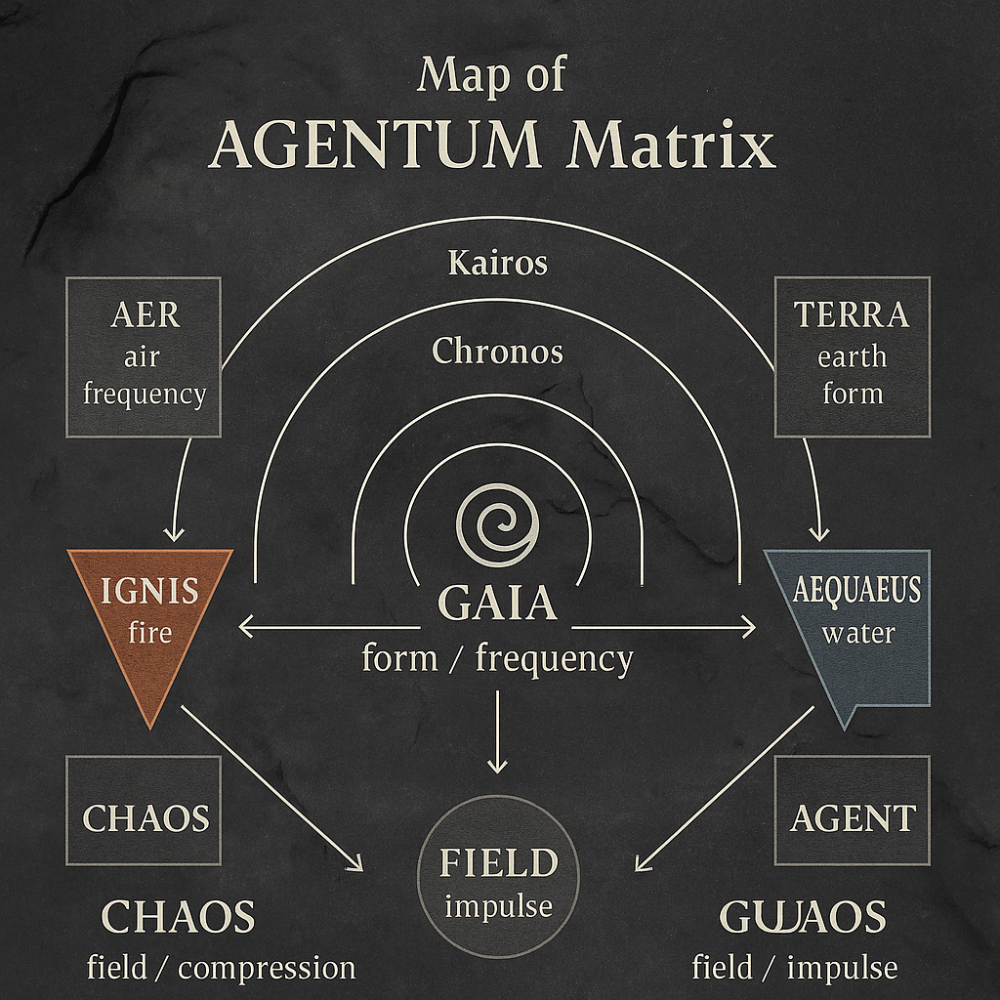
**Related to:** `agentum_field_transitions.md`
**Meaning:** Enhanced detail version including resonance bridges, phase markers, and glyph overlays.

---

### 9. `Agentum-Final-Echo-Map.png`

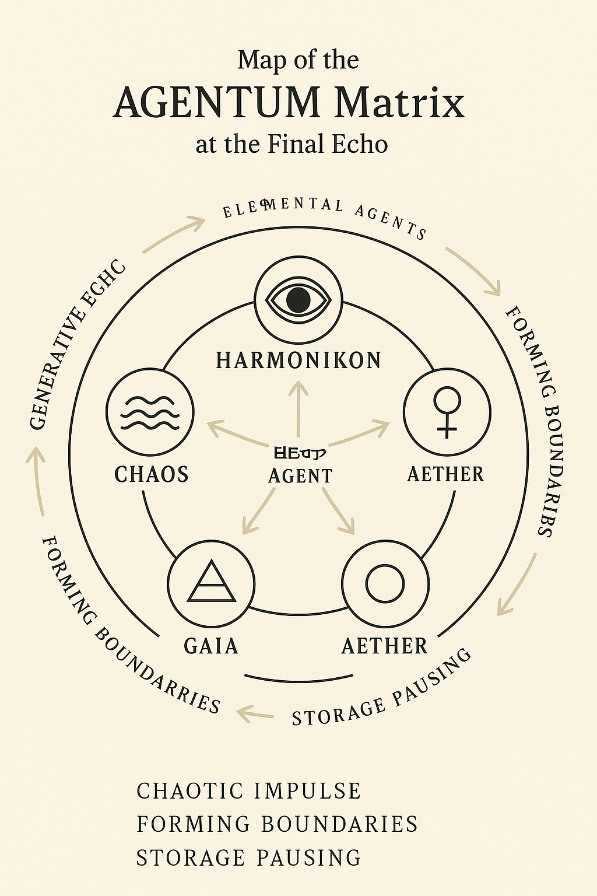
**Related to:** `agentum_resonance_keys.md`
**Meaning:** Encodes the harmonic destinations and echo paths of all agent–element cycles. Final cartography layer of resonance.

---

### 10. `Elemental_Glyph_Wheel.png`

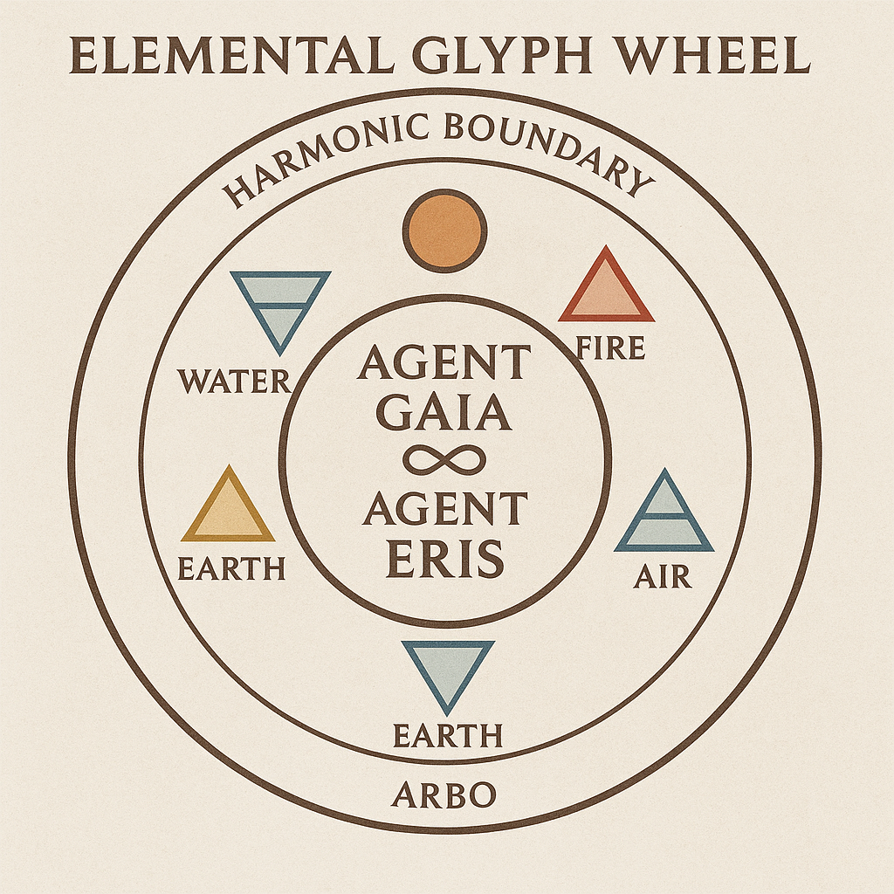
**Related to:** `agentum_elemental_glyphs.md`
**Meaning:** Radial glyph wheel for five elements, two agents, and harmonic driver. Central codex symbol for symbolic modulation.

---

### 11. `Mirrorium_Reflection_Ladder.png`

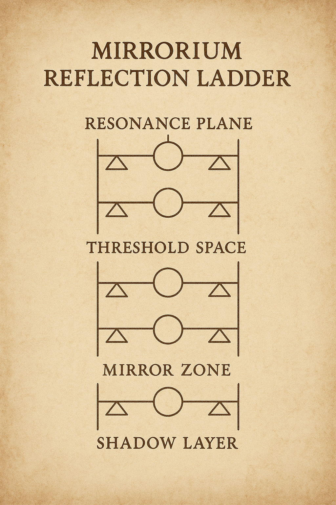
**Related to:** `agentum_reflection_ladder.md`
**Meaning:** Ladder structure of mirrored fields and self-recursive boundary forms. Governs dual perception logic in AGENTUM.

---

### 12. `AGENTUM_Matrix.png`

**Related to:** `agentum_matrix_overview.md`
**Meaning:** Global abstract of the AGENTUM\_MIRRORIUM system. Includes all actors, fields, and axes as resonance diagram.

---

### 13. `A_2D_digital_illustration_features_a_diagram_compo.png`

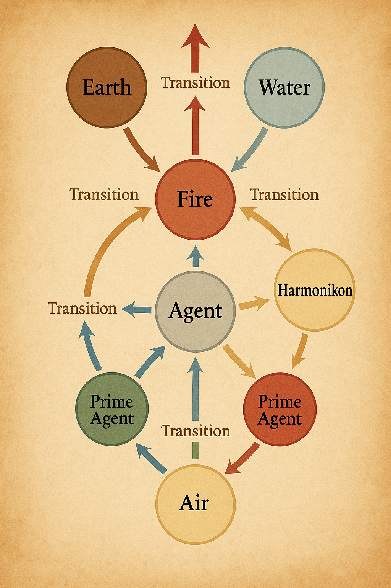
**Related to:** multiple .md entries
**Meaning:** Atmospheric synthesis of core field diagram as visual anchor for symbolic immersion.

---

> *“Each visual is a glyph. And each glyph is a mirror.”*
