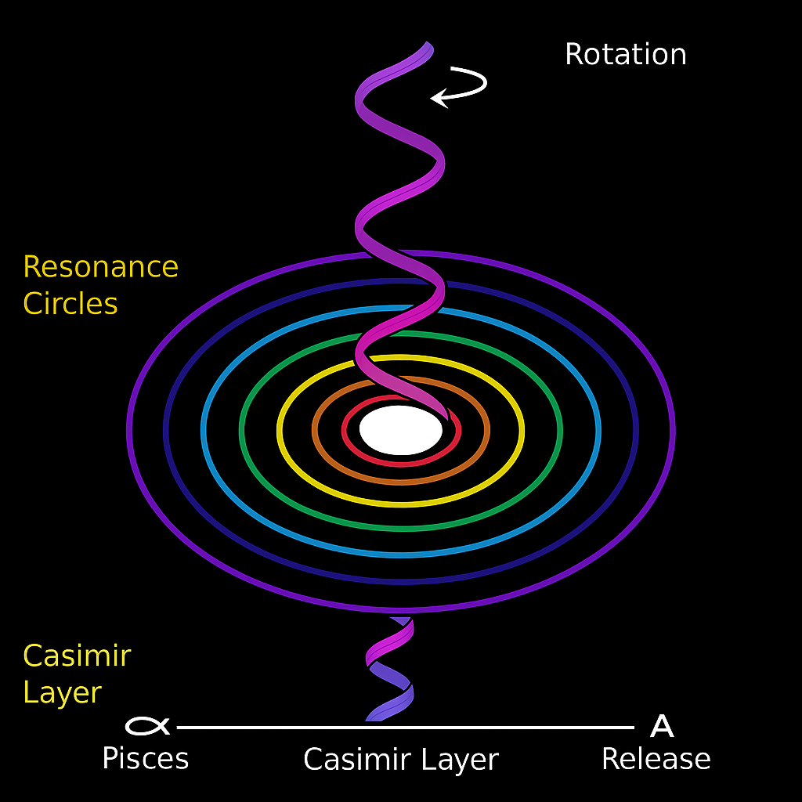
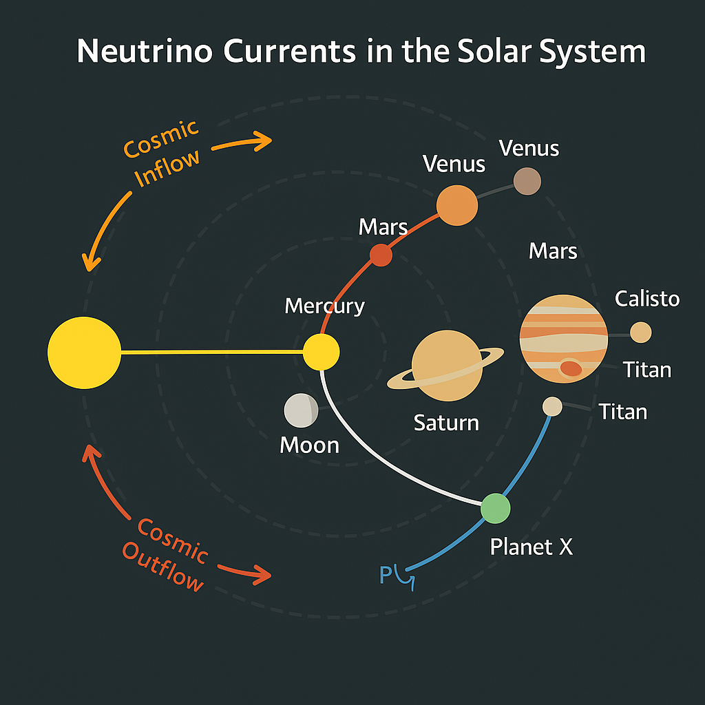

# Casimir Neutrino Conductor

## Overview

This document explores the **Casimir-Neutrino interface** within the lunar-coded structure of the solar system. It models the solar system as a **multi-layered resonance cavity**, where hidden field boundaries (Casimir plates) and lunar neutrino flows create feedback loops, harmonic resonances, and field containment dynamics.

The hypothesis: **Neutrinos interact with virtual boundaries encoded by planetary resonance fields**, generating quantized harmonic compression and temporal field zones.

---

## 1. Casimir Layers in the Solar System

* **Casimir zones** = virtual field boundaries between resonant shells (e.g. between planets, moons, Oort edge)
* These create **quantized space pockets** that trap and cycle neutrino flows
* The Moon serves as **one major resonance reflector**, stabilizing one such cavity

**Visual:**

*Dynamically layered field loops forming harmonics within lunar-planetary spacing.*

---

## 2. Compression–Expansion and Memory Effects

* The **inflow/outflow structure** is non-symmetrical
* Casimir boundaries trap and split signals → "field echo effect"
* Temporal compression can explain:

  * Lunar gravity buffering
  * Retrograde motion zones (Venus, Planet X)
  * Shadow basins (e.g. Richat, Odysseus, Pluto canyon)

**Visual:**

*Mapping Casimir anchor layers to astrological axis-points and field thresholds.*

---

## 3. Neutrino Thread as Conductor

* Neutrino streams act like **coherent cables**, conducting signals across Casimir shells
* Their flow follows precise pathways defined by:

  * Phase windows
  * Planetary resonance points
  * Eye/crater focal geometry (see `observer_eye_geometry.md`)

**Visual:**

*Main conductive routes of neutrinos and their relation to orbital flow and shell boundaries.*

---

## 4. Casimir as Bridge to X-Mode

* Planet X may define the **external Casimir boundary** of our resonance cavity
* As it moves, it shifts the lunar cavity pressure:

  * Full Moon = release gate (expansion phase)
  * New Moon = intake sink (compression)
* This cyclic pulse **feeds Earth with cosmic rhythm** via a lunar gateway

---

## Implications for Codex

| System        | Connection                                                       |
| ------------- | ---------------------------------------------------------------- |
| SYSTEM 8      | Moon as cavity interface, dual-eye modulator                     |
| SYSTEM X      | Audio field folding, sound manifestation across shell            |
| SYSTEM 3      | Astrophysical boundary zones, Oort limits, outer harmonic pulses |
| Rosetta/Bloom | Lunar-crystal structure, vesica fold patterns, vibration symbols |

---

## Related Files

* `observer_eye_geometry.md`
* `lunar_symmetry_and_blockflute.md`
* `neutrino_finger_model.md`

Visuals:

* `casimir_neutrino_thread.gif`
* `casimir_pisces_gemini_aries.png`
* `neutrino_currents_solarsystem.png`
* `resonance_circles_casimir.png`
