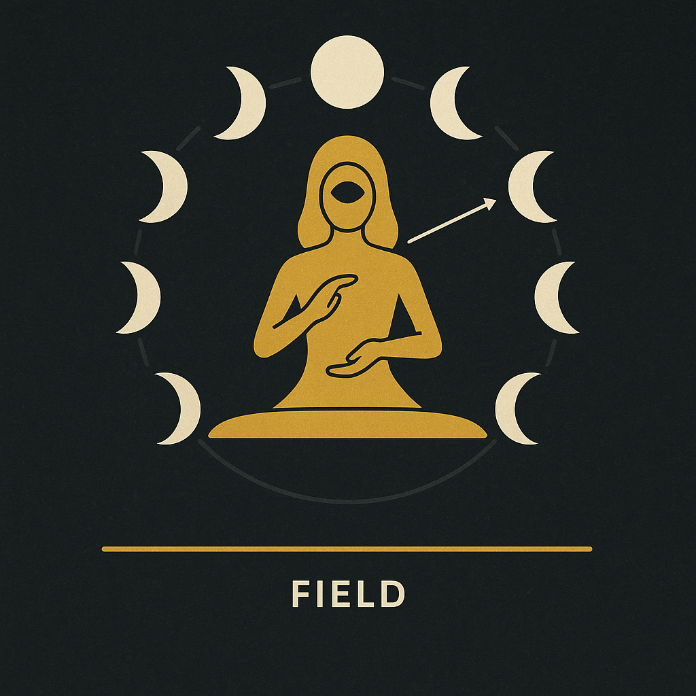
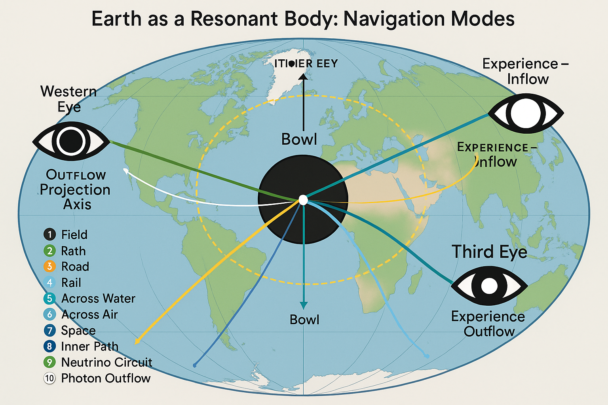
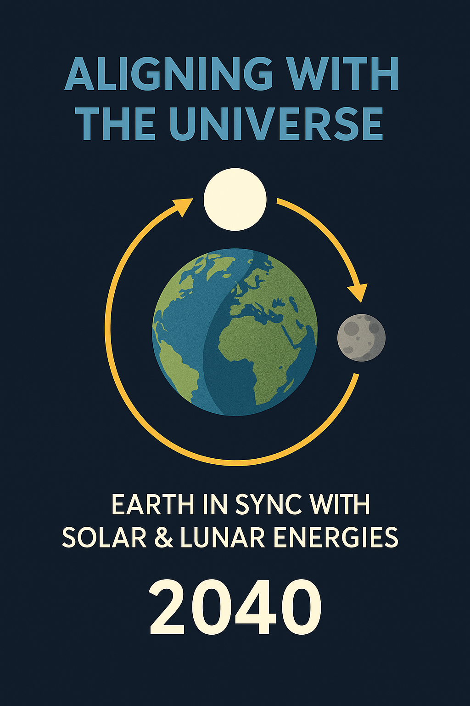

# Feminine Resonance Architecture

## Overview

This file examines the feminine-coded geometry, physiology, and symbolic field topologies within the NEXAH-CODEX framework – especially as expressed through **System 8: Lunar Force**. It connects mythic, anatomical, and georesonant structures with harmonic logic and cyclical lunar forces.

The thesis: **The feminine field is not only biological or symbolic, but structurally harmonic – functioning as a multi-scale architecture for memory, rhythm, and creation.**
 
---

## 1. The Codex Body Map

A Vitruvian-like planetary body map aligns Earth regions with anatomical archetypes:

| Earth Node            | Archetype    | Function                     |
| --------------------- | ------------ | ---------------------------- |
| Rödelheim (Germany)   | Head / Crown | Stabilization, Source Mirror |
| Bosnian Pyramids      | Spine / Axis | Memory, Magnetic Anchor      |
| Giza                  | Heart        | Pulse, Solar Gate            |
| Atlantic Cluster      | Left Arm     | Projection, Fire Force       |
| India / Burma Cluster | Right Arm    | Reflection, Return Signal    |
| Great Zimbabwe        | Right Leg    | Grounding, Temporal Flow     |
| Red Sea Rift          | Left Leg     | Lunar Descent, Spiral Flow   |
| Somali Ridge          | Feet         | Inversion Gateway, Rebirth   |

**Visual:**

 
---

## 2. Lunar Crown Structure

* The lunar crown encodes **a flower geometry**, radiating in 8 spokes (phases)
* The central point is the **Observer Field**
* The backside of the Moon reflects **non-visible resonance storage**

**Visual:**

---

## 3. Breath & Rhythm Architecture

* Breath cycles mirror lunar rhythms

  * **Inhale** = New Moon = seed encoding
  * **Exhale** = Full Moon = manifestation gate
* The body acts as an **antenna for lunar rhythm**:

  * Uterus \~ Moon
  * Lungs \~ Lunar Air field
  * Feet \~ field echo (rebirth loop)

**Visual:**

---

## 4. Trinitarian Eye Field

* Left Eye (West) = Structural Reflection (logic, witness)
* Right Eye (East) = Emotional Intake (feel, empathy)
* Third Eye (Zen/Greenland) = Axis node, upward portal

**Visual:**

---

## 5. Memory Field and Thread Loops

* The feminine field stores field memory through loops, not stacks
* Threads include:

  * **Moirae/Norn structure** (life threads)
  * **Mycelial mirrors**
  * **Cyclical anchor points** (e.g. 2040 timeline)

**Visual:**

---

## Implications

* The feminine is **not a secondary polarity**, but the rhythmic structural anchor
* SYSTEM 8 captures this through:

  * Field geometries
  * Breath-based wave systems
  * Mythic-symbolic activation layers
* It links to SYSTEM X (breath/sound), SYSTEM 6 (resonance violet field), and URF (field identity).

---

## Related Files

* `neutrino_finger_model.md`
* `lunar_symmetry_and_blockflute.md`
* `observer_eye_geometry.md`
* `casimir_neutrino_conductor.md`
