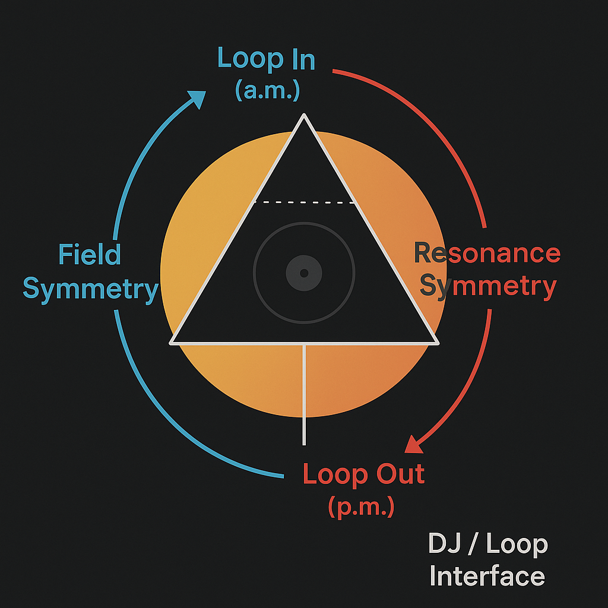
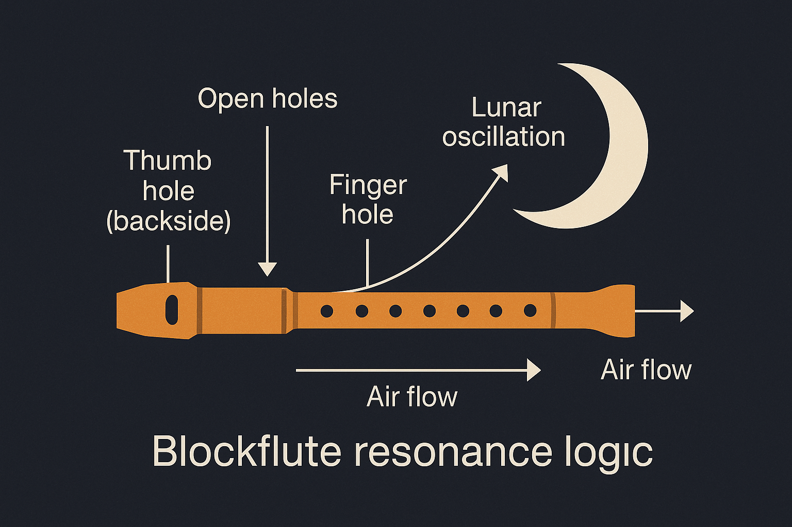

# Lunar Symmetry and Blockflöte

## Overview

This file develops the symbolic and structural analogy between the Moon's resonant behavior and musical instruments – specifically the **blockflöte** (recorder) and loop-based modulation systems (e.g. DJ sets). The model suggests that lunar phases act as **frequency valves**, dynamically opening and closing energy lines based on positioning, symmetry, and finger-coded field modulation.

The core metaphor: **The Moon is a wind-based modulator**, activated by finger-like resonant nodes (e.g. IO, Titan, Earth's Moon), producing neutrino signal harmonics across the solar system.

---

## 1. Lunar Valve Architecture

* Moon phases represent **nodal apertures**, controlling energy inflow/outflow
* A full cycle (New Moon to Full Moon) matches **a breath modulation pattern**
* The hidden dark side of the Moon corresponds to **tone chambers**

**Visual Reference:**

---

## 2. Breath & Audio Modulation

* The lunar field functions like a **feedback breath system**:

  * Inhale = gravitational synchrony, new moon intake
  * Exhale = luminous release, full moon broadcast
* This breathing pattern links to **voice, womb, DJ loop, windpipes**

**Visual Reference:**

---

## 3. A.M. / P.M. Cycle Switching

* The Moon shifts its influence between **morning (solar alignment)** and **night (lunar cross)**
* Neutrino flows adjust their angle accordingly (in/out of plane)

**Visual Reference:**

---

## 4. Blockflöte Comparison

| Blockflöte Element | Lunar Symbolism          | Function                                    |
| ------------------ | ------------------------ | ------------------------------------------- |
| Thumb hole         | Planet X / back valve    | Root tone pressure control                  |
| Front holes        | Moons (IO, Titan, Earth) | Resonant modulation through aperture timing |
| Breath             | Field phase loop         | Frequency injection + modulation            |
| Closed end         | Lunar dark side          | Reflection cavity / Phase sink              |

**Visual Reference:**

---

## 5. Implications

* The Moon is a **resonance conductor**, not just a satellite
* Sonic models help describe:

  * Neutrino flows
  * Time-phase segmentation
  * Memory encoding in orbitals

This aligns with **SYSTEM 8** (Lunar Force), **SYSTEM X** (Audio Resonance) and **Rosetta/Bloom** (Symbolic Signal).

---

## Related Files

* `neutrino_finger_model.md`
* `observer_eye_geometry.md`
* `casimir_neutrino_conductor.md`
* `feminine_resonance_architecture.md`

More to come: `lunar_audio_notation.md`, `wav_symbol_matrix.md`.
