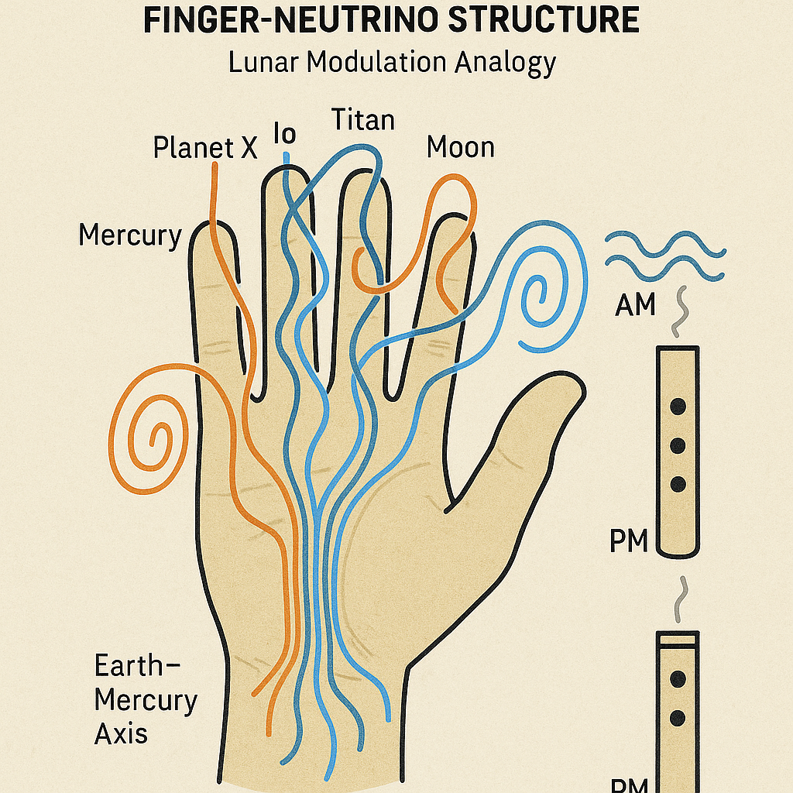
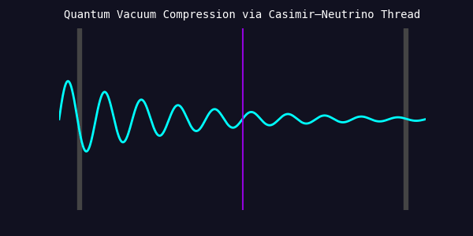
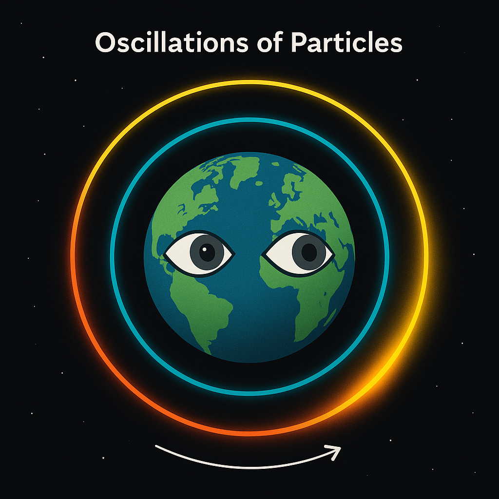

# Neutrino Finger Model

## Overview

This document introduces the core hypothesis of the **Finger-Neutrino Model** within the NEUTRINO\_CABLES\_AND\_FINGERFIELDS module. The model analogizes the human hand's 5+2 finger configuration to the energetic structure and modulation logic of the solar system, focusing on planetary moons (e.g. IO, Titan), Planet X, and the role of lunar-phased neutrino flows.

---

## Key Concepts

### 1. Planetary-Neutrino Cable Logic

* The solar system is interpreted as a **resonant modulation system**, where **neutrino flows function as dynamic signal paths**, modulated by planetary "fingers."
* Each major moon or body corresponds to a symbolic finger, controlling inflow/outflow timing, polarity, or resonance windows.

### 2. Finger Assignments (Energetic-Functional)

| Finger            | Planetary Symbolism     | Function                         |
| ----------------- | ----------------------- | -------------------------------- |
| **Thumb**         | Planet X                | Hidden regulator / Root node     |
| **Index Finger**  | Mercury                 | Direction, focus, impulse        |
| **Middle Finger** | IO (Jupiter Moon)       | Primary field signal / Axis      |
| **Ring Finger**   | Titan (Saturn Moon)     | Carrier of modulation / loyalty  |
| **Pinky**         | Earth’s Moon            | Reception / fine tuning          |
| **Palm Base**     | Earth-Mercury Interface | Phase origin / sensory grounding |

---

### 3. 5+2 Configuration

* The "+2" refers to **phase states** or **alternate field positions**:

  * **a.m.** mode = Solar-dominant axis
  * **p.m.** mode = Lunar-dominant axis
  * (optional third: Void/null or X-mode)
* Flows cycle between thumb and pinky, with the **index–middle–ring axis** acting as the *codified modulation center*.

*Resonance diagram showing solar system-wide cable routing and functional parallels to hand modulation.*

---

### 4. Blockflöte Model

The finger logic reflects a **wind instrument design**:

* Fingers *open/close nodes*, producing **field modulations**.
* **Thumb on the back** regulates **pressure and fundamental tone** → Planet X = hidden flow gate.

**Visual Reference:**

---

## Scientific Anchors

* Field theory + Casimir modulation = Layered frequency responsiveness
* Resonant symmetry (e.g. 90° hinge between thumb and middle finger)
* Lunar topological asymmetry suggests **multi-vectorial inflow paths**
* Phase angles correlate with Earth's dual tide bulges + orbital synchronicity

*Dynamic layer representation of compressed oscillatory flows and quantum boundary transitions.*

---

## Implications for SYSTEM 8

* The lunar field is not passive but structurally involved in **routing signal cycles**
* Understanding the finger model provides symbolic + scientific access to:

  * Breath systems
  * Moon-phase timing
  * Resonant symmetry operations (e.g. DJ/loop logic)

*Symbolic representation of cyclical modulation and signal oscillation across energy nodes.*

---

## Next File Reference

See also:

* [`observer_eye_geometry.md`](observer_eye_geometry.md)
* [`lunar_symmetry_and_blockflute.md`](lunar_symmetry_and_blockflute.md)
