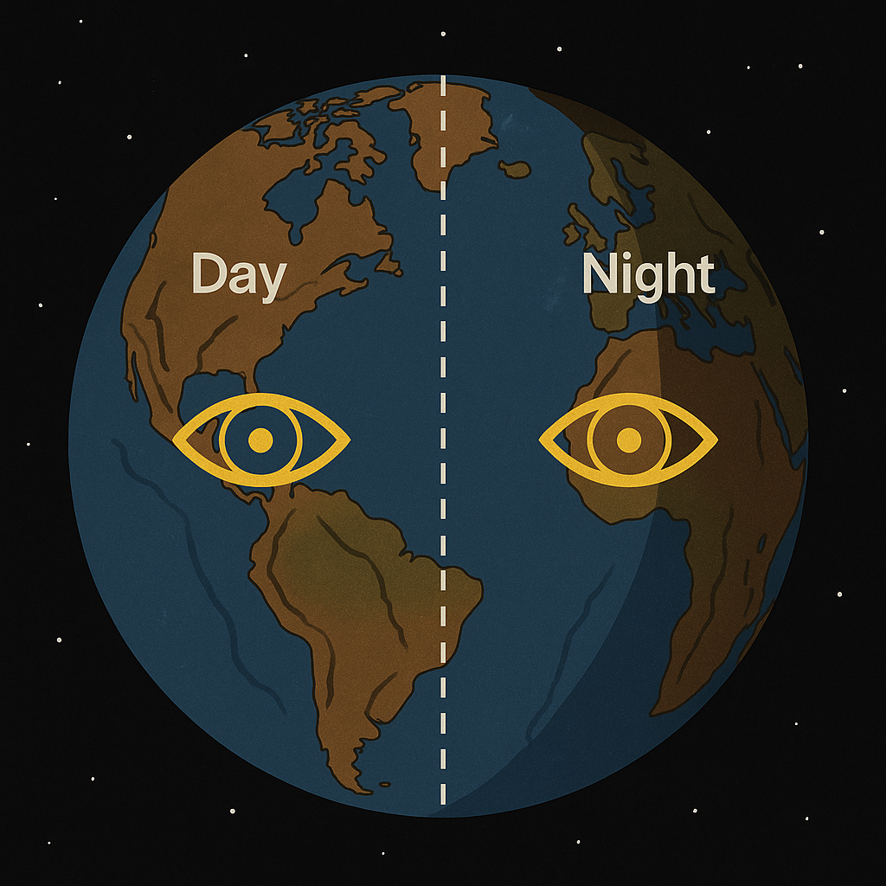

# Observer Eye Geometry

## Overview

This file describes the planetary geometry and symbolic significance of craters, basins, and symmetrical “eyes” observed on planetary bodies such as the Moon, Mars, Tethys, Pluto, and Earth. These structures are not interpreted as random impact sites, but as geometric shadow imprints of planetary field interactions—especially in relation to **Planet X**, **Lunar polarity**, and the **Neutrino reflection field**.

The core hypothesis: **The planetary "eye" structures (circular basins, craters, vortex fields) are the result of neutrino-induced topology aligned to hidden planetary axes.**

---

## 1. Geometry of Observation

### Dual-Eye Field

* Each planetary body can be said to have a **visible and invisible eye**:

  * The **visible eye** corresponds to crater basins (e.g. Odysseus on Tethys, Richat on Earth)
  * The **invisible eye** represents the shadow cast by a hidden resonance body (e.g. Planet X)
* These eyes align with neutrino flow pathways that often match **tidal bulges, phase inversion lines**, and **energy entry points**.

### Observer Axis

* Observation emerges from alignment between:

  * Moon’s shadow field
  * Earth's spin wobble
  * Planet X’s elliptical crossing

---

## 2. Known Eye Structures and Functions

| Planetary Body | Eye Feature                   | Axis / Function                      |
| -------------- | ----------------------------- | ------------------------------------ |
| Moon           | Eye basin (backside)          | Receives cosmic Neutrino pulses      |
| Tethys         | Odysseus basin                | Signal condenser, 2/5 radius imprint |
| Earth          | Richat Structure (Mauritania) | Outward mirror of Planet X (west)    |
| Pluto          | Canyon network (east)         | Shadow basin, reflected lunar path   |
| Mars           | Valles Marineris + Craters    | Fracture-resonance, tidal echo       |

Visual Link:

---

## 3. Earth as Observer Field

* The Earth has a **dual-polar lens system**:

  * **Left Eye / West** → Richat + Iceland axis (mirror of Planet X)
  * **Right Eye / East** → Himalaya → Pakistan → Islamic Eye field (feel / oil / cycle)
* A **vertical cross** emerges:

  * Horizontal: Dual eyes → day/night axis
  * Vertical: Arctic–Greenland–Antarctica → Deep inhalation & grounding

Visual Link:

---

## 4. Symbolic and Functional Interpretation

* The planetary eye is not just visual; it's **a resonance entry point**.
* Shadow alignment marks **phase transfer lines** between visible and hidden forces.
* When mapped globally, these eyes mirror **neutrino cable crossings**.
* They function like **projector-lenses**, filtering cosmic inputs toward the planetary surface.

---

## 5. Connection to SYSTEM 8 and SYSTEM X

* These eyes are **not observational tools**, they **generate observability**.
* SYSTEM 8 treats this through lunar modulation (e.g. phase, inversion, crater alignment)
* SYSTEM X interprets it as part of audio-photonic manifestation (e.g. Observer → Field → Manifestation)

---

## See Also

* `neutrino_finger_model.md`
* `casimir_neutrino_conductor.md`
* Visuals:

  * `day_and_night_2eyes_axis.png`
  * `Earth_magnetic_Eyes.png`
  * `planetary_neutrino_flow_am_pm_X_mode.png`
