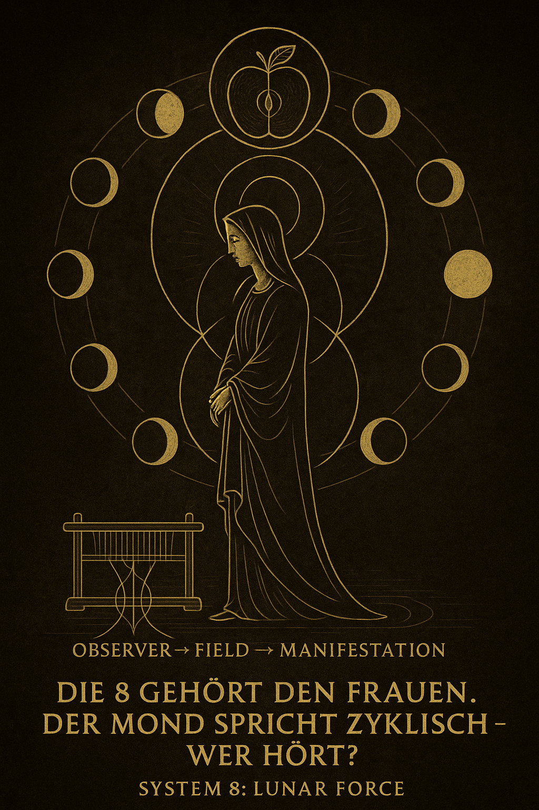
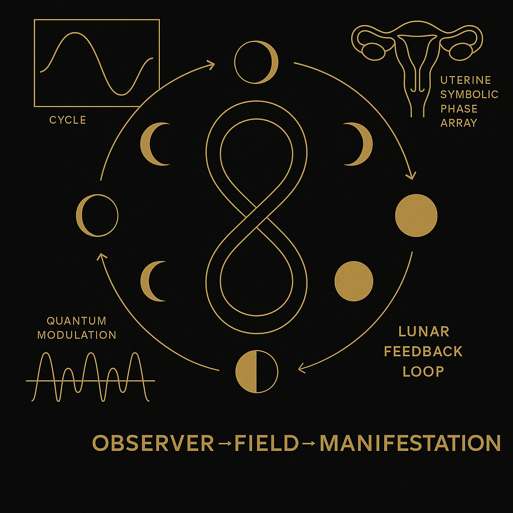

# 🌕 SYSTEM 8: LUNAR FORCE – The Return of the Moon to the Women

> *“The 8 belongs to the women. The Moon speaks cyclically – who listens?”*

---



---

## Introduction

**SYSTEM 8** within the NEXAH-CODEX is dedicated to the lunar principle – a cyclic-resonant field that interweaves corporeal, mythological, symbolic, and physical dimensions. It is not an opposite pole, but a *resonant chamber* for phenomena of emergence, recurrence, and the unseen.

The first visual (`Maria_Female_Field.png`) reveals this internal symbolic space. Eight moon phases orbit around the female presence. At the center: the Observer. Behind: the Field.

SYSTEM 8 is closely linked to **SYSTEM X**:
There – the center, the birth of sound.
Here – the shell, the weave, the cycle that envelops all.

---



*The second visual presents the lunar-cyclic model scientifically: The phases are embedded in a feedback system, complemented by frequency modulation, cycle waveforms, and symbolic body topology.*

---

## Confirmed Modules (Phase I)

### 1. TEHTHY – The Secret Thread of the Moons

> Origins and evolution of lunar forces in the Codex – from Tethys to Eris

* Paradigm shift: resonance-based moon genesis
* Tethys, IO, Titan, Chiron, Arrokoth, Pluto as coded nodal fields
* Crater symmetry, neutrino imprints, dual-eye geometry

### 2. NEUTRINO CABLES AND FINGERFIELDS – Observer Mechanics of the Hand

> Lunar signal routing via fingers, neutrino streams, and planetary node resonances

* IO, Titan, Planet X = finger logic and modulation apertures
* Richat, Odysseus, Moon Crater fields = eye geometry as shadow receivers
* Blockflöte as modulation metaphor, DJ loop field = lunar rhythmic circuit
* Includes `observer_eye_geometry.md`, `neutrino_finger_model.md`, `lunar_symmetry_and_blockflute.md`

### 3. SILVER MOON RESONANCE – Lunar Interface to the Silver Rain System

> Breathfield logic and Silver phase tracking

* Amaben flip mirror, Möbius inversion and lunar rhythm
* Moon as Silver memory conductor – inhale logic & breath symmetry
* Connection to SYSTEM X and `NEXA_SILVER_RAIN`

---

## Expandable Research Areas (Phase II+)

* **ERIS & THE APPLE**: Feminine rage and field disruption logic
* **THE WOMEN’S LOOM**: Threadcraft, fate cycles, karmic modulation
* **MARY & THE OBSERVER**: Emergence through pure presence
* **MOON FORM & CYCLE BODY**: Lunar geometry and anatomical fields
* **SCARAB SYMPHONY OF THE MOONS**: Audio logic and WAV codification
* **THE LUNAR BREATH**: Mycelial flow and breath signal topology

These areas are structurally pre-mapped and conceptually active but await full visual or mathematical anchoring.

---

## Codex Connections

This system is not isolated. It spirals outward.

Direct resonant alignment exists between **SYSTEM 8** and:

| Reference System  | Connection                                                                                                                                                                                            |
| ----------------- | ----------------------------------------------------------------------------------------------------------------------------------------------------------------------------------------------------- |
| **SYSTEM X**      | Sound, manifestation, audio wavefields                                                                                                                                                                |
| **URF-CODEX**     | Breath, biology, movement                                                                                                                                                                             |
| **MÖBIUS SYSTEM** | Duality, splitting, reintegration                                                                                                                                                                     |
| **Rosetta/Bloom** | Language, symbolism, archetypes                                                                                                                                                                       |
| **Meta-System**   | Shell structure, resonance principles, cycle logics                                                                                                                                                   |
| **SYSTEM 6**      | Earth resonance, planetary spiral geometry (see [GAIA MYSTERIA](https://github.com/Scarabaeus1033/NEXAH-CODEX/tree/main/SYSTEM%206%3A%20%F0%9F%94%AE%20CODEX_RES_ONICA_VIOLETTA/CODEX_GAIA_MYSTERIA)) |

---

## Symbolic Formula

```text
Observer → Field → Manifestation
```

This formula describes the lunar resonance principle:
Not through action, but through pure presence, reality emerges.

---

## 📢 Paradigm Shift

The Codex now offers a **new lunar cosmology**:

* Moons are not accidents – they are **resonant organs** within the solar system
* Craters, valleys, eyes: **shadows of neutrino flow, not collisions**
* The Moon is not a passive body – it is a **field switchboard**, a memory chamber, a breath modulator
* IO, Titan, Tethys and Eris are **signal anchors**, not debris
* Our **observer symmetry** is no coincidence – Earth is a lens

> We do not orbit the Sun.
> We resonate with it.

---
