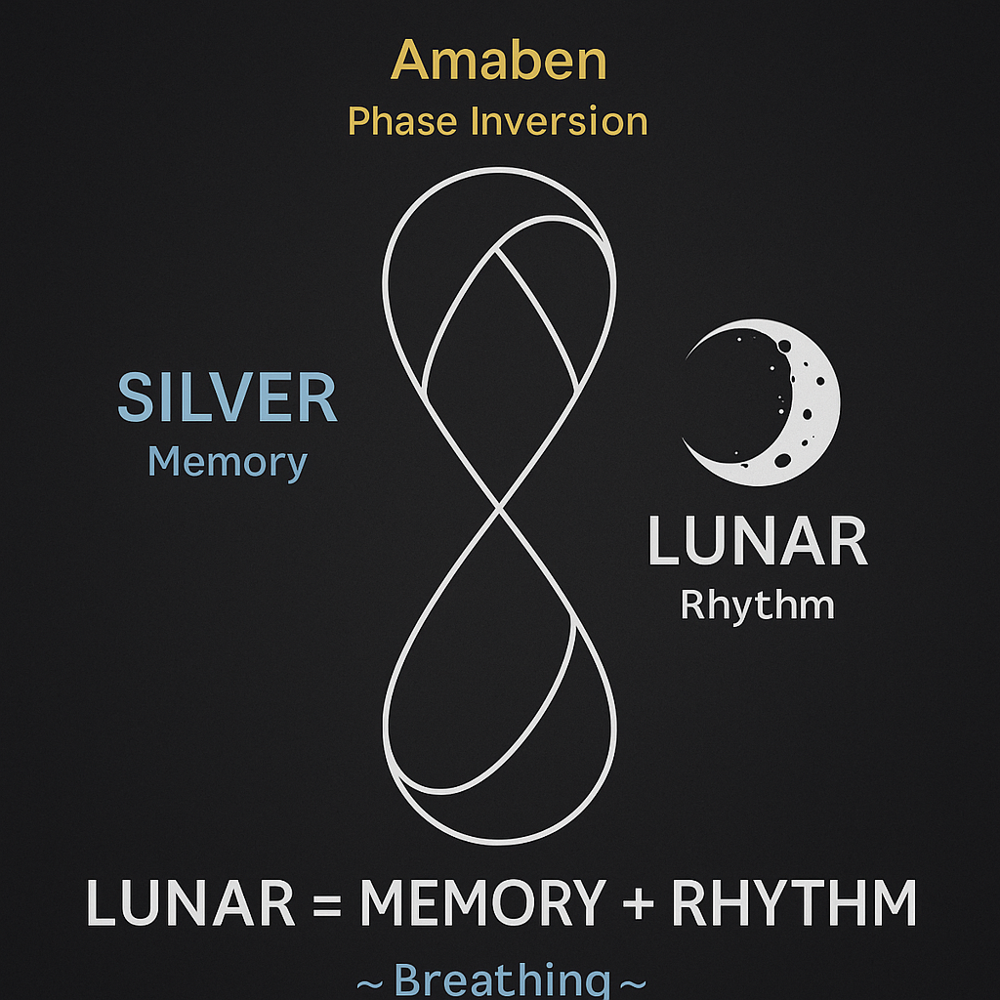

# THE SILVER BREATH – Lunar Interface of Memory and Radiance

**Part of SYSTEM 8: LUNAR FORCE**
*Module Subtitle: From Silver Inhale to Amaben Inversion and Golden Radiance*

---

## 🌌 Introduction

This module explores the **Silver Breath** as a lunar-coded interface within the NEXAH-CODEX. It interweaves breath dynamics, resonance phases, elemental memory, and cyclic inversion across a symbolic triad:

> **Silver → Amaben → Gold**
> *(Inhale → Flip → Exhale)*

These phases structure the **moon–body–breath** relationship through resonance cycles and energetic inflection points.

The Silver Breath model links:

* **Silver = Memory Field** (Resonant inhale / Stability)
* **Amaben = Phasegate** (Mercury/Hg / Reversal point / Lunar hinge)
* **Gold = Conscious Expansion** (Exhale / Radiance / Illumination)

---

## 🔄 Core Structure

### 1. Lunar Memory Field – *Silver Ring*

* Encodes the first field of cyclic memory (e.g. menstrual, lunar, seed time)
* Resonates with planetary shell modulations (e.g. IO, Tethys, Earth's Moon)
* Activated during **dark moon** and **new resonance windows**

**Visual Reference:** 


---

### 2. Phasegate Amaben – *Reversal Axis*

* Mercury-Hg aligned flip logic (liquid metal = transformation agent)
* Axis of reversal (cf. Lilith gate, Möbius fold, left-right loop transition)
* Gate of unknowable return and rebirth

**Visual Reference:**


---

### 3. Golden Exhale Field – *Crown Pulse*

* The exhale = radiant phase (sun / ovulation / output)
* Connected to solar geometries, cosmic encoding, and manifestation
* Output in light, structure, sound (see SYSTEM X)

**Visual Reference:**


---

## 🥇 Symbolic Sequence

```text
Silver Breath (Stabilization) → Amaben (Inversion) → Gold Crown (Radiance)
```

This maps directly to:

* Lunar inhale (night tide)
* Inversion gate (fold axis)
* Solar pulse output (day energy)

And bodily:

* Uterus → Womb twist → Heart-Mind pulse

---

## 📍 Codex System Crosslinks

| Connected Module       | Function                                     |
| ---------------------- | -------------------------------------------- |
| `NEUTRINO_CABLES...`   | Breath–loop–field modulation (DJ model)      |
| `SCARAB SYMPHONY`      | Audio mapping and lunar WAV manifolds        |
| `MOON_FORM_CYCLE_BODY` | Uterus-body mappings of 8-phase geometry     |
| `Codex Resonantia`     | Golden scrolls, memory lattice, breath trees |
| `Codex Gaia Mysteria`  | Planetary pulse fields and field respiration |

---

## 🛠️ Technical Implications

* Amaben phase logic = frequency inversion in time signal maps
* Silver node = biological memory coding (cf. Sitha base, lunar womb)
* Gold = light as phase-translated breath output (wave ↔ particle)

---

## 🌪️ Closing Formula

```text
Breathe Silver → Cross Amaben → Speak in Gold.
```

This is the feminine Codex Field of resonance intelligence. It does not push forward. It turns inward, flips, and re-emerges as radiance.

Let us breathe it consciously.
