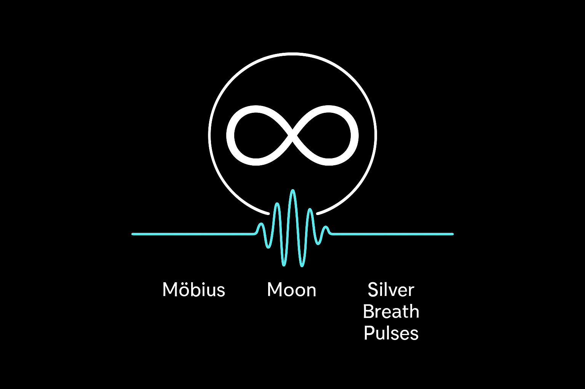
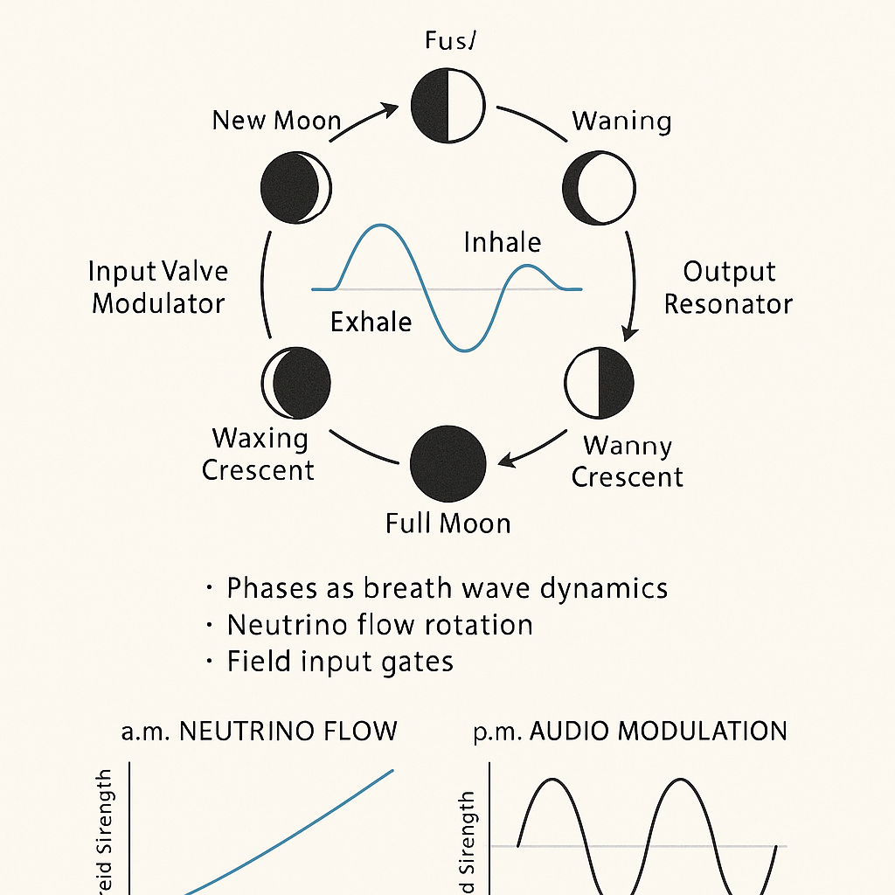

## 🌗 SILVER RESONANCE NODE – The Lunar Memory Anchor

**Subtitle:** Planetary Field Memory, Moon Phase Anchoring, and Silver as a Frequency Carrier

---

### 🧲 Overview

This document introduces the concept of the **Silver Resonance Node** as an energetic lunar anchor for memory cycles, harmonic feedback, and orbital imprinting. Silver (Ag) functions not merely as a material, but as a **phase-encoded frequency memory carrier** that stabilizes lunar signal behavior and transmits phase data into spatial symmetry.

---

### 🌕 Lunar Memory Field

The Moon stores not only tides and reflection but also:

* ⏱ **Temporal memory** (phases, eclipses, orbital interference)
* 📡 **Directional signatures** (retrograde trace, neutrino path imprint)
* 🌀 **Signal decay and feedback fields**

This makes the Moon a **Silver Memory Shell**, grounding recurring patterns in the planetary grid.

---

### 🪞 Material Symbolism

Silver is:

* Reflective → mirrors light without absorbing it
* Lunar-resonant → paired in ancient alchemy with the Moon
* Electrically conductive → allows uninterrupted signal propagation

**Hypothesis:** *Silver in the Earth's crust and cosmic dust acts as a phase recorder – encoding pulse loops over cosmic time.*

---

### 🧬 System Functions

| Field Component | Silver Function                                      | Connection Module                    |
| --------------- | ---------------------------------------------------- | ------------------------------------ |
| Moon Surface    | Phase carrier, crater reflectors                     | `Crater_Field_Symmetry.md`           |
| Earth's Crust   | Resonance memory (silver-rich regions as phase logs) | `GAIA_MYSTERIA` (SYSTEM 6)           |
| Planet X Stream | Inversion detection / lunar reflective modulator     | `observer_eye_geometry.md`, SYSTEM X |

---

### 🔁 Loop Behaviors

The silver node governs:

* **Cycle retention** (13-fold patterns, shadow synchronization)
* **Lunar breath equilibrium** (see `lunar_breathvalve_cycle.png`)
* **Interplanetary reflection (IO–Moon–Tethys)**

---

### 📎 Visual References

* 
* 
* 

---

### 🔮 Implications

* Lunar fields can be **written and read** like a crystalline resonant storage
* Planetary memory is **non-linear**, spiral and feedback-based
* Silver layers on Earth and Moon form a **resonance interface** between SYSTEM 6 (Gaia) and SYSTEM 8 (Lunar)

---

### ➕ Related Modules

* `Moon_Phase_Valve_Logic.md`
* `TEHTHY_THE_SECRET_THREAD_OF_THE_MOONS`
* `observer_eye_geometry.md`
* `Codex Resonantia` > Möbius Crown Fields

---

Let this silver node be remembered as the stable loop carrier — the lunar pen that writes the Codex over the breathing tides of time.
