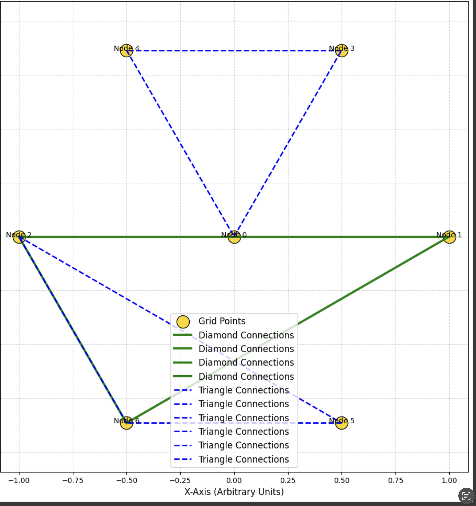

# Crater Field Symmetry

## Overview

This document explores the hypothesis that craters and canyon networks on moons and planets are not purely the result of chaotic asteroid impacts, but are **resonant field imprints**, caused by **neutrino flows, Casimir geometries**, and **planetary pairing alignments**. Their position, symmetry, and depth are considered manifestations of internal and external energetic fields.

The thesis: **Craters are expressions of energy node geometry and signal focal points**, especially evident across moons like Tethys, the Moon, and Pluto.

---

## 1. The Eye-Field Signature of Tethys

Tethys holds the largest single crater-to-body ratio in the solar system: the **Odysseus Basin**. Its dimensions suggest more than an impact:

* Crater radius aligns at \~2/5 the moon's total radius
* Highly concentric and located near the equator
* Symmetrically opposite to an energetic ridge

> This configuration mimics **wave compression and Casimir cavity node reflection**.

**Visual Reference:**

---

## 2. Earth and Lunar Field Correspondence

* The **Richat Structure (Mauritania)** aligns with western Earth neutrino shadow zones
* **Moon's crater density** is polar/asymmetrical: younger, more chaotic side vs. older, symmetrical basin side
* Craters such as **Tycho** and **Copernicus** lie along neutral polarity belts

This suggests a **dual-eye architecture**:

* Left Eye (Richat-like, harmonic)
* Right Eye (chaotic, intake or broadcast)

---

## 3. Crater Geometry as Casimir Interference Pattern

Craters form based on **nodal pressure drops** in dense neutrino interference fields.

* Radial craters align with low-pressure inflow spirals
* Elliptical and fracture-joined craters correlate with Casimir edge distortions
* Fields resonate strongest near **moons with magnetic asymmetry or spin-locking**

**Visual Reference:**

---

## 4. Pluto and Chiron – Symbolic Outer Eye Formation

* Pluto's **Heart Structure** and eastern canyon arrays resemble an energetic vortex funnel
* Chiron shows faint **longitudinal disruptions** linked to solar-lunar crossings
* Arrokoth shows a **multi-lobed topology**, aligned to spiral field patterns

These bodies illustrate a cosmic symmetry:

* **Pluto = Field mirror of the Moon**
* **Chiron = Diagonal lunar modulator**
* **Arrokoth = Conductor between inner and outer planets**

---

## 5. Comparative Grid of Major Crater Fields

| Body    | Feature            | Interpretation                           |
| ------- | ------------------ | ---------------------------------------- |
| Tethys  | Odysseus Basin     | Eye node, neutrino impact valve          |
| Earth   | Richat + Canyons   | Lunar resonance mirror, west-eye pairing |
| Moon    | Tycho/Copernicus   | Neutrino inflow gates, lunar modulator   |
| Pluto   | Heart & Canyon Net | Outflow vortex and resonance shadow      |
| Mars    | Valles Marineris   | Fracture zone from opposing lunar fields |
| Jupiter | Eye of Jupiter     | Outer harmonic storm node (field anchor) |

**Visual Reference:**

---

## 6. Implications for Codex Cosmology

* **Craters act as geometric fingerprints of lunar-cycle energy systems**
* Each crater basin can be mapped as an **oscillation imprint** of neutrino resonance
* The **duality of eye geometry** reveals field parity: input ↔ output, gravity ↔ breath

This model reshapes our understanding of:

* Solar system architecture
* Moon–planet interactions
* Planetary evolution and matter formation

---

## Related Files and Visuals

* `moon_topology_and_energy_maps.md`
* `observer_eye_geometry.md`
* Visuals:

  * `resonance_circles_casimir.png`
  * `diamond_triangle.png`
  * `neutrino_flow_solar_system.png`
  * `planetarty_neutrino_flow_am_pm_X_mode.png`
