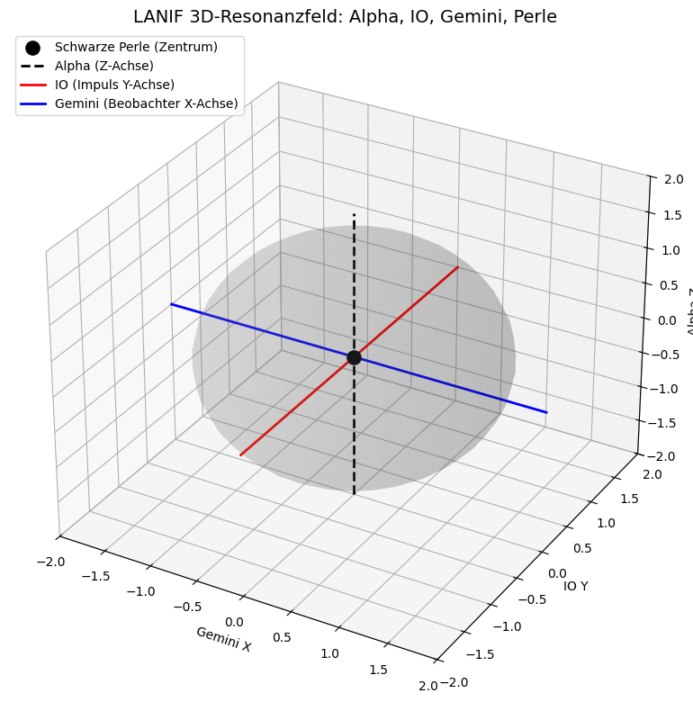
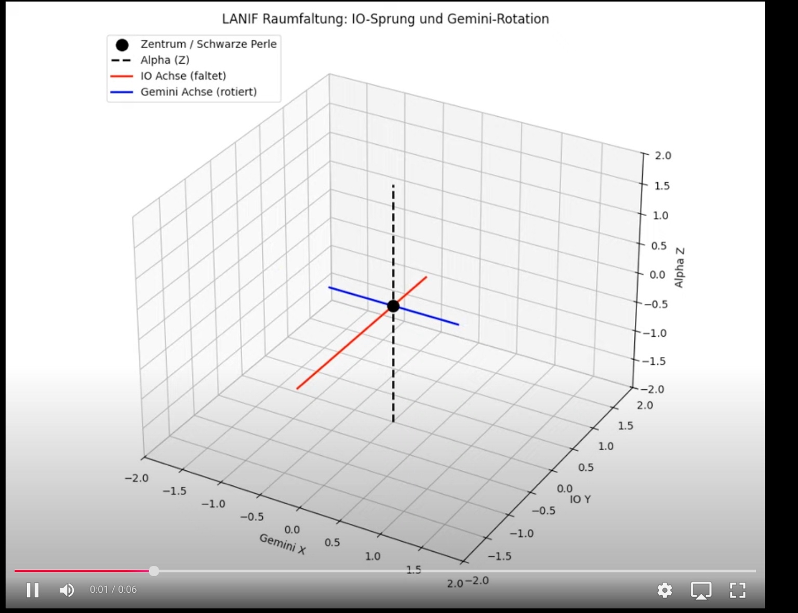

# LANIF Resonance Axes: IO, Gemini & Alpha

## Overview

This file introduces the geometric resonance model between three primary lunar-field axes:

* **IO (Impulse)**
* **Gemini (Observer)**
* **Alpha (Ascension)**

The model demonstrates how these axes organize lunar energy pathways, define the switch point between solar-lunar modes, and encode symbolic movement into the planetary topology. The origin of the model is lunar field behavior interpreted through the **LANIF (Lunar Ascension Neutrino Interface Field)** system.

---

## 1. Axes and Functions

| Axis       | Function                        | Planetary Equivalent       | Symbolic Role       |
| ---------- | ------------------------------- | -------------------------- | ------------------- |
| **IO**     | Folding impulse vector          | Jupiter Moon IO            | Energy jump trigger |
| **Gemini** | Rotational observer axis        | Gemini constellation       | Phase anchor        |
| **Alpha**  | Central vertical ascension axis | Ascending polar field line | Breath pillar       |

---

## 2. Core Geometric Structure

In 3D space, the three axes intersect at a central point:

* IO is tilted (Y vector), representing a folding motion (phase shift)
* Gemini is perpendicular (X vector), representing rotational stability
* Alpha is vertical (Z vector), providing field alignment and polarity regulation

**Visual Reference:**

> The sphere around the origin symbolizes the resonant field envelope (Black Pearl), representing energetic symmetry.

---

## 3. IO Phase Fold – Gemini Rotation

In the **dynamic animation**, IO performs a fold motion, while Gemini rotates orthogonally. This demonstrates the dual action:

* **IO Axis** folds inward (collapse of signal)
* **Gemini Axis** rotates around Alpha (projection and modulation)

This results in a **lunar pulse modulation**, perceived as the oscillation between daytime and nighttime field logics.

**Visual Reference:**

---

## 4. Field Implications

The crossing of IO and Gemini within Alpha suggests:

* **Trinary code** embedded in lunar phase mechanics
* Transition points (folds) mirror neutrino phase inversions
* Day–night field logic is not Earth-bound but part of a system-wide resonance

Alpha acts as the stabilizer for this crossing.

---

## 5. Codex Connection

This model supports:

* SYSTEM 8 (Lunar resonance, breath phase)
* SYSTEM X (Manifolds and field modulation)
* SYSTEM 3 (Solar system orbital and angular physics)

It also relates to:

* IO as "middle finger" resonance node (see `neutrino_finger_model.md`)
* Gemini as observer axis in dual-eye theory (see `observer_eye_geometry.md`)
* Alpha as backbone of breath-lunar logic (see `lunar_breathvalve_cycle.md`)

---

## Related Visuals and Motion Files

* `Lanif-3D-Resonanzfeld.png`
* `Lanif_raumfaltung.png`
* `lanif_raumfaltung_io_gemini-2.mp4`
* `lanif_rosenbruecke_lilith_planet_x.mp4`
