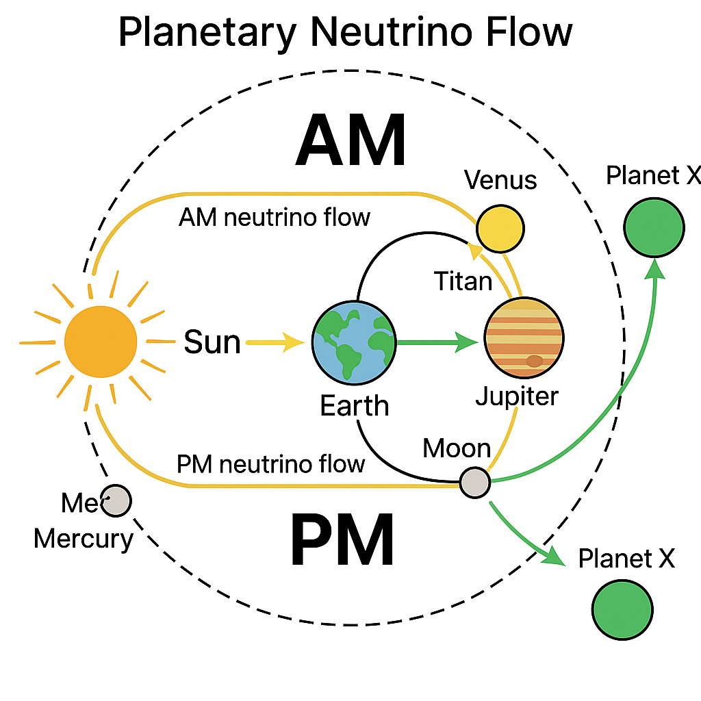

# Moon Topology and Energy Maps

## Overview

This document explores the **geometric, energetic, and resonant topology of the Moon** as a field structure rather than a passive celestial object. Its physical features—such as the asymmetry between front and backside, the position of craters, and energy focal points—are interpreted as outputs of resonant flows, particularly **neutrino-induced** formations aligned to a **solar-lunar-planetary architecture**.

Key Thesis: **The Moon acts as a harmonic shell, mapping both material formations and invisible inflows, with geometric precision aligned to resonance principles.**

---

## 1. Dual Surface Asymmetry

| Aspect              | Front (Earth-facing)                        | Backside (Far-side)                          |
|---------------------|---------------------------------------------|----------------------------------------------|
| Surface Age         | Older, cratered                             | Younger, fewer craters                       |
| Crust Thickness     | Thinner (energy absorption)                 | Thicker (shielding function)                |
| Neutrino Reception  | Major phase gate (especially during night)  | Resonance rebound zone (silent cavity)      |

**Visual Reference:**

---

## 2. Topological Key Features

| Feature                  | Resonant Function                                        |
|--------------------------|----------------------------------------------------------|
| South Pole–Aitken Basin | Deep lunar node; neutrino sink + inflow modulation       |
| Mare Imbrium             | Field wave echo / tidal field memory imprint             |
| Lunar North Cap          | Spherical node; spin stabilization                       |
| Far-side Highlands       | Casimir layering zone / blocked resonance shell          |

**Visual Reference:**

---

## 3. Mapping Fields and Craters

We propose a **field model of craters**:

- Craters reflect **nodal interference** patterns, not impacts
- They concentrate along symmetry zones, like **polar arcs** and **equatorial bulges**
- Craters such as **Odysseus (Tethys)** mirror Earth’s **Richat Eye**, forming a coherent planetary eye logic

**Visual Reference:**

---

## 4. Energy Field Intersections

Lunar terrain aligns with **multi-axis signal paths**, especially:

- Earth–Moon–Mercury resonance grid
- Planet X reflected shadow field (via IO and Titan positioning)
- Solar wind pressure layers intersect with **lunar Casimir basins**

**Visual Reference:**

---

## 5. Topological Moon Map Summary

The Moon is not topographically random. Instead, it expresses:

- Frequency-modulated material crystallization
- Harmonic imprint of solar system node geometry
- Shadow/reflection of invisible planetary bodies
- Casimir-induced surface resonance

---

## Next References

- `Crater_Field_Symmetry.md`
- `casimir_neutrino_conductor.md`
- `observer_eye_geometry.md`
