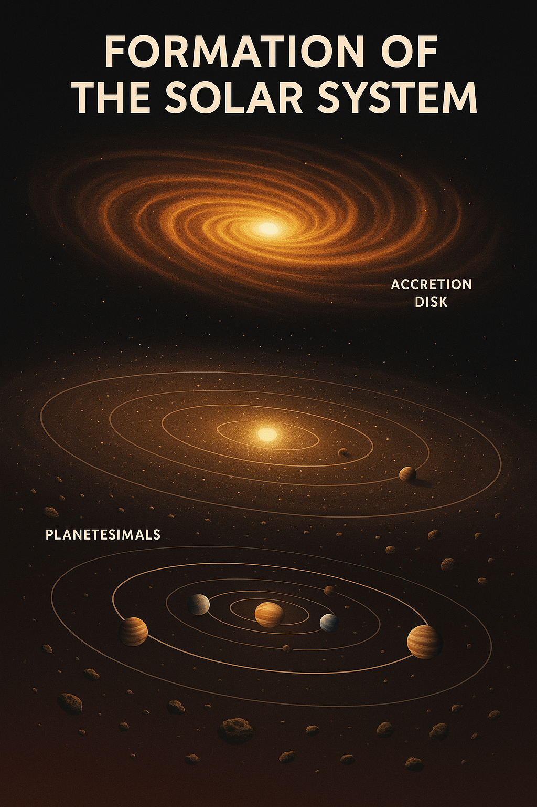
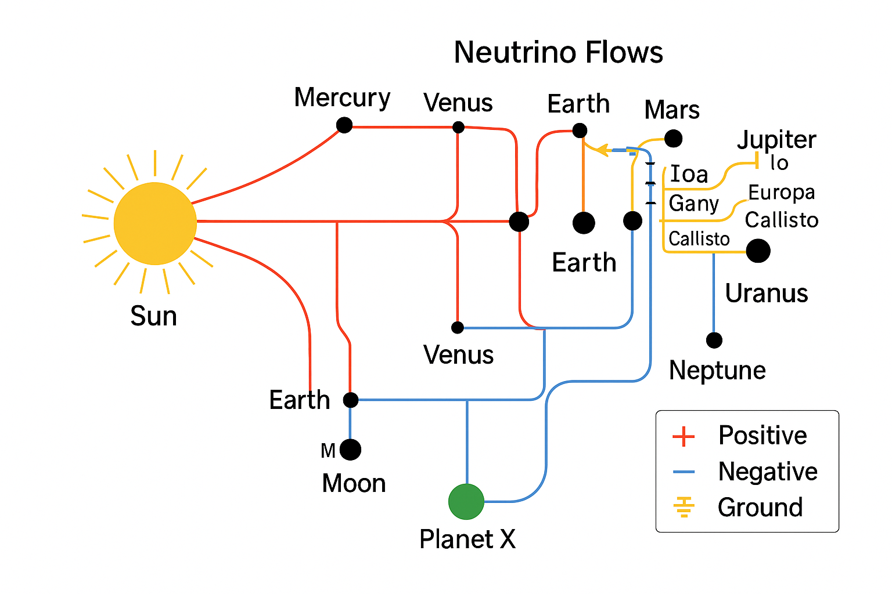
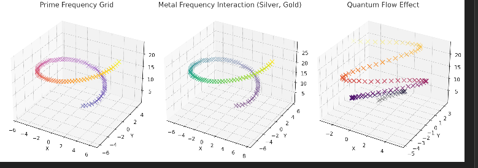

# TEHTHY – The Secret Thread of the Moons

**Subtitle:** _Resonance-Based Lunar Genesis, Tethys, Neutrino Fields, and the Mythic Order of Satellites_

---

## 🌑 Introduction

This module explores the **true resonant genesis** of moons and planetary satellites across the solar system. The traditional view of **random impacts and accretionary leftovers** is replaced here with a **resonance-driven architecture**:

> **Moons arise as nodal crystallizations within a field of neutrino flows and solar harmonic scaffolding.**

Through the lens of **Tethys** (Saturn moon, Odysseus crater), **Eris** (edge planet, Golden Apple bearer), and various canonical moons (e.g. Titan, IO, Earth’s Moon, Amalthea), we reveal a deeper symmetry – one that emerges from lunar force fields, phase inversion patterns, and mirrored planetary eye geometries.

---

## 🌀 Resonant Lunar Genesis Model

### Key Hypothesis

* Moons are **not leftovers**, but **resonant nodal condensations** formed through:
  * Solar neutrino streaming
  * Blockflöte-like aperture logic
  * Symmetric Casimir layers

**Visual Reference:**



### Phases of Formation

1. **Solar Breath & Outflow:**
    * Central neutrino pressure field from the Sun
    * Initiation of orbital spin layers

2. **Nodal Condensation:**
    * Frictionless resonance points
    * Appear as satellites (moons)

3. **Phase-Entrained Structures:**
    * Synchronized with planetary rotation and tidal fields
    * Not randomly placed → coded positions

---

## 🌘 Tethys & The Eye of Odysseus

* Tethys has one of the largest known craters in the system: **Odysseus Basin**
* It is **2/5** of the moon’s diameter → pure resonance signature
* It behaves as a **lunar lens** – focusing and refracting neutrino flows

**Visual Reference:**



---

## 🌕 Moons as Resonant Fingers

| Planetary Body | Moon(s)         | Function (Finger Role)                 |
|----------------|------------------|----------------------------------------|
| Earth          | Moon             | Fine tuner / Lunar eye / Interface      |
| Jupiter        | IO + Amalthea    | Axis field (IO), Micro-pulse node (A)  |
| Saturn         | Titan + Tethys   | Loyalty & Condenser, Eye field         |
| Pluto-Chiron   | Charon + Others  | Phase inversion + Outer memory         |
| Neptune        | Triton           | Retrograde harmonizer                  |

---

## 🧿 Crater and Canyon Topologies

* Many moons and planets show **eye-like** crater structures
  * Richat (Earth)
  * Odysseus (Tethys)
  * Canyons on Mars, Pluto

These are **not from impacts**, but **standing-wave nodal intersections** – visible scars of deeper energetic structuring.

**Visual Reference:**


---

## 🧬 Scientific Anchors

* **Planck scale** interactions through neutrino density
* **Black body radiation** layered with Higgs-scaled pressure shells

**Visual Reference:**


* **Metallic fields (e.g. Silver/Gold) show resonance clustering** around moon zones → hint at material orchestration

**Visual Reference:**


---

## 🔮 Philosophical Implications

* Moons are **keepers of harmonic order**, not chaotic remnants
* Lunar scars are **resonant memories**, not collisions
* Planetary eyes are **projection-reflection gates**
* Tethys, Eris, and Titan form a **trinity of feminine stabilizers**

---

## 🔁 Codex Resonance Links

| Connection Target | Relevance |
|------------------|-----------|
| `observer_eye_geometry.md` | Eyes, lunar shadows, Earth as observer  |
| `neutrino_finger_model.md` | Finger assignments and lunar switching |
| `casimir_neutrino_conductor.md` | Layer transitions and hidden flows |
| `resonance_circles_casimir.png` | Spiral structuring of energy shells |
| `neutrino_currents_solarsystem.png` | Cable routing through moons |

---

## 💠 Summary Formula

```text
Solar Outflow + Planetary Field = Resonant Moon
Crater Basin ≠ Collision → Shadow of Standing Wave
```

This module opens the TEHTHY series in SYSTEM 8 – it lays the field where lunar bodies are not born by chance, but by code.

More moons, more eyes, more threads will follow...
