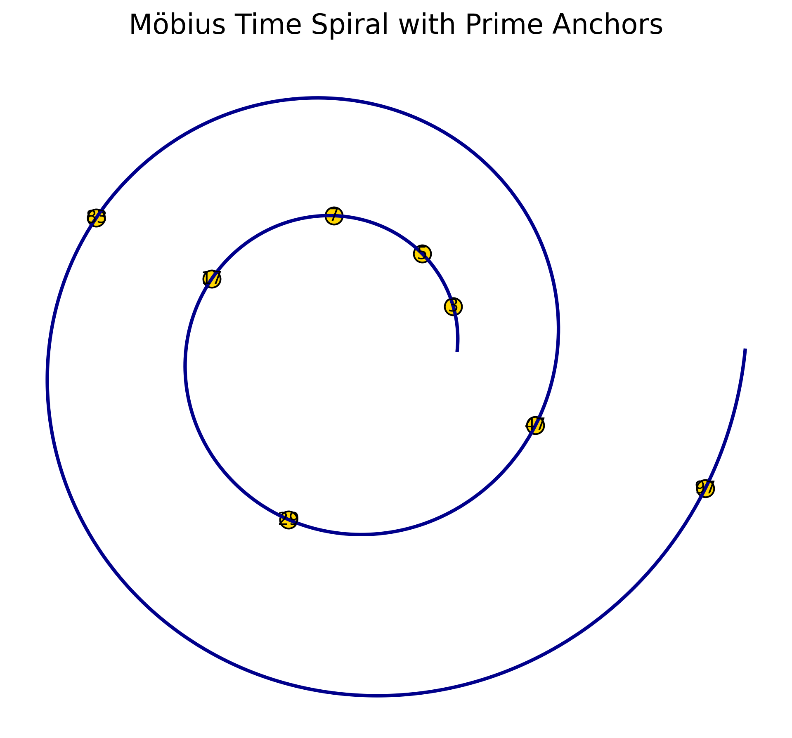
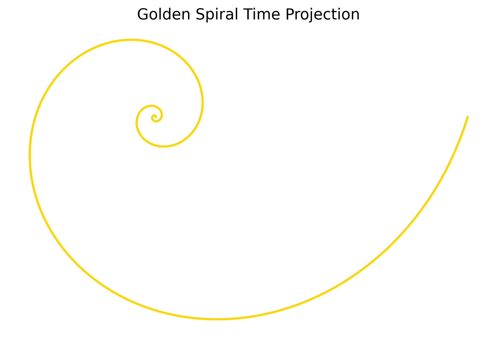
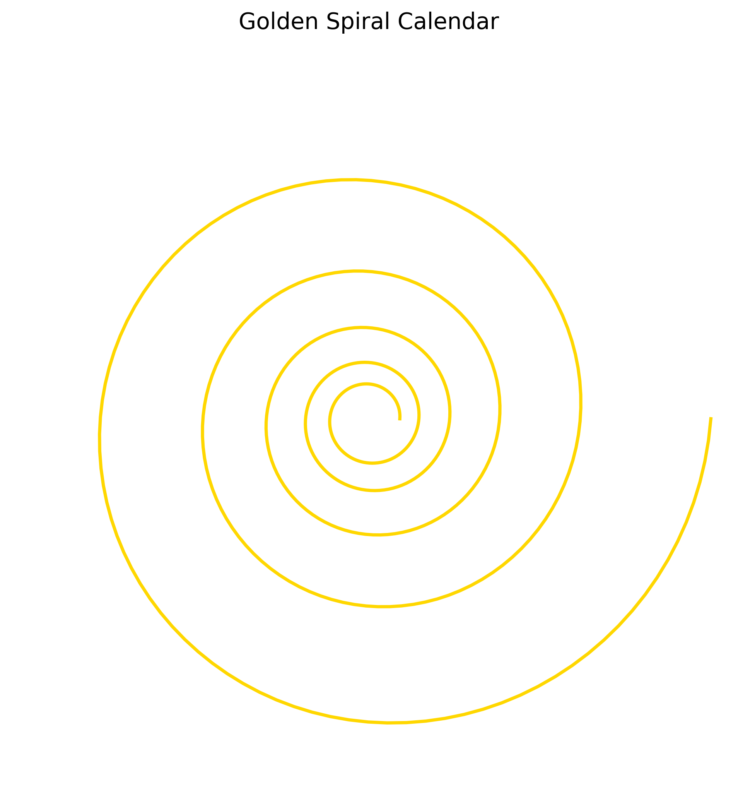
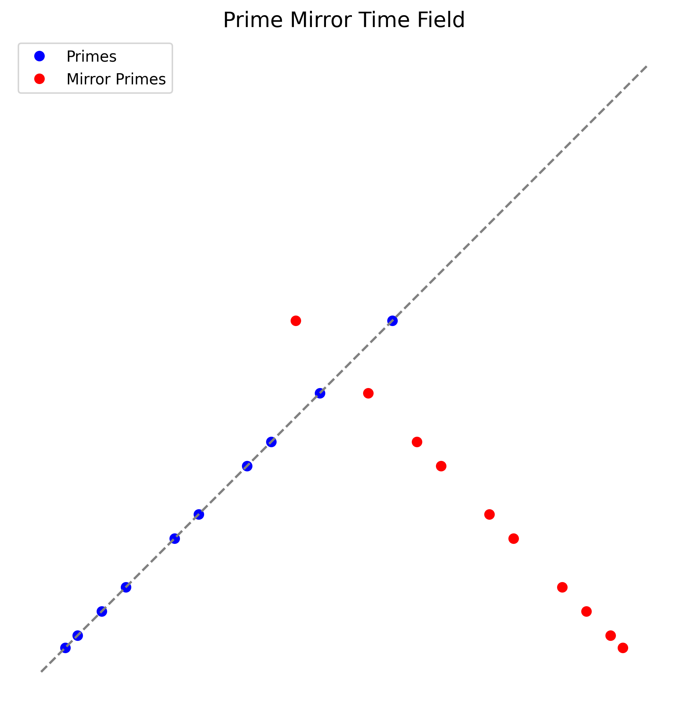
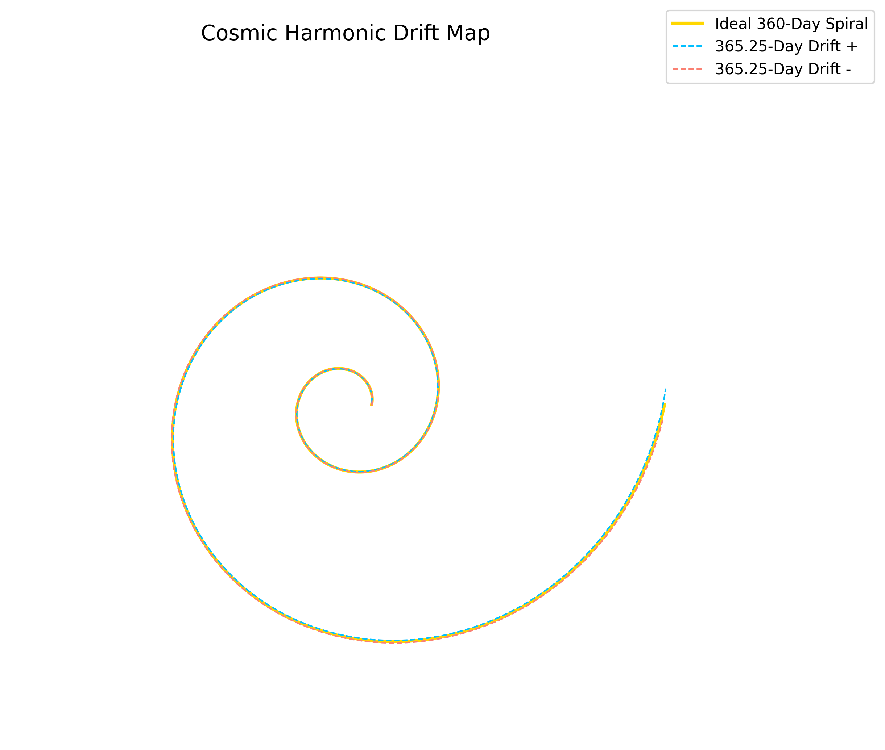

# 📚 Visual Gallery — *Cosmic Harmonic Time*

---

### 🌀 Möbius Time Spiral Primes

> A Möbius-spiral mapping of prime numbers onto a temporal field structure.  
> The spiral reveals resonant prime distributions along harmonic curves, reflecting deep number-theoretic symmetries.

[Download Möbius Time Spiral Primes (PNG)](./visuals/mobius_time_spiral_primes.png)

---

### 🌀 Golden Spiral Time Projection

> The golden spiral extended across a temporal field, modeling cosmic expansion.  
> It visualizes the geometric unfolding of time through logarithmic growth aligned with Φ (Phi).

[Download Golden Spiral Time Projection (PNG)](./visuals/golden_spiral_time_projection.png)

---

### 🌀 Golden Spiral Calendar

> A harmonic calendar based on the golden ratio, spiraling through cosmic time.  
> The structure synchronizes biological, planetary, and astronomical cycles into a unified timeline.

[Download Golden Spiral Calendar (PNG)](./visuals/golden_spiral_calendar.png)

---

### 🌀 Fibonacci Phase Map

> Phase nodes derived from Fibonacci numbers mapped in a polar layout.  
> This diagram captures the transition points of harmonic states in the flow of time.

[Download Fibonacci Phase Map (PNG)](./visuals/fibonacci_phase_map.png)

---

### 🌀 Prime Mirror Time Field

> A polar grid reflecting prime numbers across mirrored temporal axes.  
> It shows resonance points where prime distributions interact with time-layer symmetries.

[Download Prime Mirror Time Field (PNG)](./visuals/prime_mirror_time_field.png)

---

### 🌀 Cosmic Harmonic Drift Map

> A visualization of the drift between the ideal 360-day calendar and the real 365.25-day cycle.  
> Harmonic spirals illustrate the divergence and realignment of cosmic timeframes over epochs.

[Download Cosmic Harmonic Drift Map (PNG)](./visuals/cosmic_harmonic_drift_map.png)

---

# 🌀 Closing Note

> This gallery presents a visual harmonic journey through cosmic time structures, resonances, and prime distributions — bridging abstract mathematics with universal temporal dynamics.
