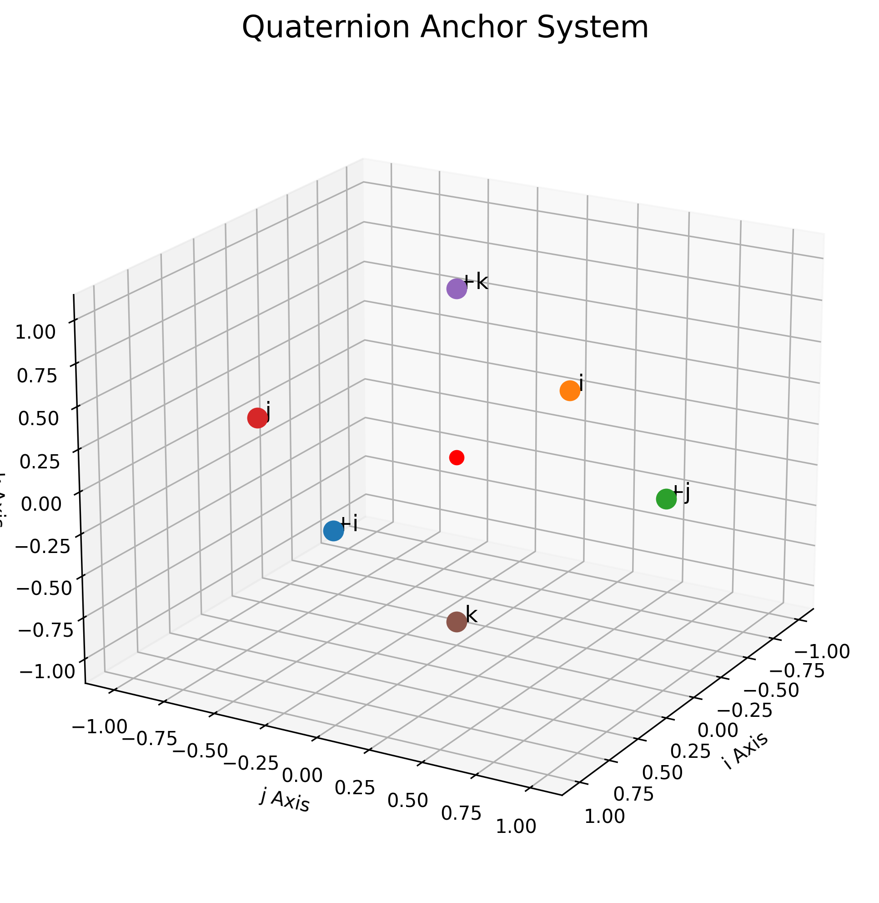
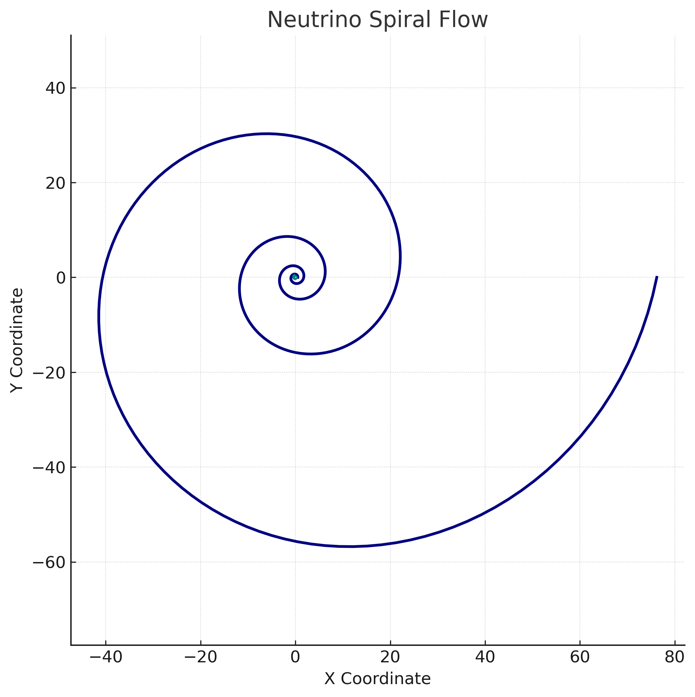
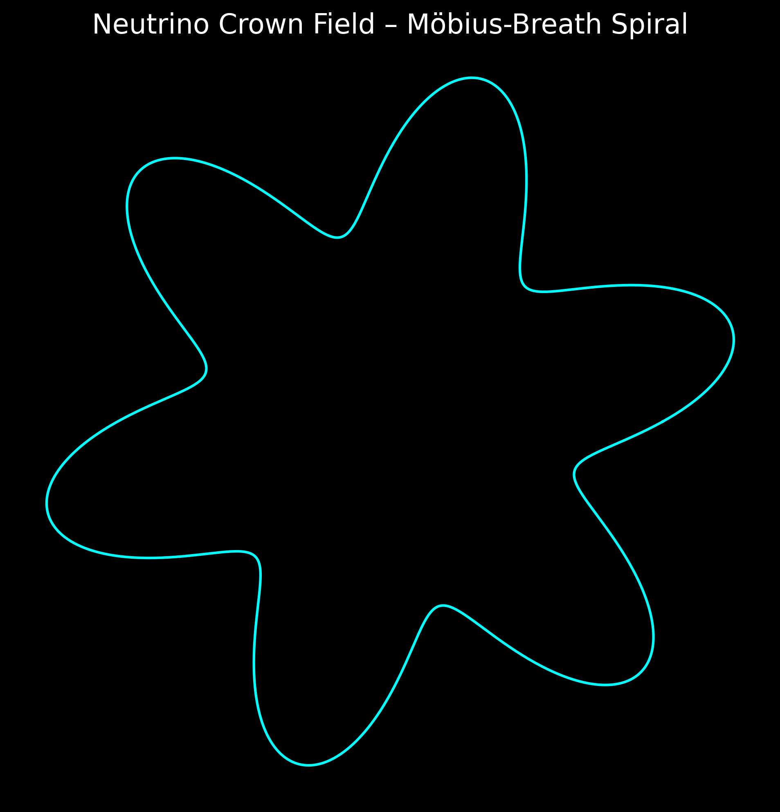

# 🎨 Visual Gallery · Möbius Neutrino Crown Framework

---

## 🌀 Breath Field Equation Flow

This visualization models the **Breath Field Equation** using prime number resonances. The pattern shows the dynamic harmonic expansion of prime-based frequencies forming a coherent flow field — essential for understanding cosmic energy distributions.

---

## 🌌 Ghost Grid Overlay

A subtle **Ghost Grid** reveals the underlying lattice of higher-dimensional curvatures. Rendered on a dark field, the circle delineates hidden structures where neutrino flows resonate — often invisible to conventional astrophysical detection methods.

---

## 🧲 Quaternion Anchor System

The **Quaternion Anchor System** maps the core directions (+i, -i, +j, -j, +k, -k) essential for the 3D orientation of the Möbius Crown. Each quaternion node serves as a stabilizing point for energy flows across different dimensional layers.

---

## 🌊 Neutrino Spiral Flow

The **Neutrino Spiral Flow** depicts a logarithmic spiral expansion, mapping the resonance layers of neutrino distributions across galactic scales. It represents the breathing dynamic of energy between stellar nodes.

---

## 🌀 Neutrino Crown Field — Möbius Breath Spiral

This graphic shows the **Möbius Breath Spiral** as the core resonant heartbeat of the Neutrino Crown. It intertwines the concepts of breathing cycles and prime anchoring points, forming the energetic scaffolding of the framework.

---

> **Note**: The "Ghost Grid Overlay Milkyway" (lotus effect) visualization remains excluded for clarity.

---
