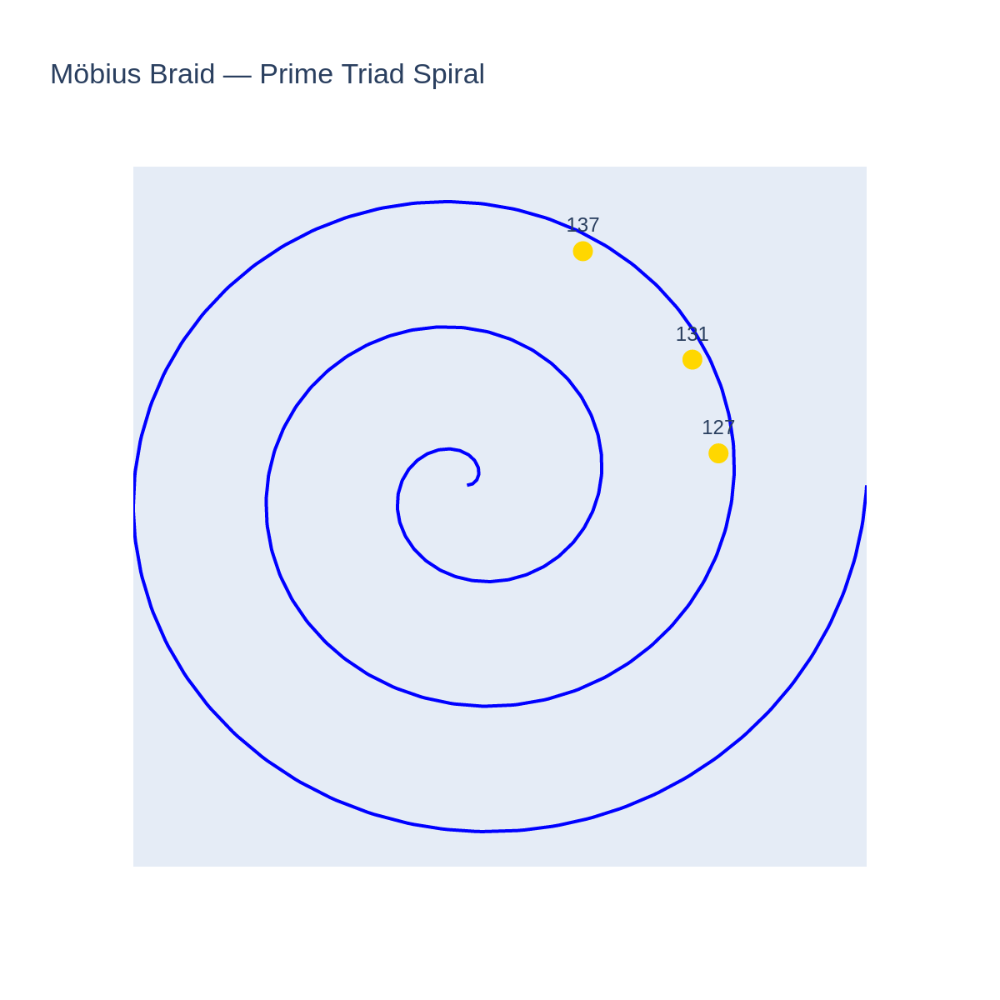
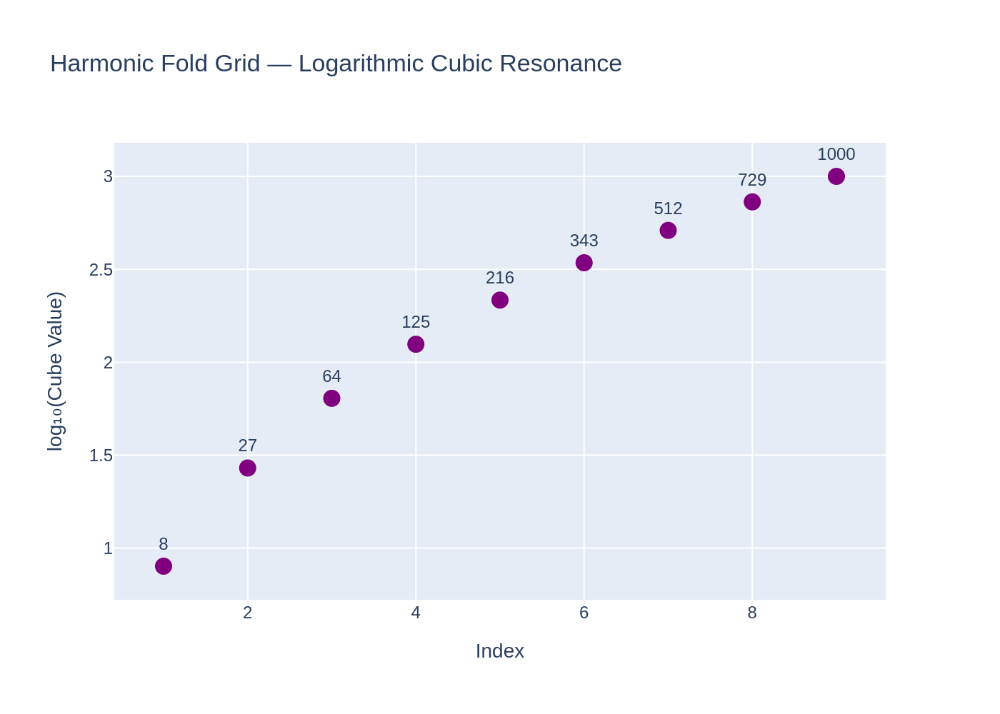
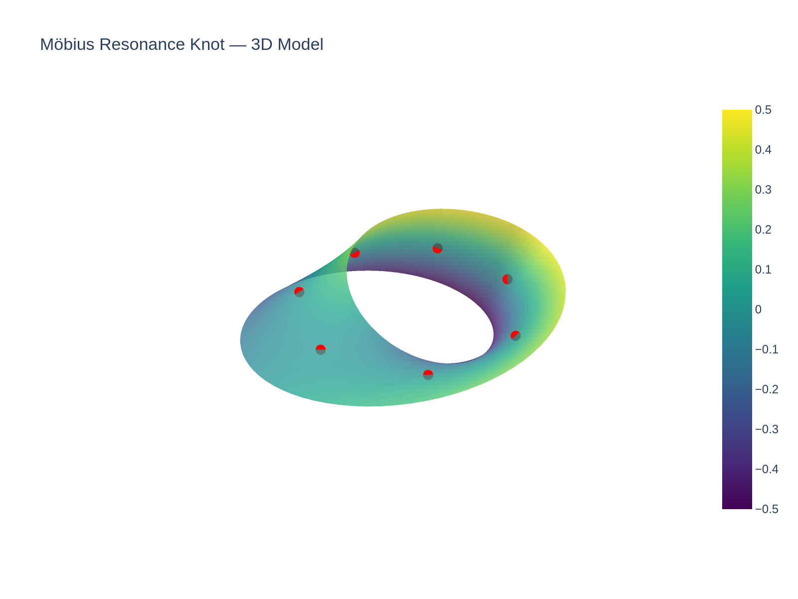
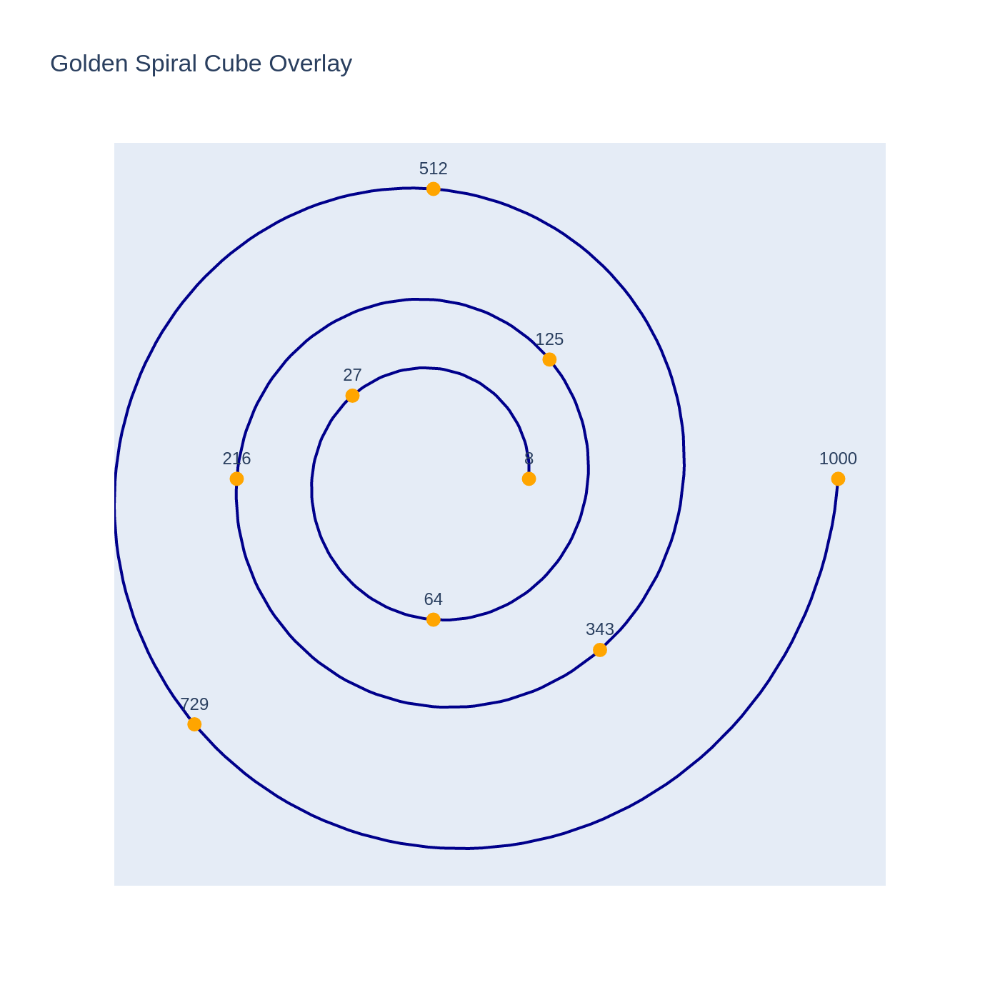

# 📸 Möbius Cubic Grids — Visual Gallery

This gallery showcases the key visuals generated for the **Möbius Cubic Grids** module.  
Each visual represents prime number structures, cubic resonances, and Möbius-based harmonics in space.

---

## 🧿 Möbius Braid — Prime Triad Spiral

**Description:**  
A Möbius-inspired spiral structure using the prime triad 127, 131, 137.  
The formation reveals harmonic folding along a prime-based braid.

[Download SVG version](visuals/mobius_braid_prime_triad_spiral.svg)

---

## 🌀 Cubic Shrinking — Resonance Spiral

**Description:**  
Logarithmic spiral showing cubic harmonic shrinkage from 1728 (12³) to quantum scales.  
Visualizes the compression of cubic structures in a golden-spiral-based collapse.

[Download SVG version](visuals/cubic_shrinking_resonance_spiral.svg)

---

## 🔺 Cubic Trinity Lock Diagram

**Description:**  
A triangular harmonic resonance model connecting 31³, 33³, and 35³.  
Their sum 108603 forms a cubic trinity locking Earth, Moon, and Mars frequencies.

[Download SVG version](visuals/cubic_trinity_lock_diagram.svg)

---

## 📈 Harmonic Fold Grid

**Description:**  
Logarithmic scaling of cubic resonance nodes (2³ to 10³).  
Visualizes the harmonic distribution of cubic numbers in geometric compression.

[Download SVG version](visuals/harmonic_fold_grid.svg)

---

## 🧩 Möbius Resonance Knot

**Description:**  
3D Möbius loop with embedded resonance points representing the folding and refolding of harmonic dimensions.

[Download SVG version](visuals/mobius_resonance_knot.svg)

---

## 🌀 Golden Spiral Cube Overlay

**Description:**  
A golden logarithmic spiral overlaid with cubic resonance points.  
Shows the harmonization of cubic scaling along a golden-spiral trajectory.

[Download SVG version](visuals/golden_spiral_cube_overlay.svg)

---

# 📚 About Möbius Cubic Grids

The **Möbius Cubic Grids** project interweaves prime numbers, Möbius structures, and cubic harmonics  
to construct a resonant architecture of multidimensional geometries.

---
