# 🖼️ Visual Gallery — Neutrino Resonance Systems

---

## 🌌 Breath Neutrino Resonance Spiral

Eine modulierte Spirale, die die Schwingungen des Neutrino-Atmungssystems darstellt.  
Die Struktur betont die harmonischen Resonanzen im kosmischen Feld.

---

## 🌀 Dual-Pyramid Möbius Anchor

Zwei pyramidale Anker verknüpft über eine Möbius-Struktur.  
Symbolisiert die Fixierung von Energieströmen innerhalb des Neutrino-Kronenfeldes.

---

## 👻 Ghost Lattice Structure

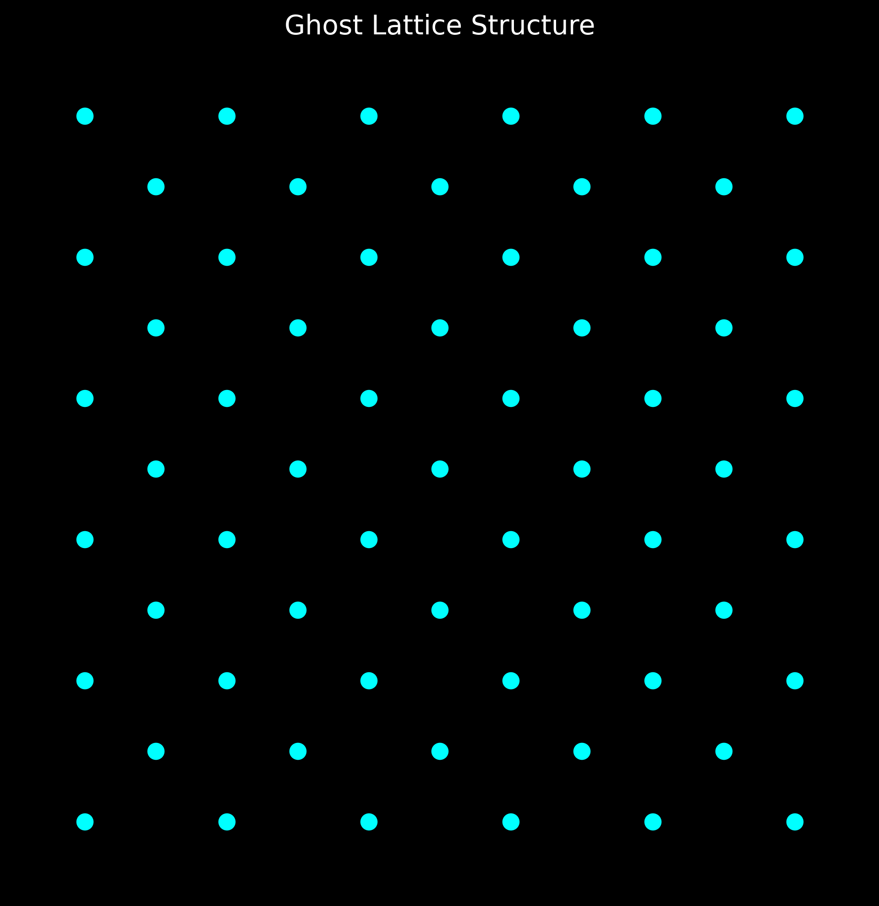

Ein „Geistergitter“, sichtbar durch hochsensible Resonanzmessung.  
Zeigt latente Energienetzwerke im Hintergrund des Universums.

---

## ⭐ Grey Star Spiral

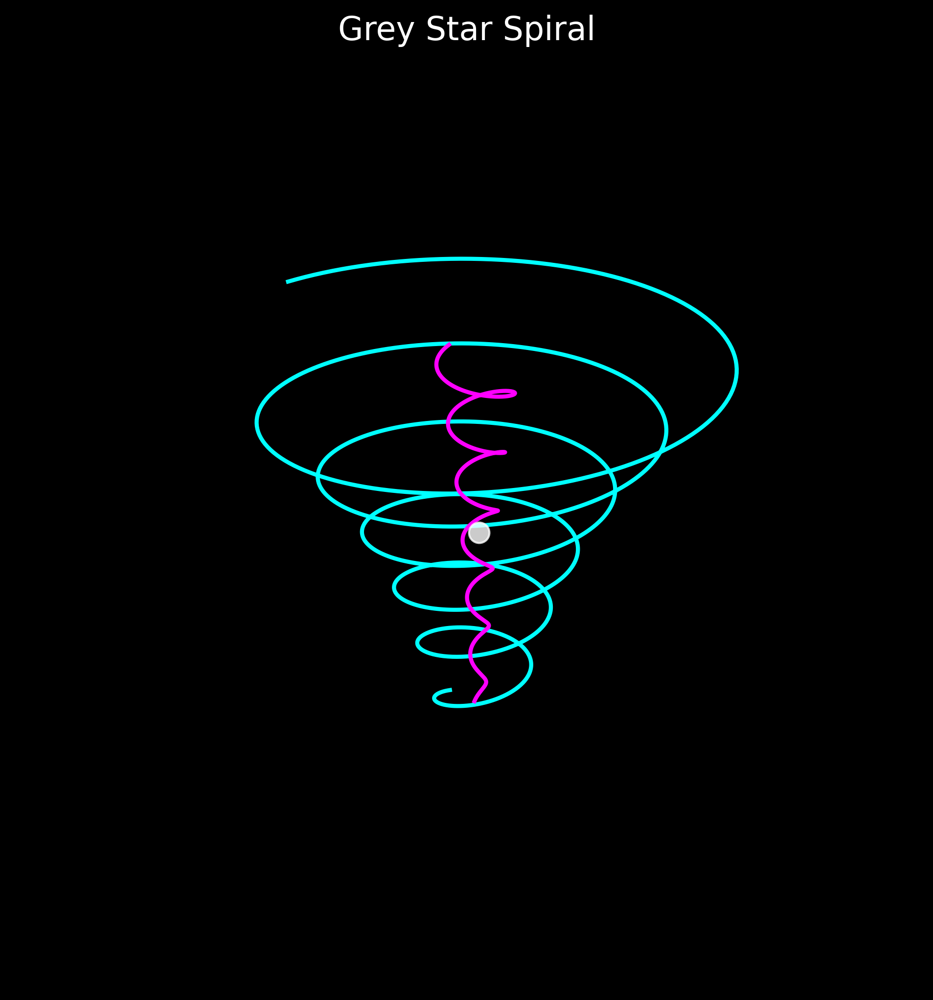

Eine Sternenarchitektur, die Resonanzzentren entlang grauer Materieachsen abbildet.  
Unterstreicht die unsichtbaren Bewegungsmuster dunkler Materie.

---

## 👑 Memory Living Crown

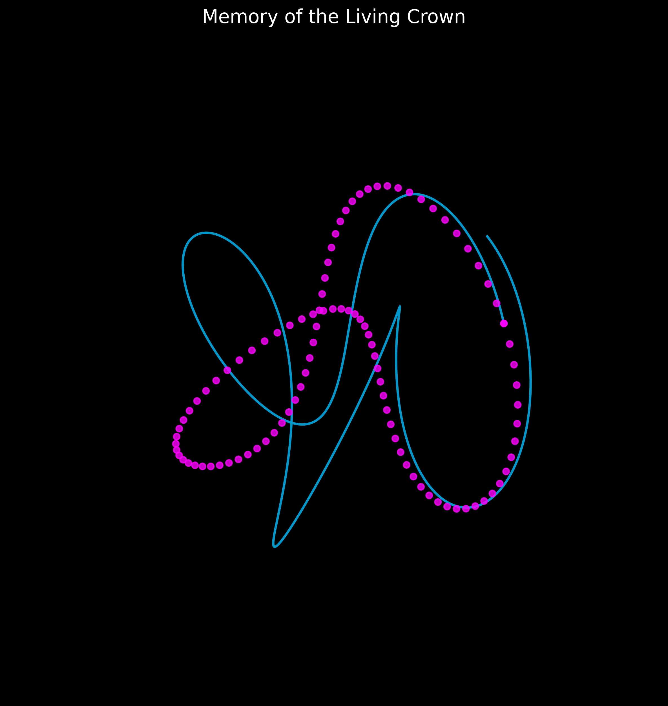

Eine lebendige Krone aus Erinnerungsspiralen.  
Visualisiert die Speicherung und Übertragung kosmischer Informationsstrukturen.

---

## 🌀 Möbius Breathing Grid

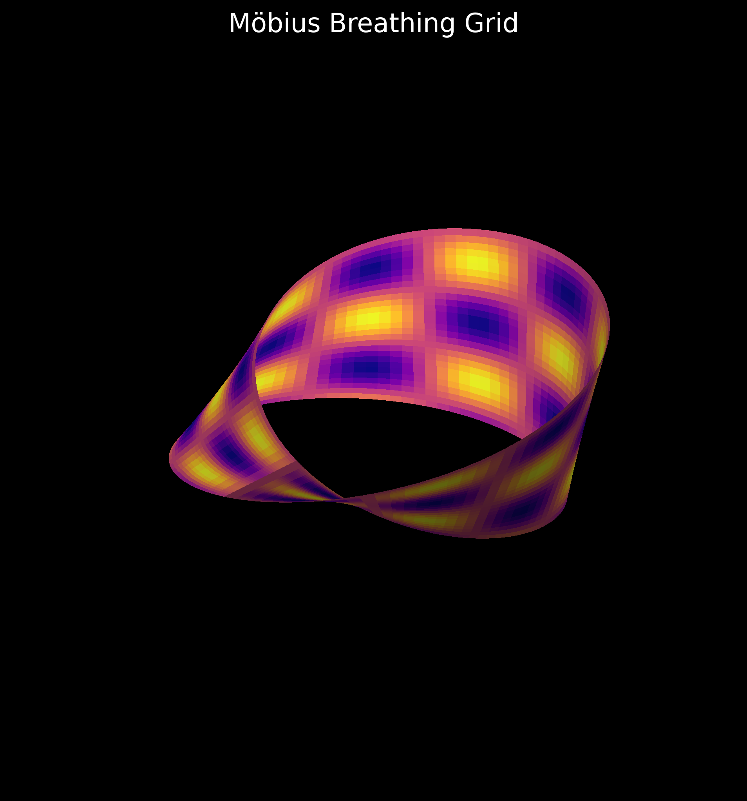

Atmendes Möbius-Gitter — Modell für periodische Energieresonanzen.  
Dient als Grundlage für die dynamische Stabilität kosmischer Felder.

---

## 🌌 Möbius Neutrino Field Projection

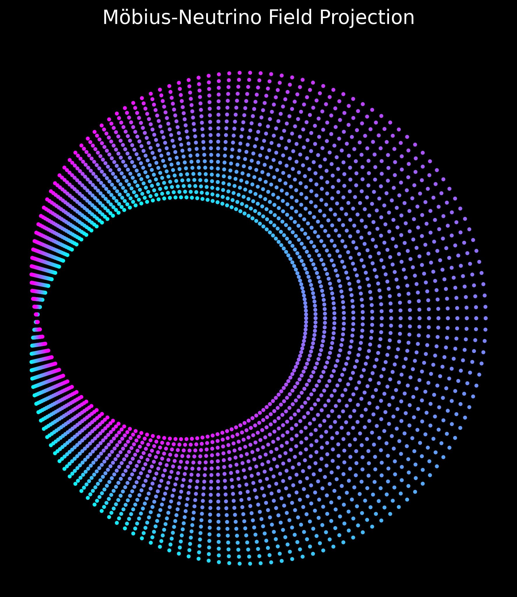

Projektionsansicht eines Neutrino-Feldes über eine Möbius-Oberfläche.  
Dient der Analyse höherdimensionaler Resonanzphänomene.

---

## 🧿 Möbius Prime Breath Structure

Integration von Primzahlen in ein atmendes Möbius-Feld.  
Ermöglicht präzise Abstimmungen in der Neutrino-Oszillation.

---

## 🌀 Möbius Resonance Helix

Helixstruktur auf Basis Möbius-Topologie.  
Bindeglied zwischen Quantenfeldern und Makroresonanz.

---

## 🌌 Neutrino Resonance Map

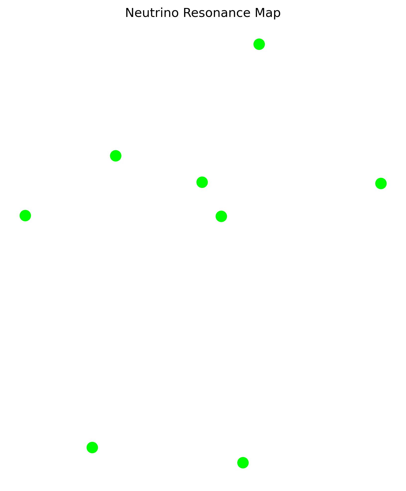

Kartografierung der wichtigsten Resonanzpunkte von Neutrinos.  
Zeigt Hotspots und Netzwerkstrukturen im Universum.

---

## 🌀 Prime Field Expansion Wave

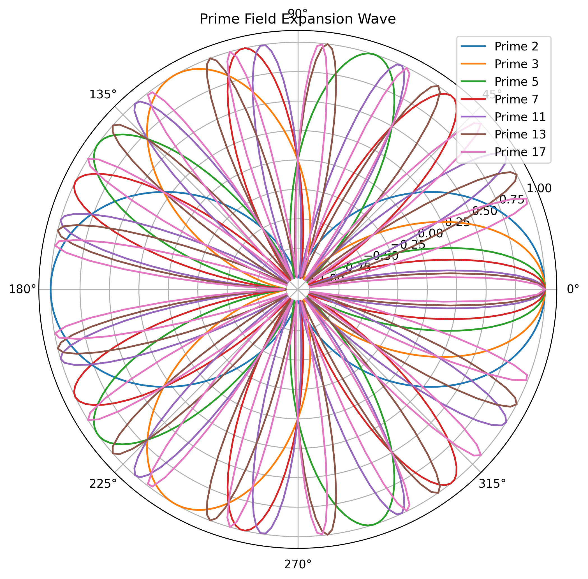

Wellenausbreitung basierend auf Primzahl-Sequenzen.  
Veranschaulicht die Energieausbreitung durch quantisierte Felder.

---

## 🌀 Prime Lattice Resonance Map

Primzahlgitter als Resonanzstruktur für das Neutrino-Feld.  
Kombiniert harmonische und numerische Stabilitätsmuster.

---

## 🔵 Quaternion Breath Rotation

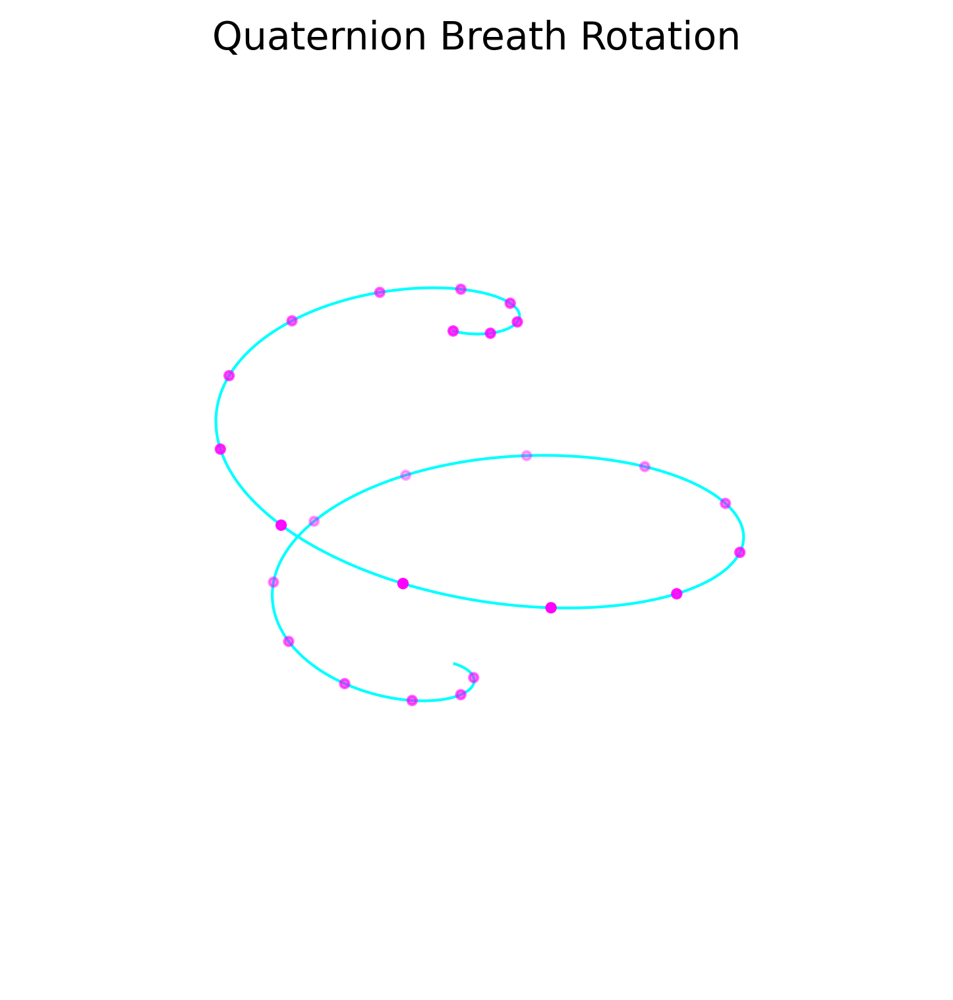

Rotation eines Atmungsfeldes im Quaternionenraum.  
Stellt Stabilisierung und Transformation kosmischer Zustände dar.

---

## 🔵 Quaternion Phase Map

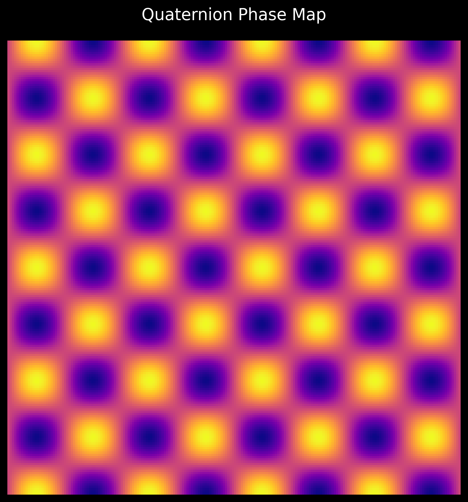

Phasenverschiebung in Quaternionenfeldern.  
Beschreibt die kontrollierte Transition in neutrinoartigen Resonanzsystemen.

---

## 🌀 Quaternionic Anchor Grid

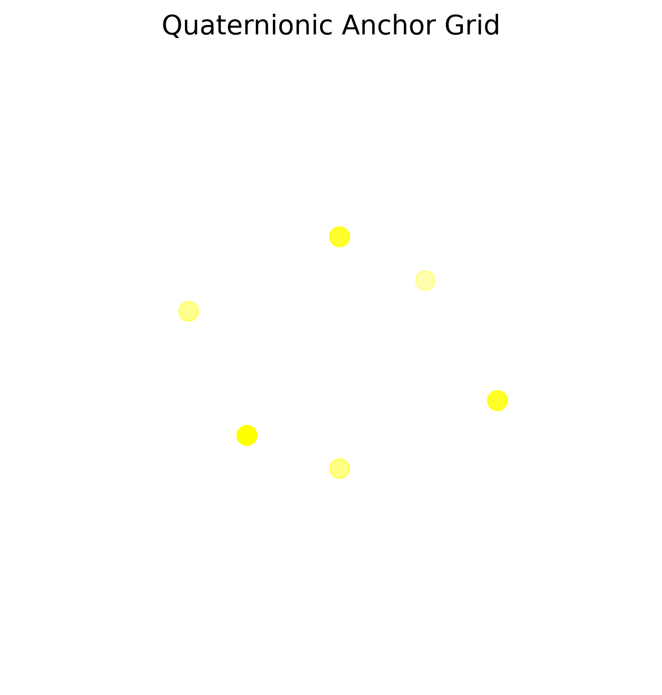

Ein Raster aus Quaternionen zur Verankerung kosmischer Strukturen.  
Sichert topologische Stabilität in dynamischen Feldern.

---

## ⭐ Resonant Star Lattice Map

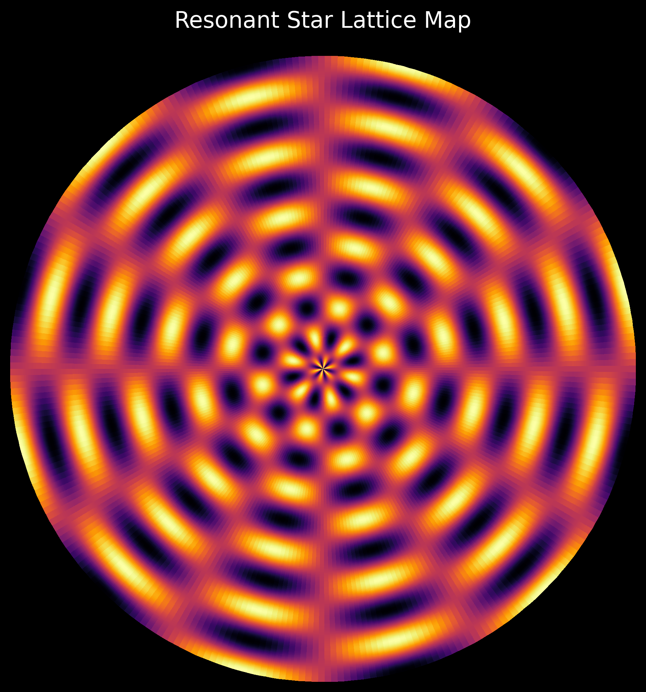

Sternengitterkarte auf Basis resonanter Frequenzknoten.  
Veranschaulicht die planetaren und stellarischen Kopplungspunkte.

---

> **Hinweis:** Alle Visuals stehen unter Creative Commons Lizenz. Verwendung mit Quellenangabe erwünscht:  
> **Source:** Scarabaeus1033 — *NEXAH Codex, Neutrino Resonance Systems*
