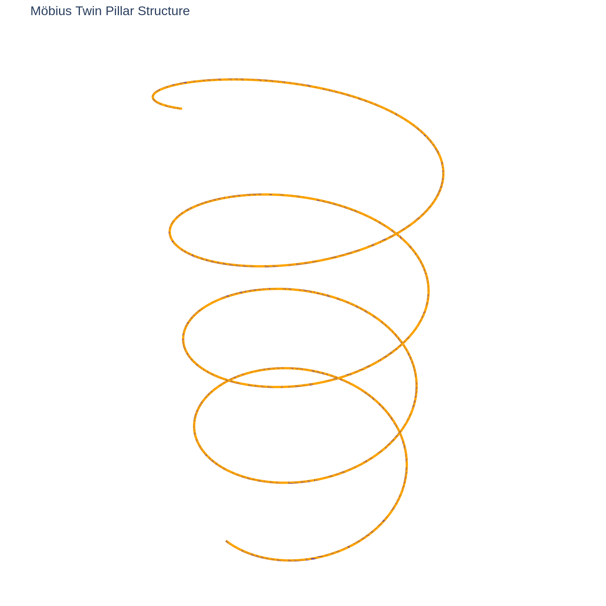
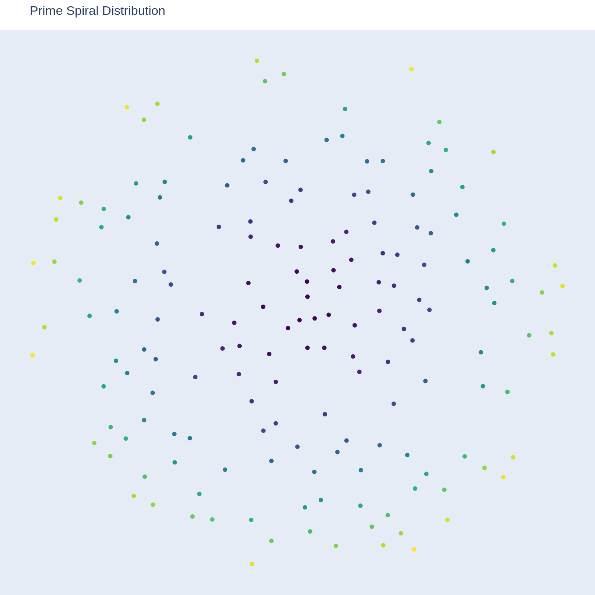
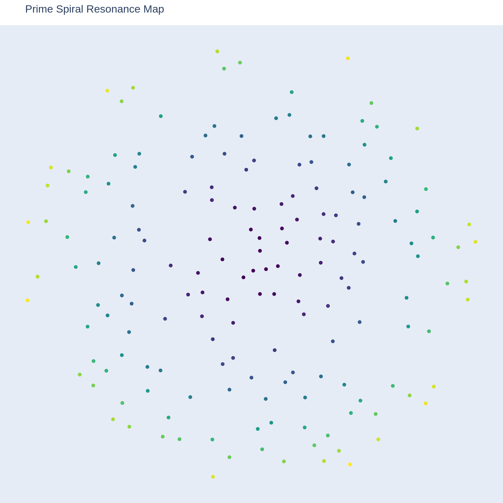
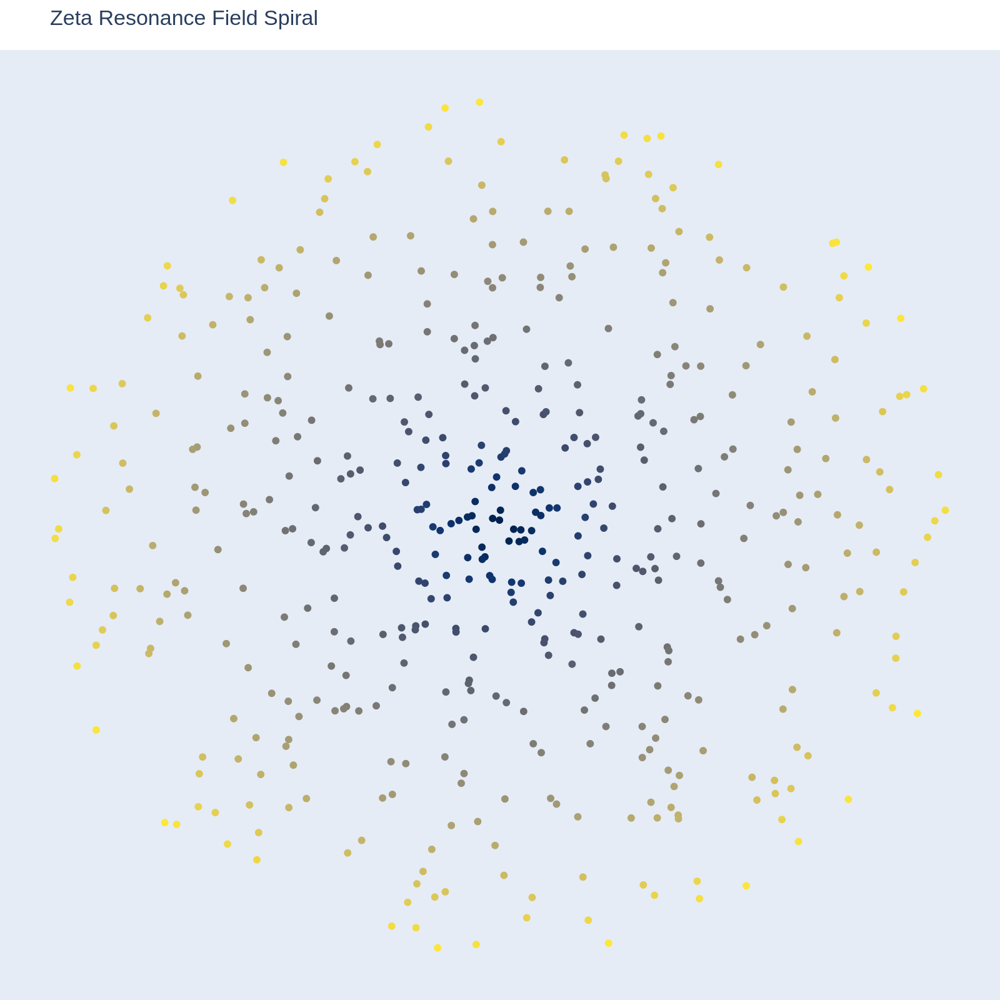
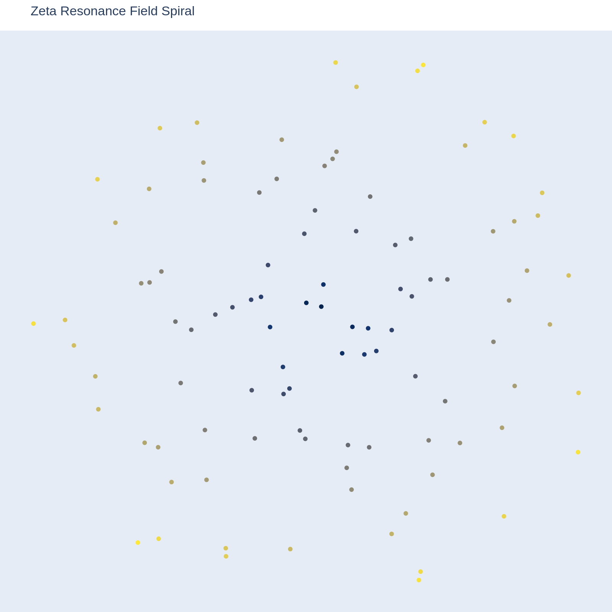

# 🌌 Prime Resonance Frameworks – Visual Gallery

A curated selection of visualizations illustrating prime-based harmonic structures, Möbius transformations, and Zeta resonance fields.  
All visuals are based on the *Tessaric Möbius Seal* research threads.

---

### 1. Möbius Twin-Pillar Structure
**Filename:** `mobius_twin_pillar_structure.png`
  
A schematic depiction of the Möbius Twin-Pillar Portal — illustrating the twin-axis inversion based on prime harmonics and quaternion frameworks.  
The twin pillars symbolize dual cosmic resonance channels.
  

---

### 2. Prime Spiral Distribution
**Filename:** `prime_spiral_distribution.png`
  
A prime number distribution mapped onto a polar spiral using the Golden Angle (~137.5°).  
It reveals the hidden order and resonance clustering of primes within harmonic fields.
  

---

### 3. Prime Spiral Resonance Map
**Filename:** `prime_spiral_resonance_map.png`
  
Enhanced spiral map overlaying prime nodes and Zeta field contours.  
Highlights resonance nodes and invisible harmonic tensions between prime constellations.
  

---

### 4. Zeta Resonance Spiral I
**Filename:** `zeta_resonance_spiral.png`
  
A detailed resonance map of the first 200 nontrivial zeros of the Riemann Zeta function, projected into a spiraling field.  
This visualization captures the harmonic signature of Zeta-driven prime distributions.
  

---

### 5. Zeta Resonance Spiral II
**Filename:** `zeta_resonance_spiralii.png`
  
A magnified view focusing on the inner field of Zeta resonances.  
It reveals the fine-grained prime echo structures near the critical strip, enabling deeper prime field analysis.
  

---

# 📚 **Legend**
| Visual | Description |
|:--|:--|
| Möbius Twin-Pillar Structure | Twin-axis Möbius geometry, symbolic of quantum inversion gates. |
| Prime Spiral Distribution | Prime placement on Golden Angle spirals. |
| Prime Spiral Resonance Map | Prime distribution + Zeta zero overlays. |
| Zeta Resonance Spiral I | Global resonance field of Zeta zeros. |
| Zeta Resonance Spiral II | Zoomed prime resonance core field. |

---
