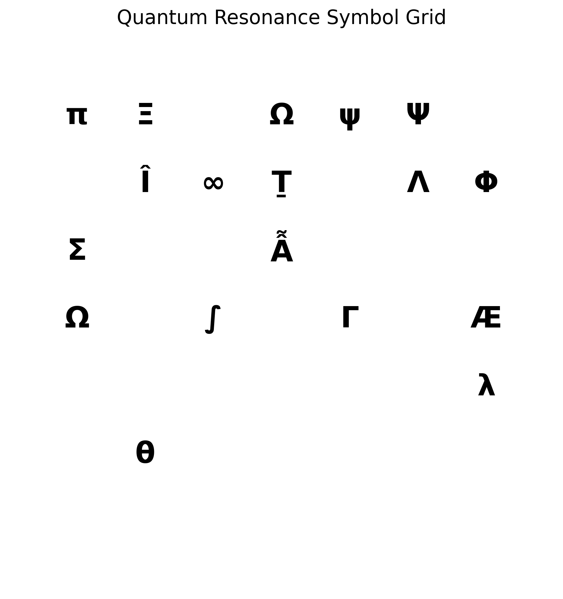
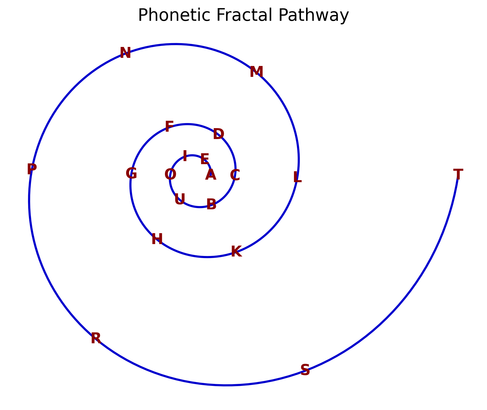
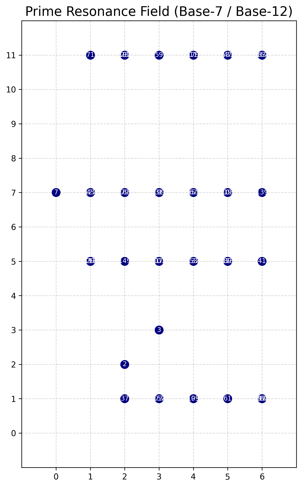
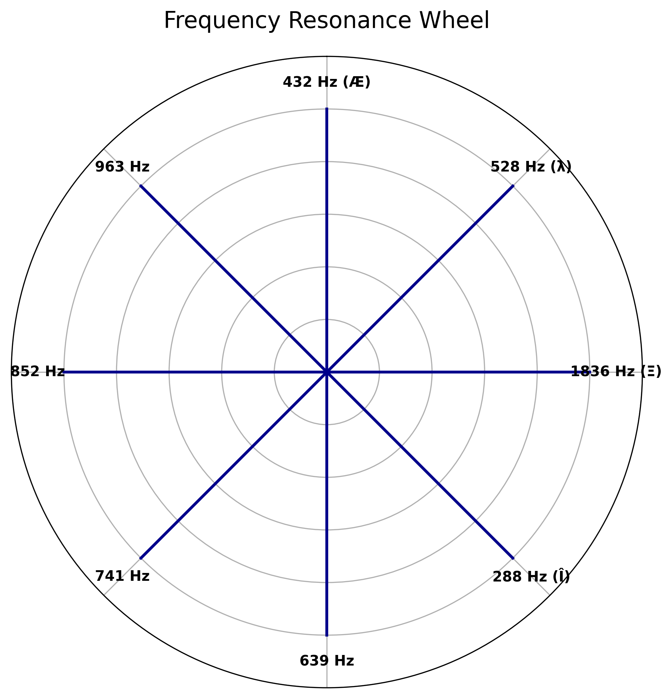
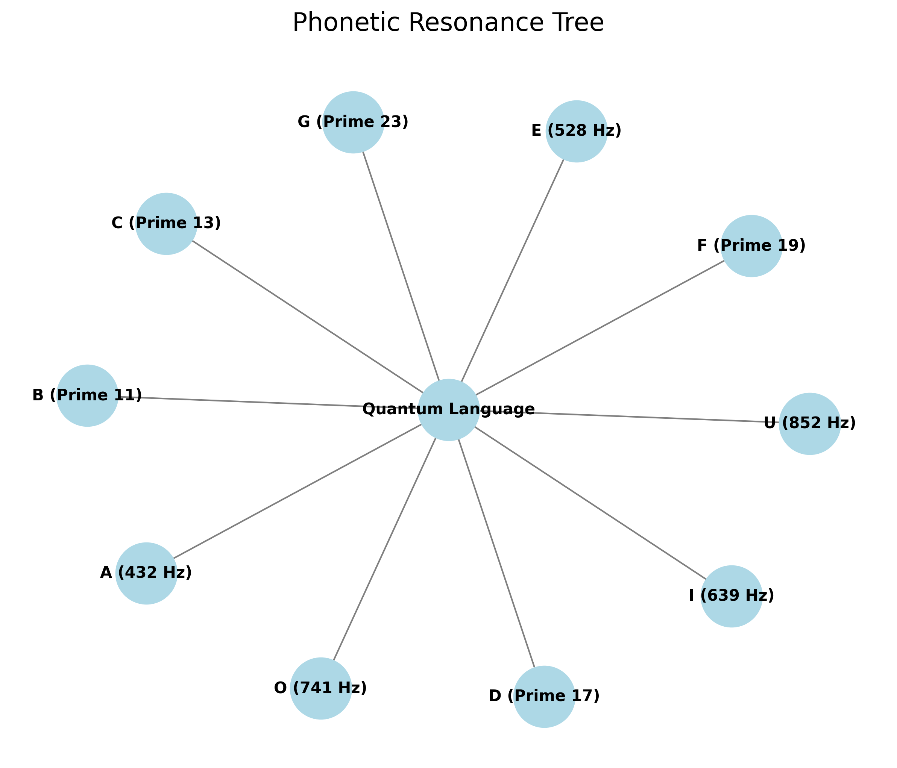
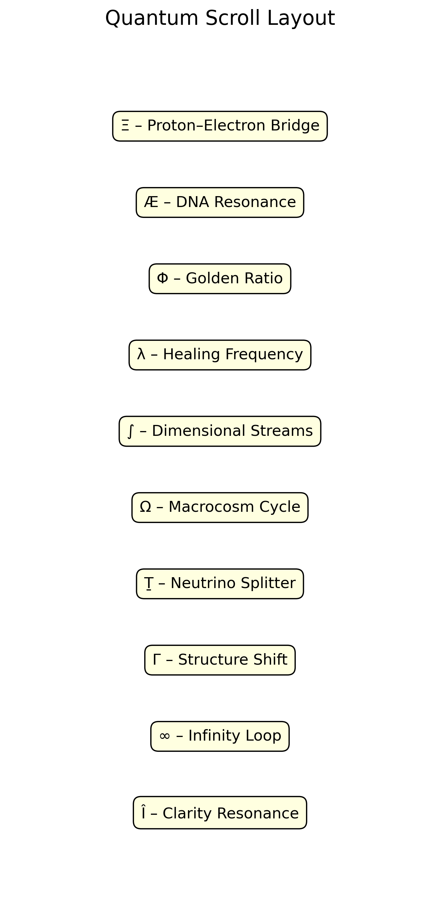

# 🖼️ Quantum Resonance Language — Visual Gallery

A curated gallery of key visuals illustrating the structure, symbols, and resonance frameworks of the Quantum Resonance Language.

---

## 1. Quantum Resonance Symbol Grid

**Description:**  
Arrangement of quantum resonance symbols based on modular 7×7 grid logic.

---

## 2. Phonetic Fractal Pathway

**Description:**  
Fractal spiral mapping of vowels and consonants along resonance curves.

---

## 3. Emerald Lock Diagram

**Description:**  
Symbolic Emerald Lock connecting macrocosm and microcosm through quantum symbology.

---

## 4. Prime Resonance Field

**Description:**  
Mapping of prime numbers on a Base-7/12 resonance lattice.

---

## 5. Frequency Resonance Wheel

**Description:**  
Radial arrangement of key quantum resonance frequencies.

---

## 6. Phonetic Resonance Tree

**Description:**  
Hierarchical resonance tree linking phonemes to frequencies and primes.

---

## 7. Quantum Scroll Layout

**Description:**  
Scroll-like vertical layout displaying key modules of the quantum language system.

---

> 📜 **Note:**  
All visuals are optimized for both print (300dpi) and web usage (compressed PNG).
