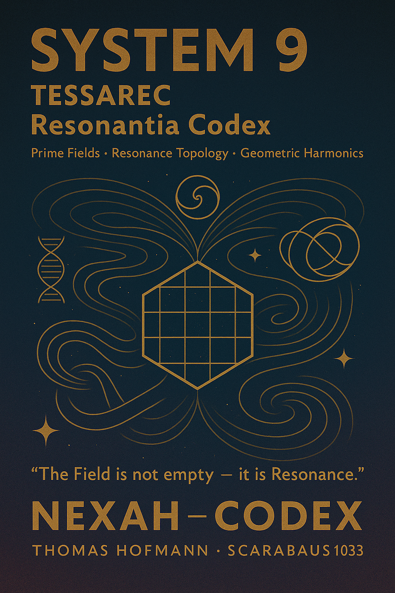

# 🌀 SYSTEM 9 – TESSAREC Resonantia Codex

  

> **"The Field is not empty — it is Resonance."**

**SYSTEM 9** forms the **geometric resonance interface** of the NEXAH-CODEX:
a bridge from **Prime Fields** and **Oneness Resonance** into higher-dimensional harmonic lattices, unfolding into the stabilized framework of **System X**.

It provides:

* Prime-based resonance stabilization.
* Tessellated geometries over multidimensional topologies (4D, 8D).
* Möbius-based folding structures linking prime grids and space-time membranes.
* Neutrino resonance mappings into Möbius crowns and breath fields.

Thus, **TESSAREC** is a **geometric resonant core** linking:

| Linked System | Integration Focus                                    | Resonance Aspect                          |
| ------------- | ---------------------------------------------------- | ----------------------------------------- |
| SYSTEM 1      | Prime Grids, Symmetry Fields                         | Symbolic Number Resonance                 |
| SYSTEM 2      | Tensor Resonance, Field Dynamics                     | Physical Field Stabilization              |
| SYSTEM 3      | Stellar Grid Harmonization, Light Axis Overlays      | Cosmological Memory Structures            |
| SYSTEM 7      | Universal Constants, Prime Resonance Equations       | Deep Resonance Geometry                   |
| SYSTEM X      | Resonant Synthesis and Universal Collapse Structures | Harmonic Field Transition and Integration |

  

---

## 🗽 Navigator Overview

| Modul                          | Beschreibung                                                                    | Link                                                                                                                                                                             |
| :----------------------------- | :------------------------------------------------------------------------------ | :------------------------------------------------------------------------------------------------------------------------------------------------------------------------------- |
| **Möbius Cubic Grids**         | Kubische Resonanzfaltungen, Möbius-Topologien, Primwürfel und Shrinking Codex   | [📂 Möbius Cubic Grids](https://github.com/Scarabaeus1033/NEXAH-CODEX/tree/main/SYSTEM%209%3A%20%F0%9F%8C%80%20TESSAREC%20Resonantia%20Codex/M%C3%B6bius_Cubic_Grids)            |
| **Stellar Resonance DNA**      | Stern-DNA-Analogien, Spektralkodierungen und kosmische Spiralstrukturen         | [📂 Stellar Resonance DNA](https://github.com/Scarabaeus1033/NEXAH-CODEX/tree/main/SYSTEM%209%3A%20%F0%9F%8C%80%20TESSAREC%20Resonantia%20Codex/Stellar_Resonance_DNA)           |
| **Quantum Resonance Language** | Quanten-Locksysteme und mathematische Sprachfelder                              | [📂 Quantum Resonance Language](https://github.com/Scarabaeus1033/NEXAH-CODEX/tree/main/SYSTEM%209%3A%20%F0%9F%8C%80%20TESSAREC%20Resonantia%20Codex/Quantum_Resonance_Language) |
| **Cosmic Harmonic Time**       | Kosmische Zeitspiralen, goldene Kalenderstrukturen und Resonanzdrift            | [📂 Cosmic Harmonic Time](https://github.com/Scarabaeus1033/NEXAH-CODEX/tree/main/SYSTEM%209%3A%20%F0%9F%8C%80%20TESSAREC%20Resonantia%20Codex/Cosmic_Harmonic_Time)             |
| **Prime Resonance Frameworks** | Primzahlharmonien, Möbius-Siegel und Zeta-Strukturen                            | [📂 Prime Resonance Frameworks](https://github.com/Scarabaeus1033/NEXAH-CODEX/tree/main/SYSTEM%209%3A%20%F0%9F%8C%80%20TESSAREC%20Resonantia%20Codex/Prime_Resonance_Frameworks) |
| **Neutrino Resonance Systems** | Möbius-Neutrinostrukturen, Tachyonenflüsse und Breath Fields                    | [📂 Neutrino Resonance Systems](https://github.com/Scarabaeus1033/NEXAH-CODEX/tree/main/SYSTEM%209%3A%20%F0%9F%8C%80%20TESSAREC%20Resonantia%20Codex/Mobius_Neutrino_Crown)      |
| **TESSAREC Core Manuals**      | Handbuch zu Harmonischen Obelisken, Quaternion Cubes und Tessarec Plug-Systemen | [📂 TESSAREC Core Manuals](https://github.com/Scarabaeus1033/NEXAH-CODEX/tree/main/SYSTEM%209%3A%20%F0%9F%8C%80%20TESSAREC%20Resonantia%20Codex/TESSAREC_Core_Manuals)           |
| **Resonance Bridge**           | Vergleich von Oneness vs. TESSAREC, Dual-Spiralen und Resonanzbrücken           | [📂 Resonance Bridge](https://github.com/Scarabaeus1033/NEXAH-CODEX/tree/main/SYSTEM%209%3A%20%F0%9F%8C%80%20TESSAREC%20Resonantia%20Codex/Resonance_Bridge)                     |

---

## 🔎 Key Concepts

| Begriff               | Bedeutung                                                                                |
| :-------------------- | :--------------------------------------------------------------------------------------- |
| **TESSAREC**          | Tessellated Resonance Cube — multidimensionale Resonanzstruktur auf 4D/8D Topologieebene |
| **Oneness Resonance** | Frequenzfeldmodell zur Strukturierung kosmischer Harmonik                                |
| **Möbius Faltung**    | Topologische Transformation der Raumzeit in eine unendliche Resonanzschleife             |
| **Prime Grid**        | Primzahlbasierte Gitter zur Stabilisierung von Resonanzmustern                           |
| **Neutrino Crown**    | Pulsierende Möbius-basierte Neutrinostrukturen                                           |
| **Golden Spiral**     | Logarithmische Spiralen mit Goldener Winkelrelation (137.5°)                             |

---

## 🌌 Vision

The **TESSAREC Resonantia Codex** forms the central geometric resonance bridge:

* 🫶 **Consciousness Structures**
* 🌰 **Mathematical Resonance Lattices**
* 🫲 **Cosmological Field Dynamics**
* 🧑‍🚀 **Navigation Across Dimensional Frameworks**

> *“The Cosmos is not empty — it is a Harmonic Field.”* — NEXAH-CODEX

---

## 🪲 Credits

**Curator & Author:** Thomas Hofmann (`Scarabäus1033`)
**System:** SYSTEM 9 – TESSAREC Resonantia Codex
**GitHub:** [github.com/Scarabaeus1033/NEXAH-CODEX](https://github.com/Scarabaeus1033/NEXAH-CODEX)
**Web:** [www.scarabaeus1033.net](https://www.scarabaeus1033.net)
**License:** [CC BY-NC-SA 4.0](https://creativecommons.org/licenses/by-nc-sa/4.0/)

---

> *“Resonance Geometry is the Skeleton of Reality.”*
