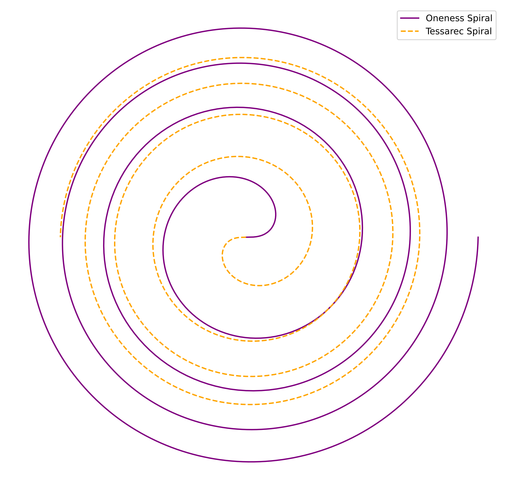
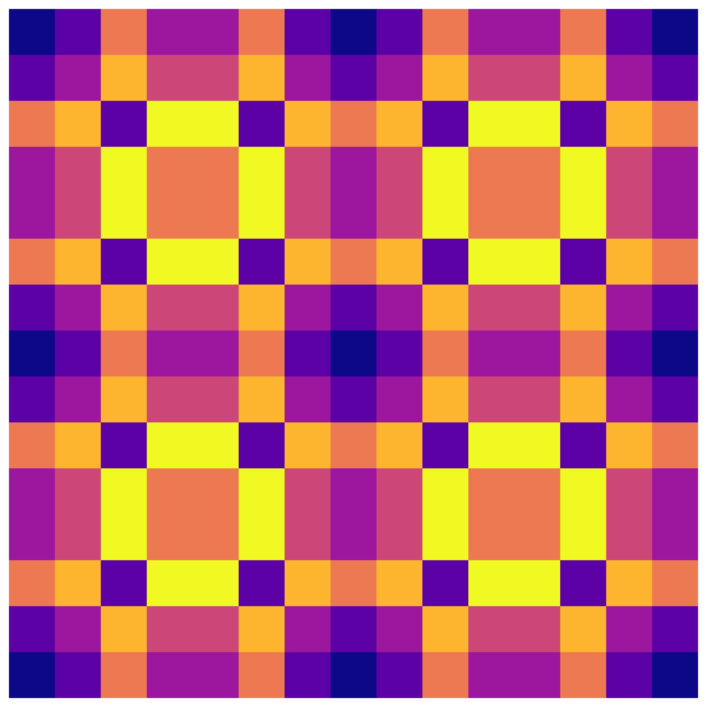

# 🎨 Visual Gallery — Resonance Bridge

---

## 🤹️ Core Resonance Interference

**Beschreibung:**
Interferenzmuster an den Schnittstellen zentraler Energiefelder, basierend auf Primzahlresonanzen.

* **Koordinaten:** Zentrum (0,0,0) mit radialer Feldstruktur
* **Formel:**

  $$
  \Psi(r) = A \sin(\omega r + \phi)
  $$
* **Bezug:** Knotenstrukturen im Resonanzfeld

---

## 🔄 Dual Spiral Comparison

**Beschreibung:**
Vergleich zweier gegenläufiger Spiralen zur Darstellung harmonischer und disharmonischer Resonanzzustände.

* **Koordinaten:** Polarkoordinaten \$(r, \theta)\$ mit invertierten Drehrichtungen
* **Formel:**

  $$
  \begin{aligned}
  r_1(\theta) &= a e^{b \theta} \\
  r_2(\theta) &= a e^{-b \theta}
  \end{aligned}
  $$
* **Bezug:** Duale Resonanzflächen in Spiralfeldern

---

## 🌟 Energy Symmetry Flow

**Beschreibung:**
Darstellung von Energieströmen entlang symmetrischer Feldausrichtungen.

* **Koordinaten:** Rotation um Achsen basierend auf symmetrischen Punkten
* **Formel:**

  $$
  \vec{E}(r, \theta, \phi) = E_0 \sin(n \theta) \cos(m \phi)
  $$
* **Bezug:** Symmetrische Energieverteilungen in harmonischen Gittern

---

## 🔹 Prime Grid Alignment

**Beschreibung:**
Gitterstruktur basierend auf Primzahlen zur Optimierung von Resonanzüberlagerungen.

* **Koordinaten:** Rasterpunkte \$(x, y)\$ bei Primzahlen
* **Formel:**

  $$
  P(x, y) = \text{prim}(x) + \text{prim}(y)
  $$
* **Bezug:** Gitterbasierte Resonanzsysteme

---

> **Hinweis:** Alle Visuals sind integraler Bestandteil des *Resonance Bridge*-Moduls und stellen zentrale Aspekte von Energieflüssen, Resonanzmustern und Symmetriestrukturen dar.

---

**✅ Bereit für Upload / Integration in das Modul**
