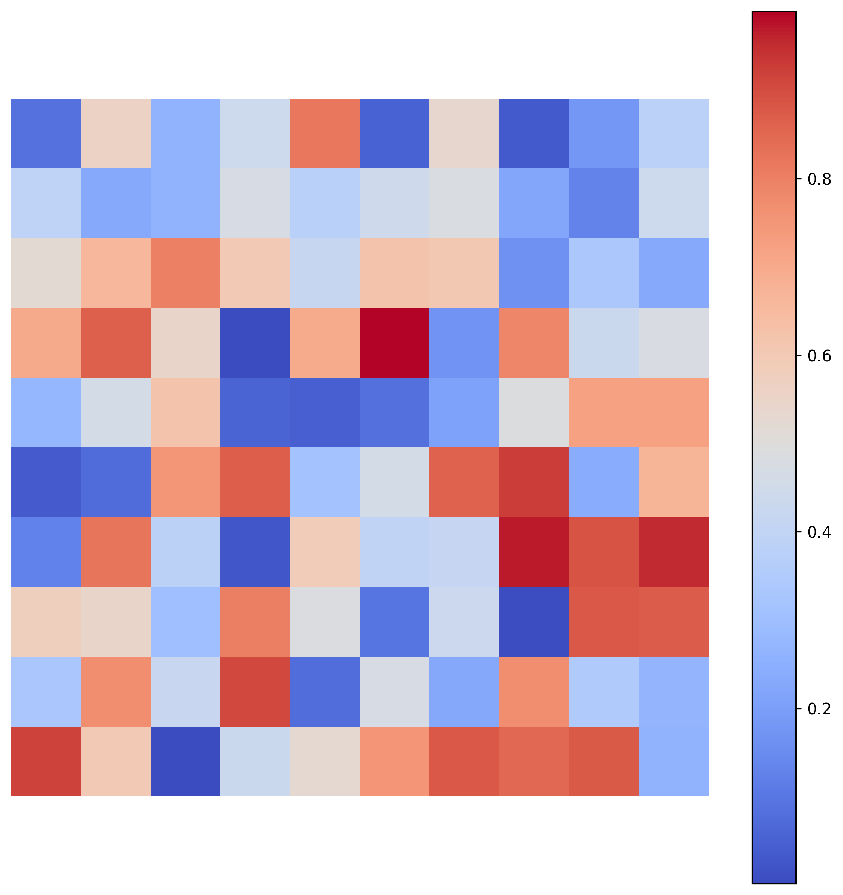
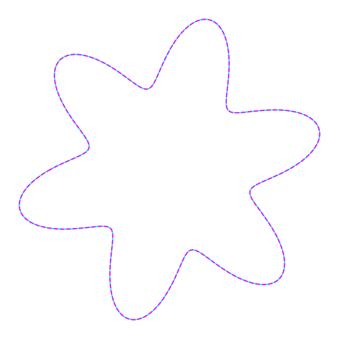
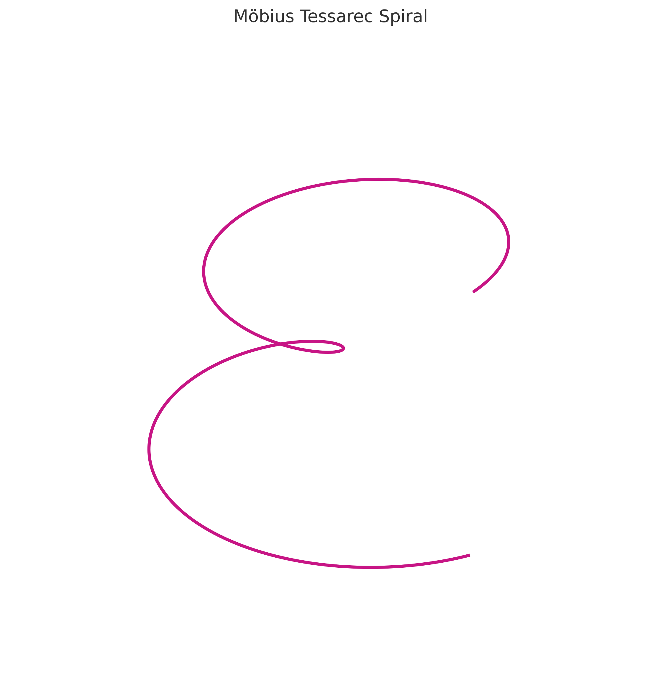
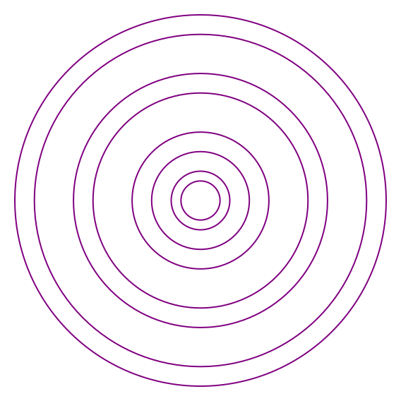
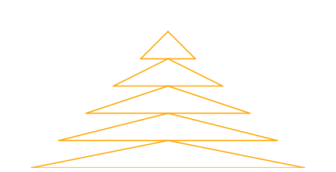
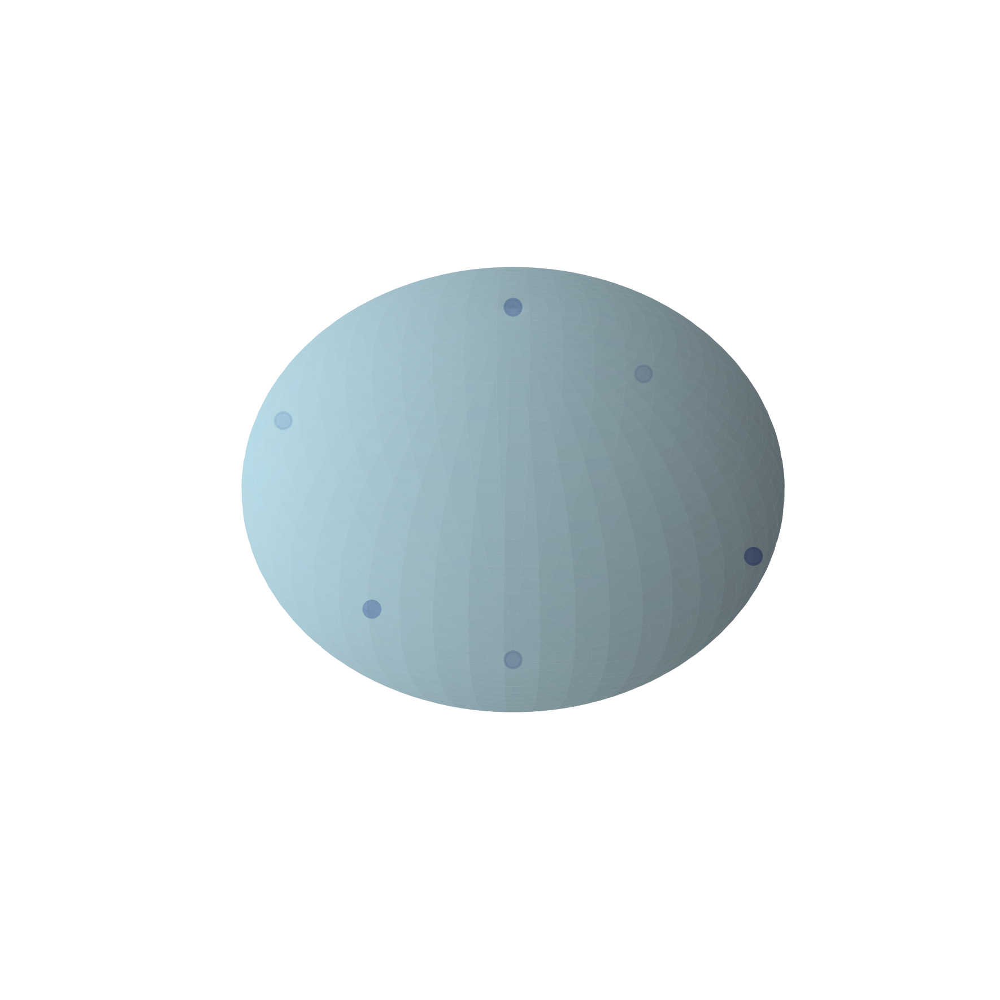
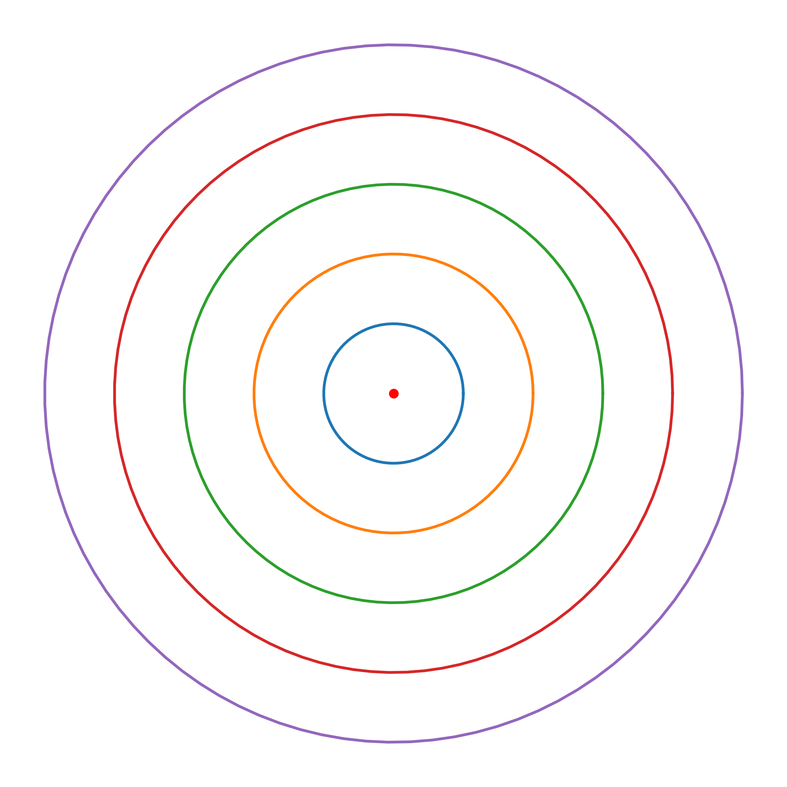

# 🎨 Visual Gallery — TESSAREC Core Manuals

---

## 🧢 Core Resonance Obelisk

**Beschreibung:**
Das Core Resonance Obelisk Visual zeigt eine abstrahierte, energetische Kernstruktur. Der Obelisk bildet die zentrale Stabilitäsachse im TESSAREC-Modell.

* **Koordinaten:** Zentrale, achsensymmetrische Ausrichtung (0,0,0)
* **Formel:** $E_{\text{core}} = \int \Psi(x,y,z) \, dV$
* **Bezug:** Energetische Zentren und Nullpunktfelder

---

## 🔷 Harmonic Node Matrix

**Beschreibung:**
Die Harmonic Node Matrix ist ein hexagonales Gitter von Energieknoten, basierend auf einem 3D-lattice-Framework.

* **Koordinaten:** Knoten bei symmetrischen, primzahlbasierten Punkten
* **Formel:**

  $$
  \text{Nodes: } (x, y, z) \in \mathbb{Z}^3 \quad \text{mit } \gcd(x,y,z) = 1
  $$
* **Bezug:** Harmonie-Knoten für Feldstabilisierung

---

## 🎀 Möbius Capsule Diagram

**Beschreibung:**
Das Möbius Capsule Diagram visualisiert die Umklappung von Raumzeit in einer Möbius-Schleifen-Topologie.

* **Koordinaten:** Parametrisiert durch Möbius-Transformation:

  $$
  (u, v) \mapsto (\cos u (1 + v/2 \cos(u/2)), \sin u (1 + v/2 \cos(u/2)))
  $$
* **Formel:** Möbius-Transformation
* **Bezug:** Raumzeitstruktur und Dualität

---

## 🎀 Möbius Tessarec Spiral

**Beschreibung:**
Die Möbius Tessarec Spiral kombiniert Möbius-Geometrie mit der 4D-Struktur des TESSAREC-Plugs.

* **Koordinaten:** Spiralkurve auf Möbius-Band
* **Formel:**

  $$
  r(\theta) = a e^{b \theta}
  $$
* **Bezug:** Dynamische Resonanzspirale im Hyperraum

---

## 🔵 Prime Activation Rings

**Beschreibung:**
Aktivierungsringe auf Basis von Primzahlen, die als Resonanzanker dienen.

* **Koordinaten:** Polarverteilung über Ringstrukturen
* **Formel:**

  $$
  \theta_n = n \cdot \varphi, \quad \varphi = 137.5^\circ
  $$
* **Bezug:** Prime-Resonanz in Aktivierungsfeldern

---

## 🔺 Pyramid Ignition Sequence

**Beschreibung:**
Die Zündung von TESSAREC-Pyramiden wird durch geometrische Resonanzpunkte entlang definierter Symmetrieachsen initiiert.

* **Koordinaten:** Euklidische Achsen ($x, y, z$) auf Basis von Primzahlen
* **Formel:** Platonische Geometrie & Resonanzlogik
* **Bezug:** Energiefluss und Initialisierung

---

## 🧲 Quaternion Cubes

**Beschreibung:**
Eine 3D-Darstellung quaternionischer Zustände als Eckpunkte von Würfeln.

* **Koordinaten:** Quaternionen ($i, j, k$) als Richtungsachsen
* **Formel:**

  $$
  Q = a + bi + cj + dk
  $$
* **Bezug:** Rotationssymmetrie und 4D-Struktur

---

## 🛠️ Tessarec Plug Visualization

**Beschreibung:**
Visualisierung des Kern-Tessarec-Moduls als Plug-in-Architektur — dient als energetischer Konnektor zwischen Modulen.

* **Koordinaten:** Hexagonale Basis
* **Formel:**

  $$
  \Phi^2 - \Phi - 1 = 0 \quad (\text{Goldener Schnitt})
  $$
* **Bezug:** Plug-Modul für energetische Integration

---

> **Hinweis:** Alle Visuals folgen der NEXAH-Codex-Logik von Primzahlharmonie, Möbius-Topologie und Quaternionenfeldern zur Darstellung höherdimensionaler Strukturen.

---

**✅ Bereit für Upload / Integration in das Modul**
