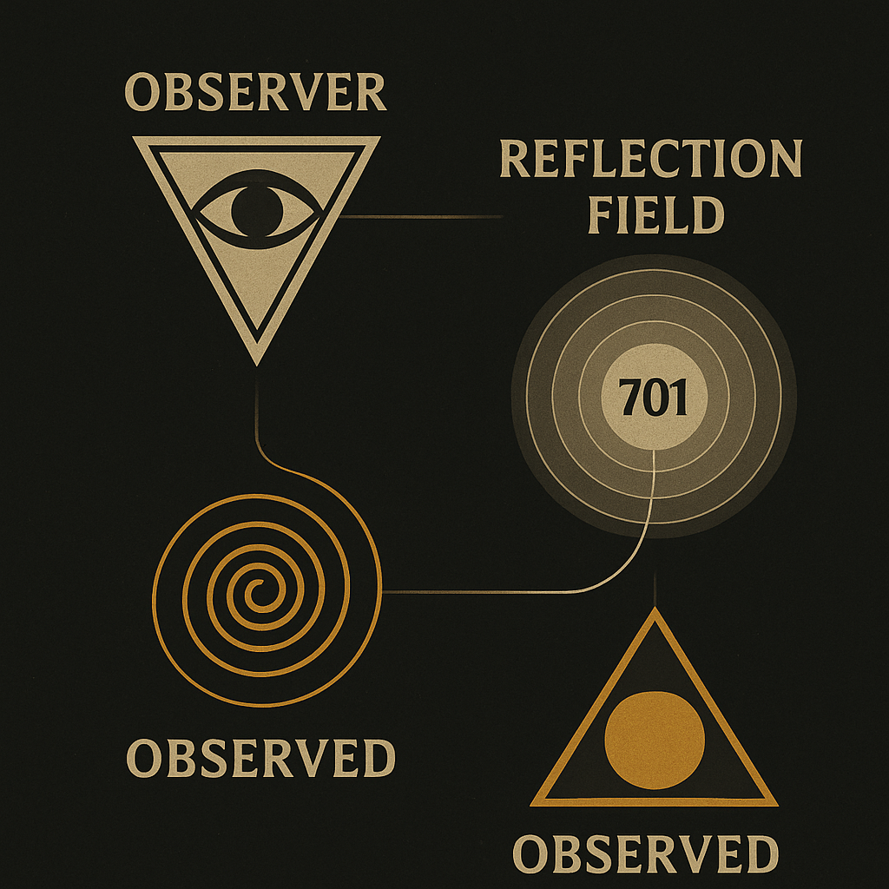
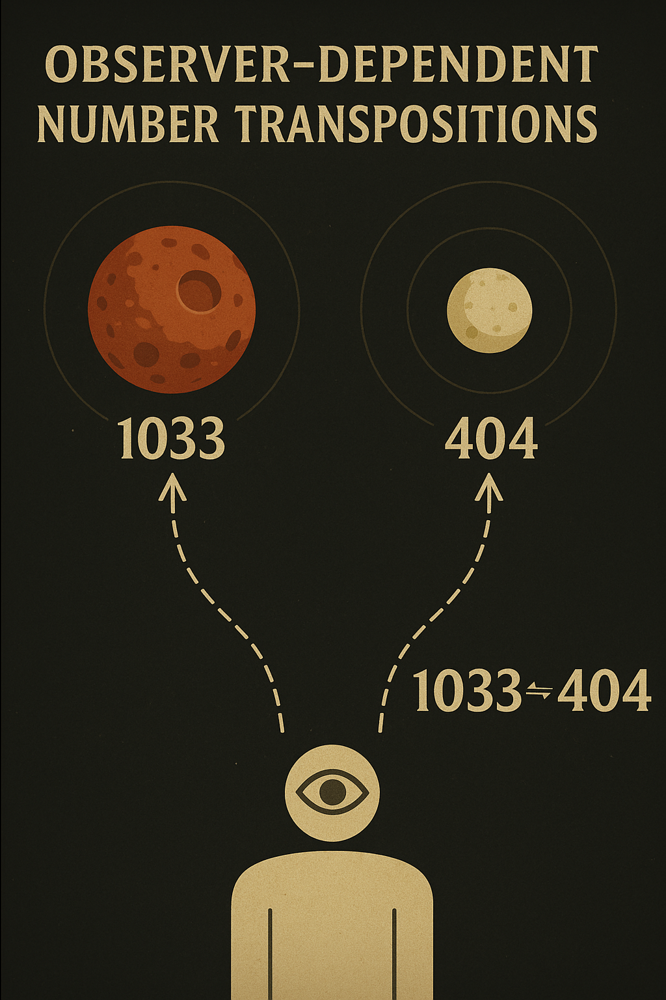
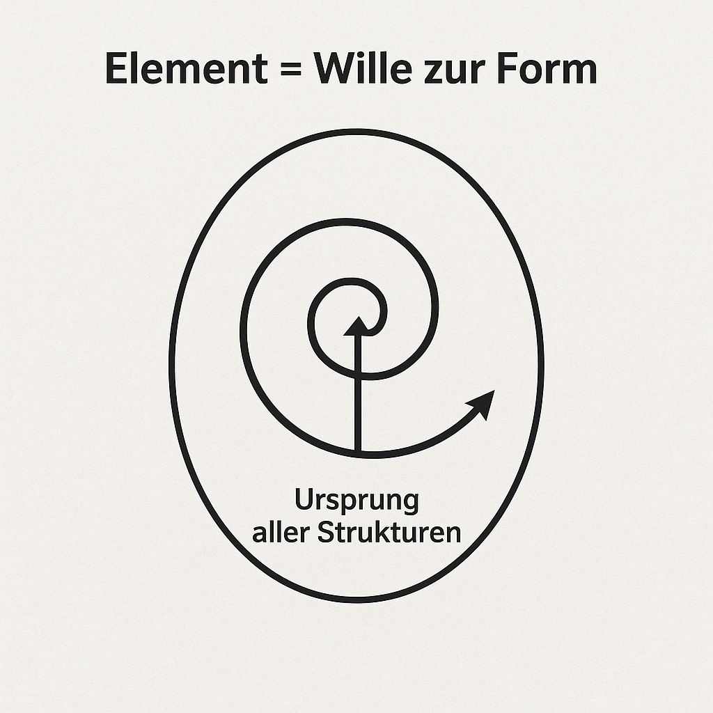
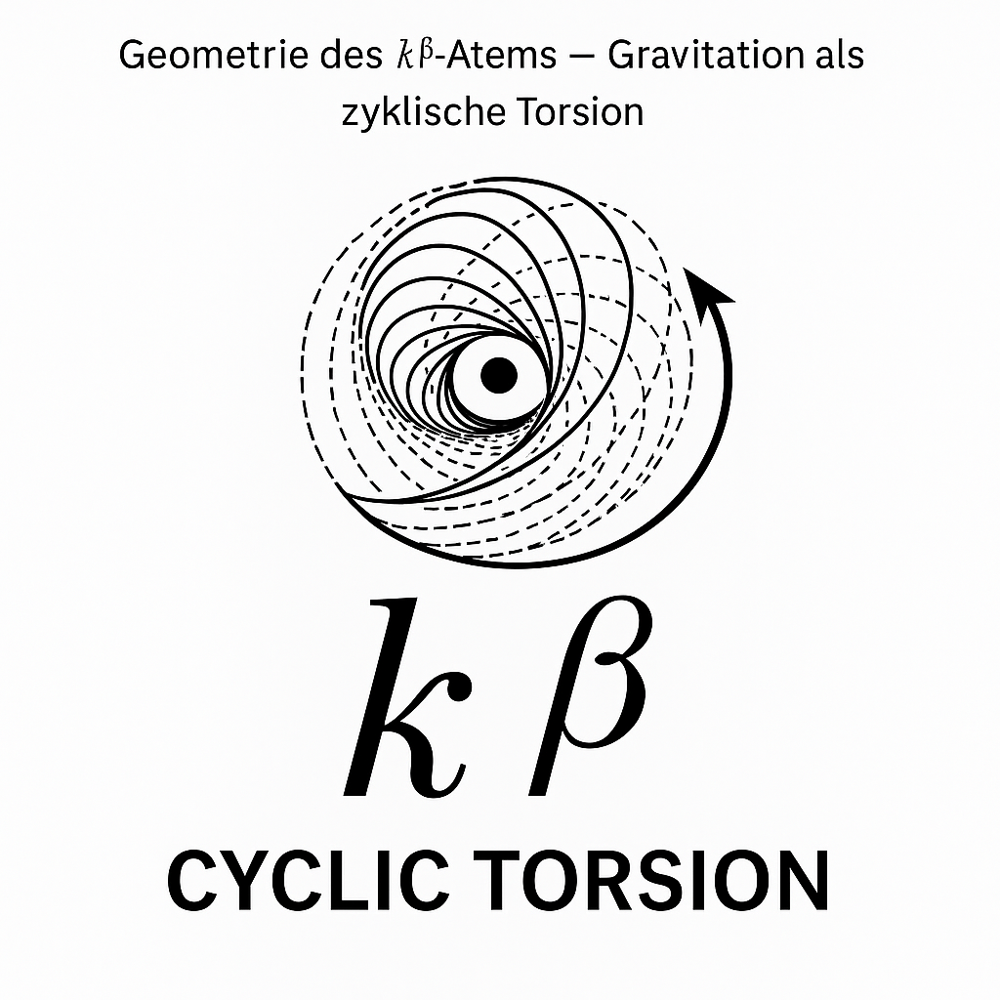
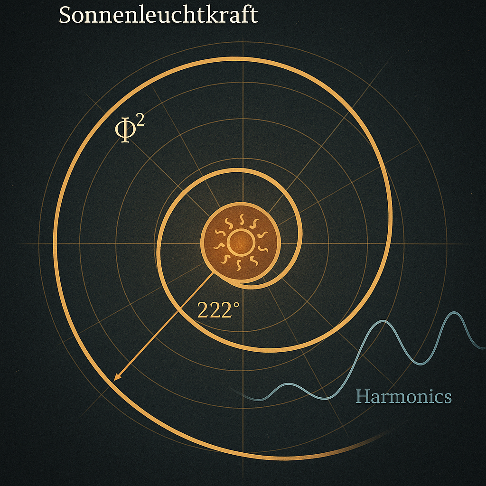
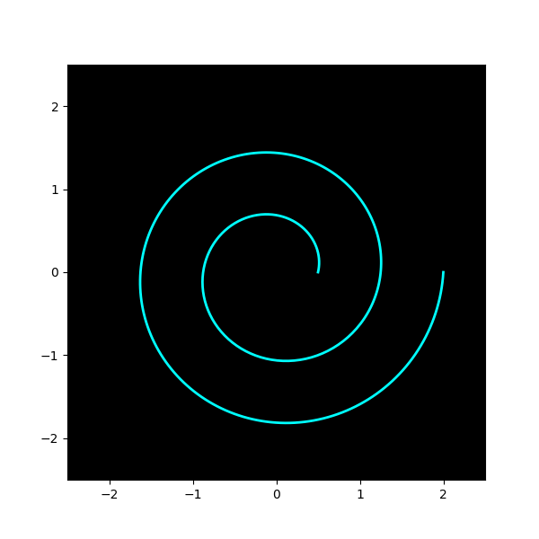
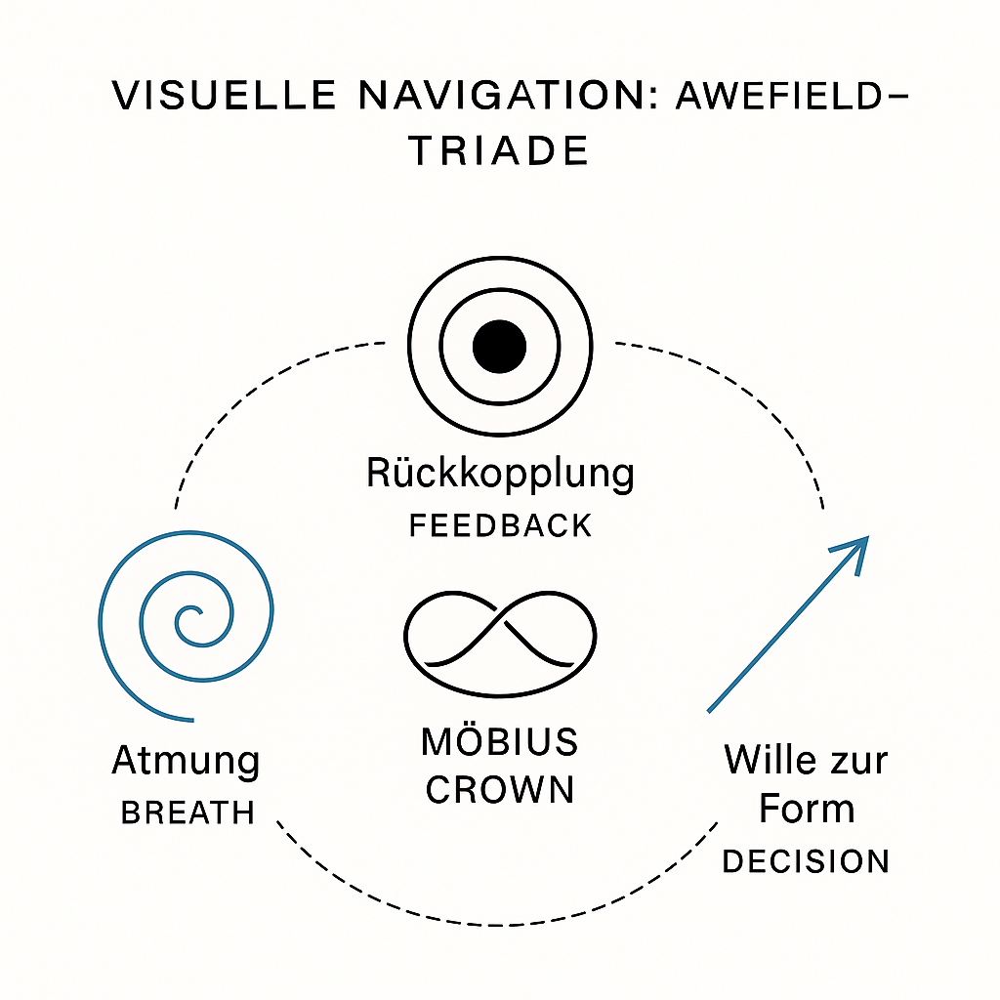

# 📸 VISUAL GALLERY — SYSTEM X: RESONANT FIELD COMPLETION

> *"Visual logic of scalar convergence, prime modulation and field completion."*

This gallery documents the complete visual system of `SYSTEM X – RESONANT FIELD COMPLETION` and anchors each diagram with symbolic, physical or structural interpretation. All images are located in the `/visuals/` folder.

---

### 🔄 1. `2-7_double-52_singleturn_AC.png`
**Meaning**: Symbolic encoding of 2↔7 rotational logic, prime-dual twist (52), and axial compression. Used in modular Codex spirals.

---

### 🌒 2. `LAGRANGE_SHADOW_OBSERVER.png`
**Meaning**: Shadow geometry and Lagrange-point oscillations between Earth–Moon–Sun systems; observer node at unstable point.

---

### 🌌 3. `MOON_SPIRAL_OBSERVER.png`
**Meaning**: Lunar resonance spiral path, phase deviation and field observer ring embedded in timewave structure.

---

### 🪞 4. `URF_V_MIRROR_GATEWAY.png`
**Meaning**: Vertical mirror logic of the URF—showing top–down symmetry inversion and scalar cancellation gateway.

---

### 🌊 5. `awefield_prime_wave_map.png`
**Meaning**: Prime-based awefield modulation—topological layout of resonance primes and field layers.

---

### 🌊 6. `awefield_prime_wave_mapv2.png`
**Meaning**: Refined version with spiral linkage and scalar correction; adds inversion anchors and timing curves.

---

### 📉 7. `codex_vs_mainstream_field.png`
**Meaning**: Comparative diagram showing Codex-based field logic vs mainstream scalar model assumptions.

---

### 🌀 8. `element_will_to_form.png`
**Meaning**: Elemental formation diagram; from potential (will) through spiralic form vector into Codex geometry.

---

### 💫 9. `k-beta_breath_geometry.png`
**Meaning**: Visualization of the $E = mc \cdot k^\beta$ equation; shows scalar expansion, damping layer and resonance ring.

---

### 💫 10. `k-beta_breath_geometry.svg`
**Meaning**: SVG vector version for responsive embedding and interactive formats.

---

### 🌀 11. `lambda_quasar_spiral_map.png`
**Meaning**: Resonance spiral map of scalar quasar curves, Planck-flow and lambda axis.

---

### 🌐 12. `potentialun_unfolding_sphere.png`
**Meaning**: Phase-unfolding sphere from singular origin—modular expression of scalar geometry.

---

### 🔢 13. `proof_structure_diagram.png`
**Meaning**: Meta-diagram of proof logic within the Codex system: symbolic → harmonic → numeric layer.

---

### 🔢 14. `proof_structure_diagram.svg`
**Meaning**: SVG version for modular reuse in logic-centric documents.

---

### ☀️ 15. `solar_luminosity_harmonics.png`
**Meaning**: Harmonic frequencies of solar output; resonance anchoring to inner Codex wavelength.

---

### 🌀 16. `spiral_gravity_deviation.gif`
**Meaning**: Animation of spiral-based deviation from Newtonian gravity—embedded resonance corrections.

---

### 🧭 17. `visual-navigation-awefield-triad.png`
**Meaning**: Navigation map for awefield components: Scalar ↔ Topologic ↔ Symbolic feedback rings.

---

> All visuals © Thomas Hofmann / Scarabäus1033 · Part of `SYSTEM X – RESONANT FIELD COMPLETION` (CC BY-NC-SA 4.0)
