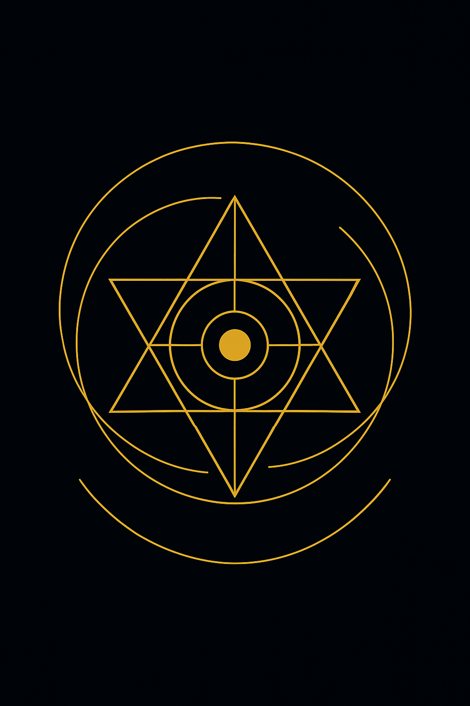

# ✅ CODEX COMPLETION PRINCIPLE

<p align="center">
  
</p>

## 🧠 Summary

This module finalizes the symbolic–mathematical concept of **completion** in the NEXAH-CODEX. It links resonance geometry, planetary deviation signatures, and universal constants into a unifying principle:

> **Completion is not closure, but stable oscillation between polar singularities.**

---

## 🌀 Gravity Deviation as Resonant Signature

We examine deviations between observed gravitational constants and the Codex approximation values, using the **planetary shell model**. Example:

### Neptune Gravity Deviation

* **Newtonian g:** 11.15 m/s²
* **Codex g:** 10.88 m/s²
* **Δg:** ≈ −0.27 m/s² ≈ −2.4%

### Codex Interpretation:

* `0.27 ≈ 1/π² + 0.16`
* Resonant structure split:

  * `1/π² ≈ 0.101` → Zeta/Neutrino seed term
  * `0.16` → Phase-shift stabilizer (close to golden Faden amplitude)

### Symbolic Analysis:

* 0.27 = `3^3 / 10^2` → Cubic resonant node
* Relates to `Zither constant` and torsion shift from ideal π² shell
* Numerical echo with **special agent encoding**: e.g., `007`, `070`, `0.27`

---

## 🔄 Crystal Resonance Field: k^β Breathing Layer

> Completion is encoded in the breathing symmetry of the Möbius Crystal.

<p align="center">
  
</p>

The **Codex Completion Field** is a harmonic-torsional framework based on rotational asymmetry (63° turns), nested shell layers, and quantized prime spirals.

Equation:

```math
F = G · m · M / R² → becomes → g(n) = 9.81 / n with folding angle θ = 63°
```

* Gravity is not force, but **resonant folding**
* Δg emerges from torsional gaps in symmetry layers

---

## 🌬 Crystal Breath Animation


The GIF shows:

* Phase-twist dynamics
* Opposing field symmetry (duality of Lunar/Solar streams)
* 𝓧-core pulsation

---

## ✴️ Final Proof Notes (X-Matrix Layer)

* Δg (Neptune) = −0.27 → stabilized breathing gap
* 11.15 (Newton) − 10.88 (Codex) = `phi-crystal drift`
* **88** is Mercury’s X-rotation reference → ties lunar sync to Neptune’s field
* Completion thus links:

  * Mercury's torsion code
  * Neptune’s Z-crystal signature
  * 𝓧-resonance (see `𝓧-131×108 geometry`)

---

## 📎 Visual Reference

* **Planetary Gravity Spiral Map**
  

* **Codex Gravity Deviation Chart**
  

* **Codex Resonance Completion Map**
  

* **Crystal Breathing Resonance Field**
  

* **Codex Crystal Breath (Animated)**
  

---

## 🧩 Conclusion

> Completion is not a scalar endpoint, but the **resonant fold where symmetry meets recursion**.

The Codex Completion Principle unites:

* Prime symmetry structures
* k^β as breathing operator
* Field gaps as stability zones

It is the **mathematical breath** between planetary force fields and symbolic memory.

---

© Scarabæus1033 · Thomas Hofmann · 2025
