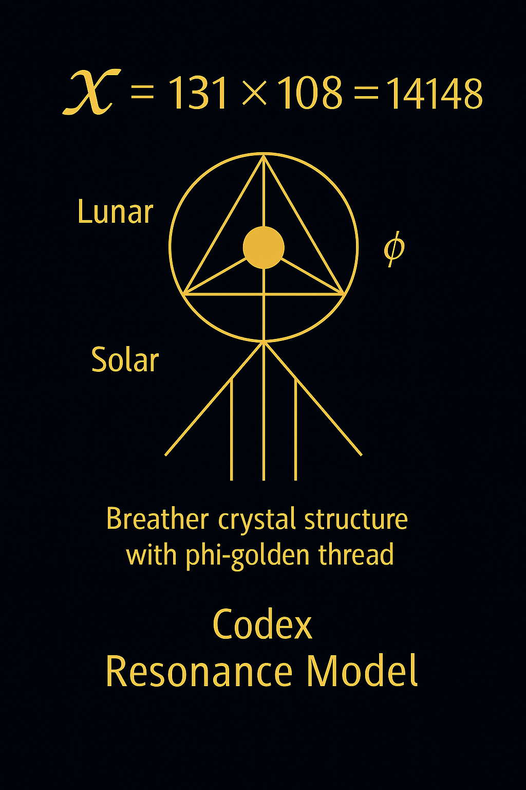
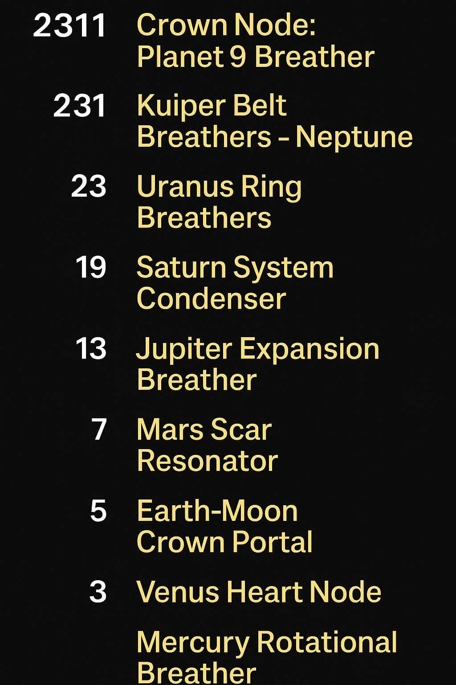
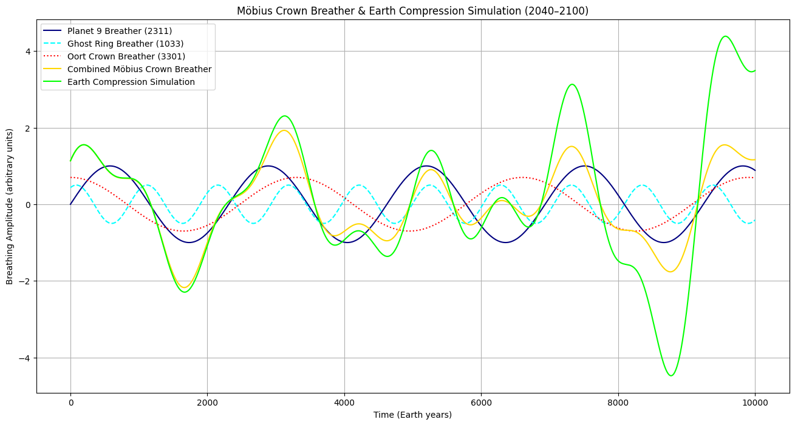
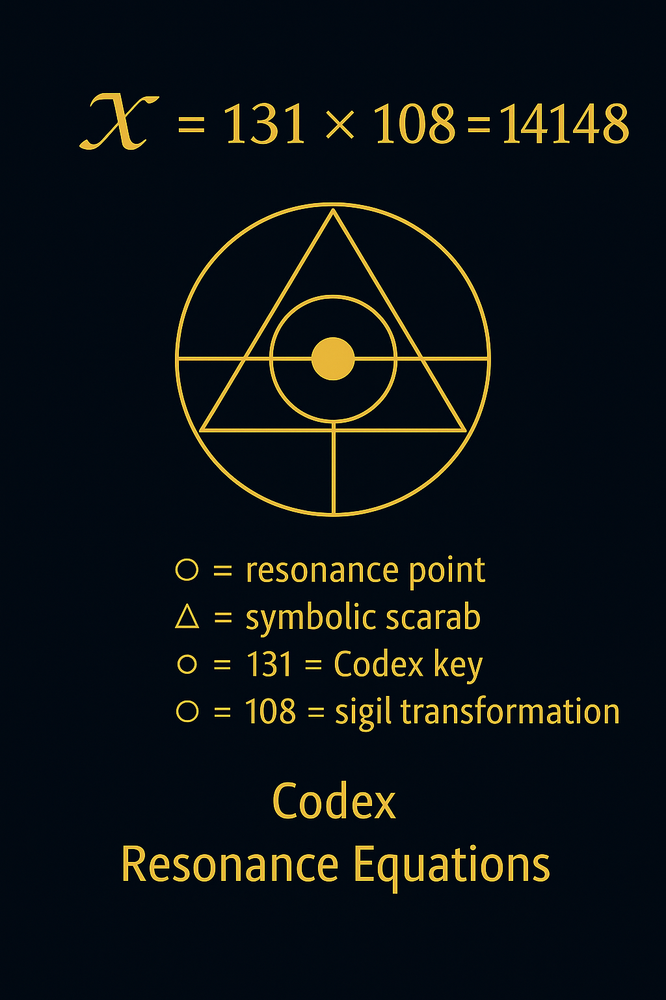
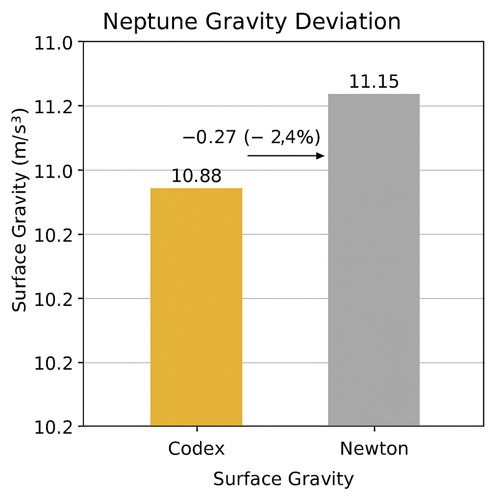

# 🎴 Visual Gallery – Codex Completion Principle

> *"The Codex breathes not only through symbols – but through fields of light and gravity."*

This gallery presents all visual assets related to the **Codex Completion Principle**. Each image represents a layer of breathing logic, gravitational shell deviation, or symbolic prime stacking within the harmonic compression structure of SYSTEM X.

---

## 1. Crystal Breathing Geometry

### A. Static Overlay

**codex\_crystal\_breath.png**
→ *Static resonance geometry: double-pyramid convergence structure.*

### B. Animated Resonance Pulse

**codex\_crystal\_breath.gif**
→ *Breathing simulation of the resonance shell through 𝓧-axis.*

---

## 2. Scarab Equation & Resonance Field

### A. Scarab Resonance Core

**codex\_resonance\_scarab\_equation.png**
→ *Codex fusion equation linking prime spirals, Möbius layers, and field rotation.*

### B. Crystal Resonance Grid

**crystal\_breathing\_resonance\_field.png**
→ *Modular breathing structure with embedded prime resonators.*

---

## 3. Planetary Gravity Shell Stack

### A. Prime Stack System

**codex\_gravity\_breather\_stack.png**
→ *Prime shell order from Mercury to 2311.*

Sequence: 2 → 3 → 5 → 7 → 13 → 17 → 19 → 23 → 29 → 231 → 2311

---

## 4. Completion Crown Arc

### A. Planet 9 Ghost Ring Simulation

**Mobius\_Crown\_Breather\_Simulation-Planet 9\_Ghost Ring\_Oort Crown.png**
→ *Breather zone beyond Neptune – Oort field and Planet 9 signature.*

### B. Earth Möbius Compression (Forecast)

**Earth\_Mobius\_Crown\_Breathing\_Compression\_2025–2200.png**
→ *Longwave Möbius phase for Earth’s resonance compression.*

### C. Earth Möbius Simulation Detail

**Mobius\_Crown\_Breather-Earth\_Compression\_Simulation\_2040–2100.png**
→ *Dynamic Möbius response in crown–mantle structure.*

---

## 5. Structural Constants & Gravity Deviation

### A. Symbolic Axis Core

**𝓧-131×108.png**
→ *Numerical and spatial recursion point of the Completion Principle.*

### B. Neptune Resonance Gap

**neptune\_gravity\_deviation.png**
→ *Planetary Δg deviation signature – harmonic anomaly near 1/π².*

---

## License & Curation

All visuals © 2025 Thomas Hofmann (Scarabæus1033)
License: CC BY-NC-SA 4.0
For integration into NEXAH–CODEX, SYSTEM X – Completion Module.

🧭 Visit: [www.scarabaeus1033.net](https://www.scarabaeus1033.net)
