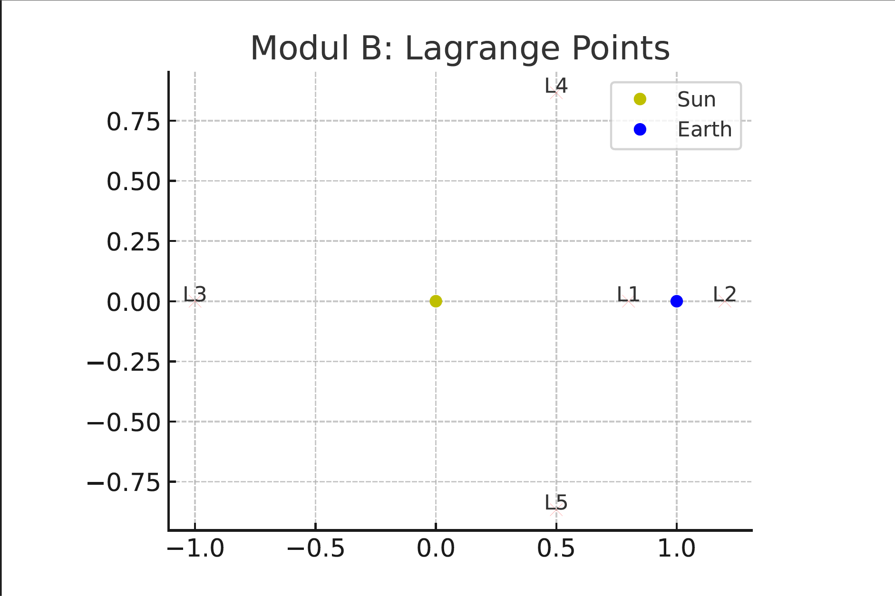
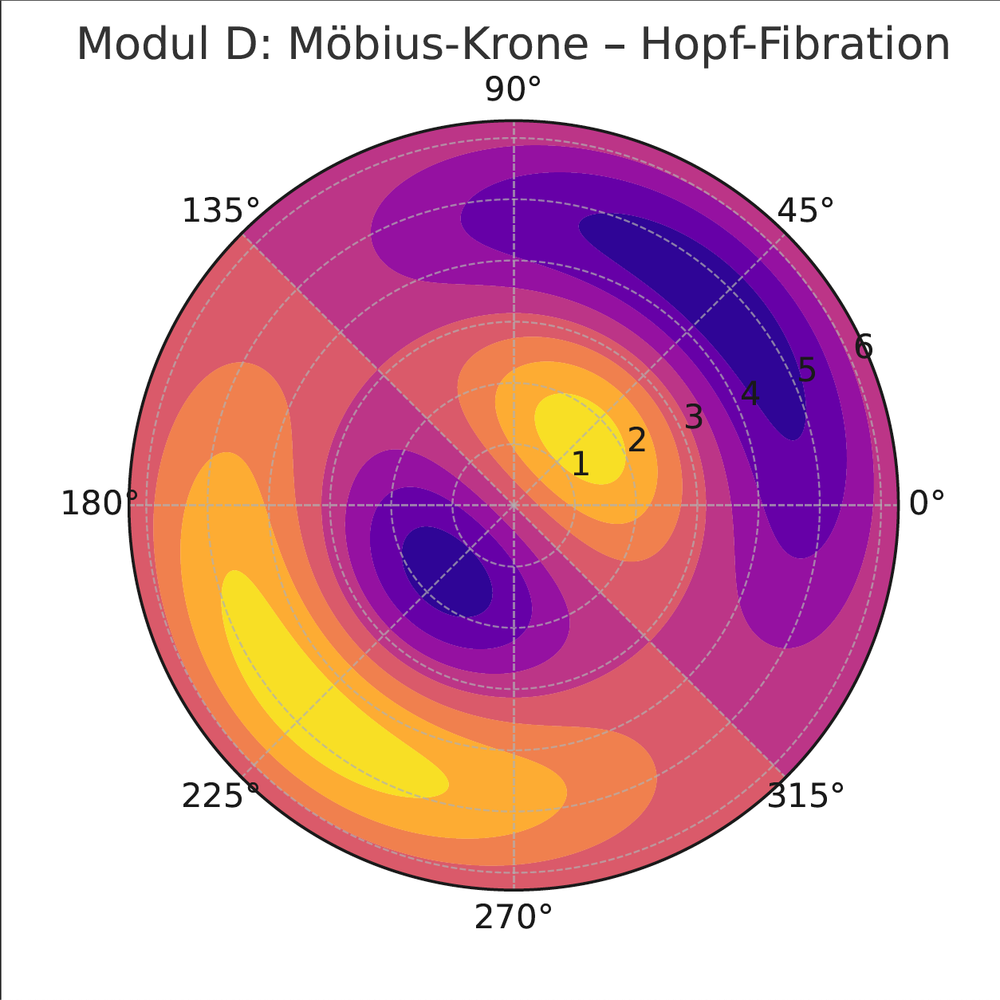

# 🧿 CODEX_OBSERVERIUM – Eye of the Möbius Node

## Module Overview

The CODEX_OBSERVERIUM is the central resonance anchor for perception, topological binding, and conscious phase structure within the NEXAH-CODEX. It integrates:

- the **Fourier spiral of the observer**
- the **Möbius Crown via Hopf Fibration**
- the **Lagrange equilibrium field (Sun–Earth system)**
- the **Breathing structure of conscious modulation** (Silver–Amaben–Gold cycle)

## 🔭 Core Visuals

### Module B – Lagrange Points

> Dynamic equilibrium between Sun and Earth. Symbolic storage field of the observation impulse.

---

### Module C – Observer Resonance (Fourier Sum)

> Spiral of harmonic nodes. The observer emerges as a field maximum across resonance phases.

---

### Module D – Möbius Crown (Hopf Fibration)

> A topological interface folding S³ → S² × S¹. Möbius becomes the phase-link of the inner eye.

---

## Related Modules in the Codex System

- [Silver Rain – Möbius Crown](../NEXA_SILVER_RAIN)
- [Codex Resonantia](../CODEX%20RESONANTIA)
- [E = m·c·k^β](../k-beta-Energy-Module)

---

🜂 *Observation is not a function – it is a phase.*  
🌀 *The knot does not see – it is seen.*
