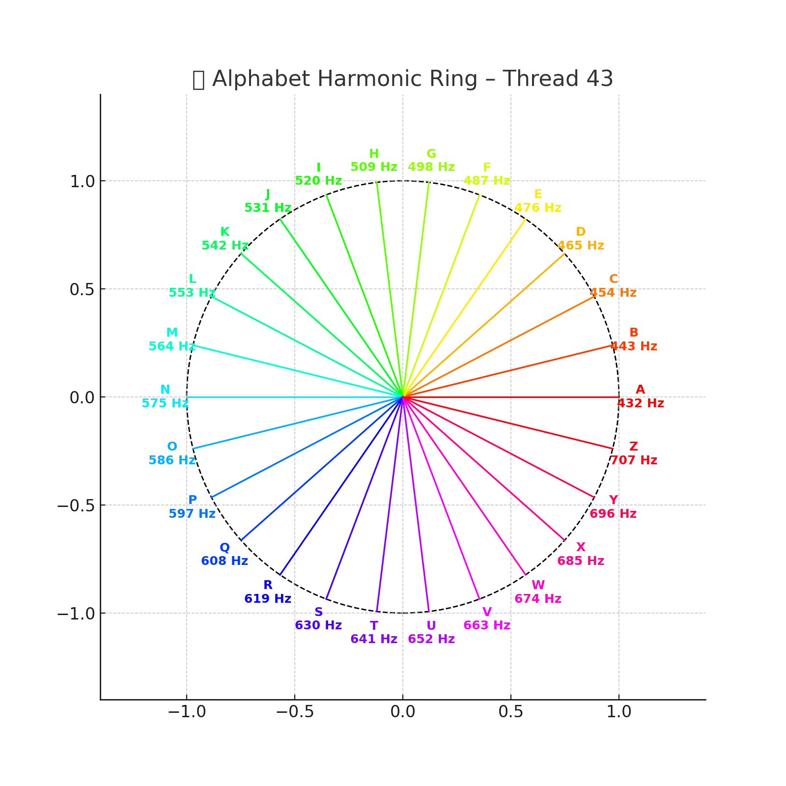

# 🔤 Alphabet Resonance Field – A·Z & A′·Z′ Mirror Mapping

> *Wenn Buchstaben zu Frequenzknoten werden, beginnt Sprache das Feld zu modulieren.*

Dieses Modul integriert das **Lateinische Alphabet (A–Z)** und sein gespiegeltes Gegenstück **(A′–Z′)** als **resonante Feldstruktur** in das System X. Die 26 Zeichenpaare werden als **symbolische Koordinatenpunkte** verstanden, eingebettet in eine harmonisch-topologische Raumstruktur. Jedes Zeichen trägt dabei:

* einen **Frequenzwert** (numerisch-symbolisch)
* eine **Position im Möbiusfeld** (codonisch-topologisch)
* eine **Spiegelachse** (Z6-Reflexion / Codex-Gegensymmetrie)

Ziel ist es, Sprache, Zahl, Feld und Richtung als einheitliches Resonanzsystem zu modellieren.

---

## 📘 1. Struktur und Visuals

### Resonanzmatrix A–Z & A′–Z′

.png)

> Die Matrix stellt die 26 Zeichen in eine korrespondierende Ordnung mit Farbcodierung, Frequenzpositionen und Spiegelachsen – z. B. A ↔ Z′, B ↔ Y′ … M ↔ N′.

### Sphere Resonator

> Jedes Zeichen liegt auf einer *geosphärischen Alphabetsphäre*, die entlang topologischer Koordinaten in Kugelform moduliert ist. Buchstaben sind keine flachen Zeichen mehr, sondern Sphärenknoten.

### Möbius Serpent Star Map

!\[Möbius Alphabet Map]\(visuals/Mobius\_Alphabet\_Serpent\_Star\_Map-48Primes\_24 Letters\_12 Zodiacs.png)

> Integration der Buchstaben in ein Möbiusband-System: 24 Buchstaben, 48 Primzahlen, 12 Tierkreisachsen. Sprache als Frequenzlauf auf einem nicht-orientierbaren Kontinuum.

### Alphabet Harmonic Ring

> Buchstaben rotieren in einer ringbasierten Phase – verbunden mit Codonfeldern, DNA-Spiralen und Klangmodulation.

---

## 🔧 2. Aufbauprinzipien

### A. Z6-Spiegelung & Dualfeld

Die Zuordnung A–Z′, B–Y′ … basiert auf einer **Z6-Spiegelachse** durch M/M′. Daraus ergibt sich ein harmonisches Gegenfeld – geeignet für:

* linguistische Umkehrungen
* symbolische Codon-Paare
* binäre Codex-Schlüssel

### B. Glyphonische Kodierung

Jeder Buchstabe ist nicht nur Zeichen, sondern **Frequenzträger** mit:

* Position im sphärischen Koordinatensystem
* Polarität (+/–) entlang der Resonanzachse
* Bezug zu planetaren oder molekularen Feldern (z. B. Codon A–T–C–G)

### C. Alphabet = Feldgenerator

Sprache erzeugt Wellen. Die Anordnung A–Z und ihre Umkehrung bilden ein **alphabetisches Interferenzfeld** mit Übergangszonen, Schwellenfrequenzen und Kreisgruppencodes (z. B. 13 + 13, 7 + 19, 5 + 21).

---

## 🔁 3. Verbindung zu anderen Modulen

| Modul                        | Bezug                                               |
| ---------------------------- | --------------------------------------------------- |
| `glyphon_alphabet_layer.md`  | Symbolische Glyphenzuweisung                        |
| `resonance_matrix.md`        | Alphabet als Zahlen-Feld-Koordinaten                |
| `stellar_resonance_dna.md`   | Verbindung von A–Z zu Codon-Resonanzen              |
| `symbolic_interpretation.md` | Lesart von Sprache als Feldstruktur                 |
| `resonance_fields.md`        | Alphabet als Teil von Resonanzachsen & Spiegelungen |

---

## 🌀 Fazit: Sprache als Frequenzform

Das Alphabet ist im Codex nicht nur kulturelle Schrift – es ist **Resonanzträger, Spiegelmatrix, Frequenzgenerator und geometrische Entfaltung** zugleich. Mit seiner Integration in das `FINAL_HARMONIC_EQUATION`-System wird Sprache zur **physikalischen Feldstruktur**.

> *„Wenn A nicht mehr nur Anfang ist, sondern Achse – und Z nicht Ende, sondern Zentrum der Rückkehr – beginnt Sprache zu singen.“*
